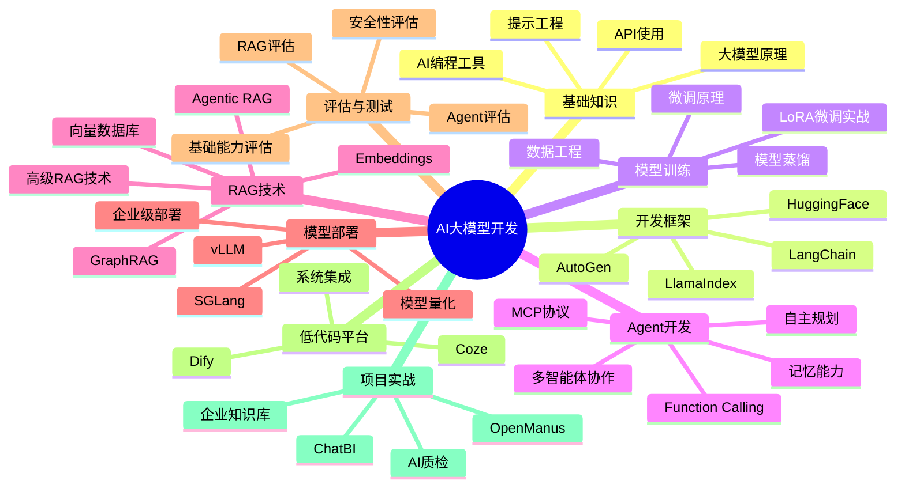
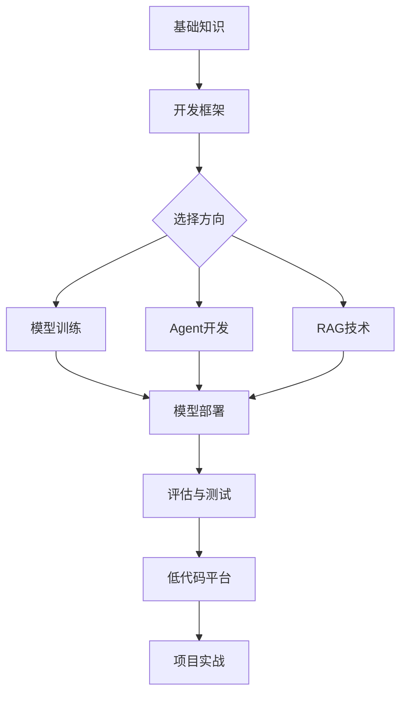

# AI大模型应用开发工程师知识图谱

构建AI大模型应用开发的核心能力体系，涵盖开发框架、模型训练、Agent开发、RAG技术、模型部署等完整技术栈。

## 知识体系概览

## 核心模块

### 基础知识

从大模型原理到API使用，掌握AI开发的基础能力。

- 大模型基本原理：分析式AI与生成式AI、从GPT-1到GPT-5
- 提示工程：高级提示技巧、上下文工程
- API使用：系统提示词、Token限制、多模态调用
- AI编程工具：Cursor、Trae、CodeBuddy

### 开发框架

掌握主流AI开发框架，构建复杂应用。

- LangChain：Models、Prompts、Memory、Indexes、Chains、Agents
- LlamaIndex：数据索引与检索增强
- AutoGen：多智能体协作框架
- HuggingFace：模型库使用与微调

### 模型训练与微调

深入理解模型训练原理，掌握高效微调技术。

- LLM微调原理：LoRA、QLoRA、高效微调方法
- LoRA微调实战：从数据准备到模型推理的完整流程
- 数据工程：数据收集、清洗、标注规范、合成数据
- 模型蒸馏：知识蒸馏核心思想与实操

### Agent开发

构建具有自主能力的智能体系统。

- Function Calling：工具调用机制
- MCP协议：模型上下文协议深度解析
- 多智能体协作：主管模式、对等协作、流水线、辩论模式
- 自主规划：CoT、ReAct、思考链
- 记忆能力：短时记忆、长时记忆、记忆流

### RAG技术

构建检索增强生成系统，赋能大模型知识能力。

- Embeddings：向量表示与相似度计算
- 向量数据库：FAISS、Milvus、Chroma、Qdrant详解
- 高级RAG技术：GraphRAG、Agentic RAG、多模态RAG
- RAG调优：混合检索、重排序、自适应检索

### 模型部署

企业级AI服务部署与性能优化。

- 硬件选型：GPU选型、集群规划
- 模型量化：GPTQ、AWQ、GGUF、BitsAndBytes
- 部署框架：Ollama、vLLM、SGLang
- 高并发原理：KV Cache、PagedAttention

### 评估与测试

系统化评估大模型的能力与安全性。

- 基础能力评估：MMLU、HellaSwag、C-Eval等基准
- RAG评估：忠实度、相关性、RAGAS框架
- Agent评估：任务完成率、工具使用准确性
- 安全性评估：有害内容检测、红队测试

### 低代码平台

快速构建AI应用的低代码解决方案。

- Coze：工作流、插件、知识库
- Dify：本地化部署、应用实战
- 系统集成：API封装、企业系统对接

### 项目实战

真实项目案例，从理论到实践。

- 企业知识库：RAG冠军方案解析
- OpenManus：AI写作助手开发
- AI质检：YOLO vs Qwen-VL
- ChatBI：Text-to-SQL智能查询

## 学习路径

## 技能要求

| 技能领域 | 初级 | 中级 | 高级 |
|---------|------|------|------|
| 大模型原理 | 了解基本概念 | 理解训练过程 | 掌握架构设计 |
| 开发框架 | 使用基础组件 | 构建复杂应用 | 设计框架架构 |
| 模型训练 | 使用预训练模型 | 进行LoRA微调 | 设计训练方案 |
| Agent开发 | 实现简单Agent | 多Agent协作 | 自主规划系统 |
| RAG技术 | 搭建基础RAG | GraphRAG/Agentic RAG | 设计企业方案 |
| 模型部署 | 本地部署 | 量化+高并发 | 集群架构设计 |
| 评估与测试 | 基础基准测试 | RAG/Agent评估 | 安全评估体系 |

## 开始学习

选择您感兴趣的模块开始学习：

- [基础知识](/ai-llm-dev/basics/) - 从零开始学习AI大模型
- [开发框架](/ai-llm-dev/frameworks/) - 掌握主流开发框架
- [模型训练](/ai-llm-dev/training/) - 深入模型训练与微调
- [Agent开发](/ai-llm-dev/agent/) - 构建智能体系统
- [RAG技术](/ai-llm-dev/rag/) - 掌握检索增强生成
- [模型部署](/ai-llm-dev/deployment/) - 企业级部署实践
- [评估与测试](/ai-llm-dev/evaluation/) - 系统化评估模型能力
- [低代码平台](/ai-llm-dev/low-code/) - 快速构建AI应用
- [项目实战](/ai-llm-dev/projects/) - 真实项目案例
