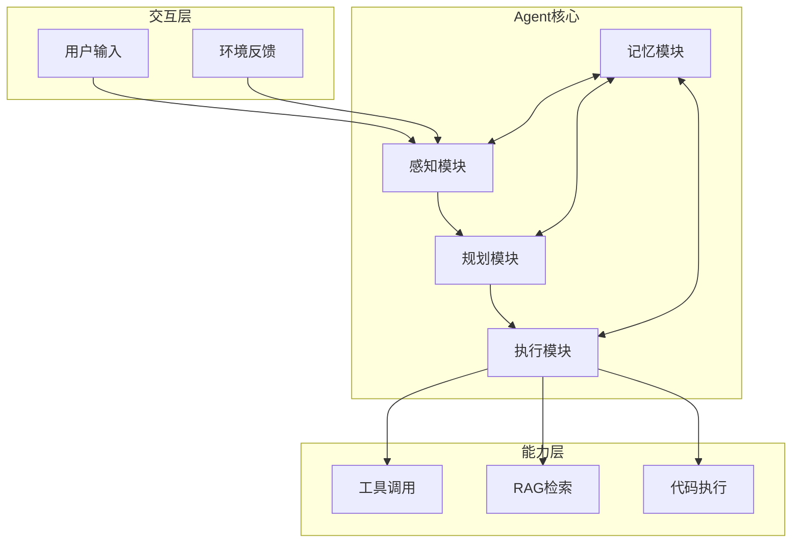
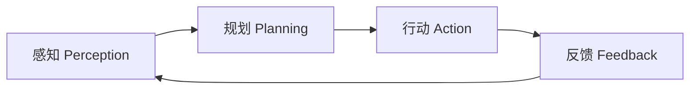
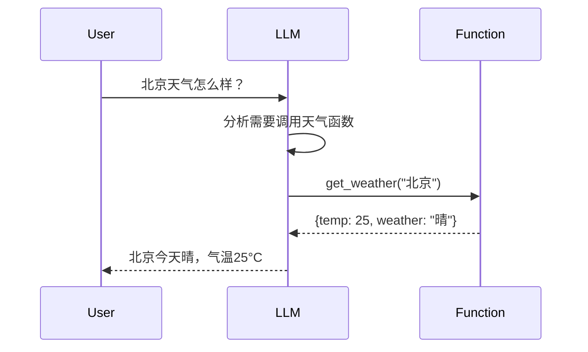
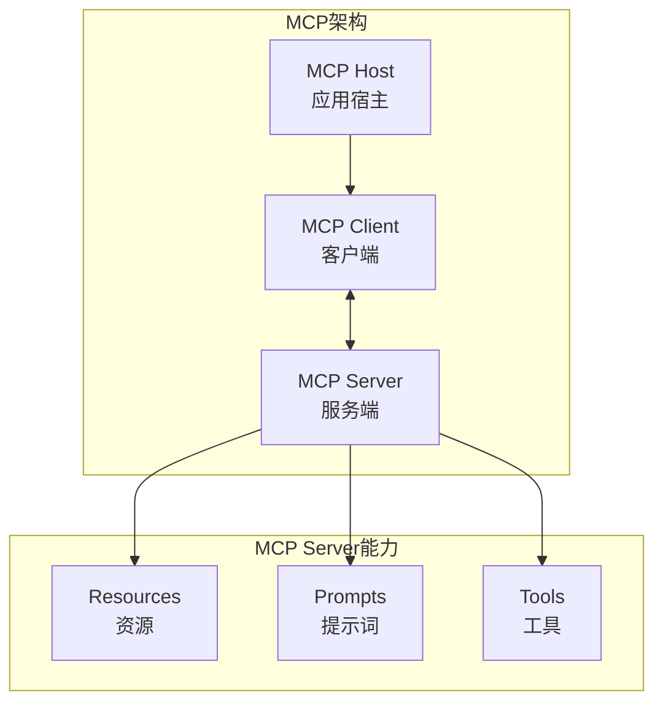
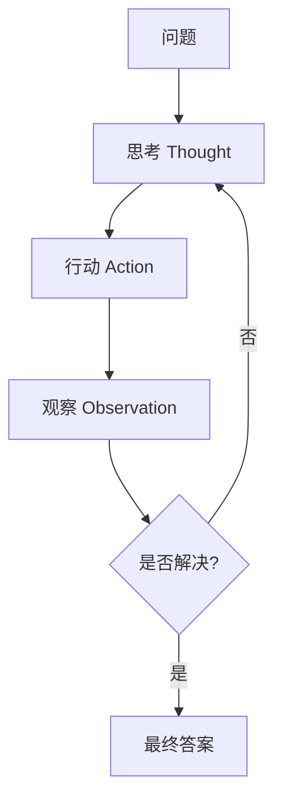
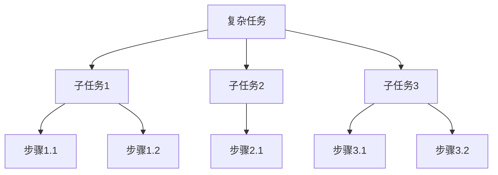
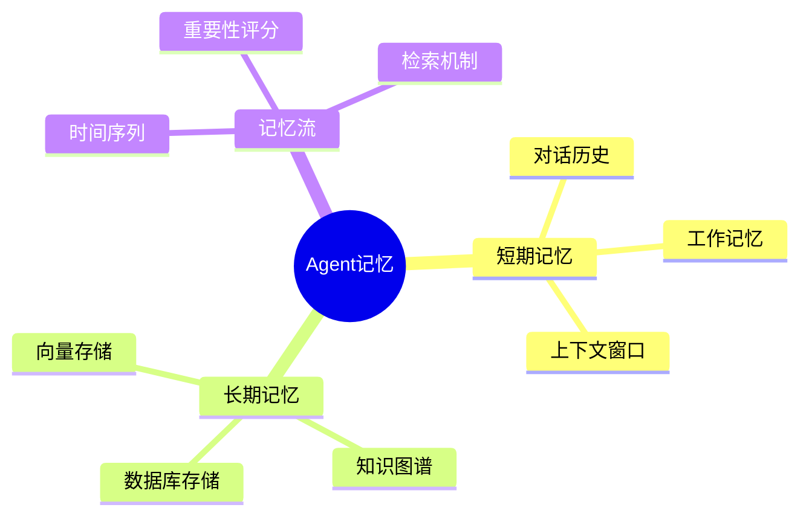

# AI Agent智能体开发

构建具有自主规划、工具调用和记忆能力的智能体系统。

## Agent架构概览

> **分层设计思想**：Agent架构采用三层设计，就像一个人一样——有"感官"接收信息、有"大脑"思考和决策、有"手脚"执行动作，还有"记忆"存储经验。
>
> - **交互层**（感官）：负责接收外部输入——用户的指令和环境的反馈。相当于Agent的"眼睛和耳朵"
> - **Agent核心层**（大脑）：包含感知、规划、执行、记忆四大模块。感知模块理解输入，规划模块制定策略，执行模块调用工具，记忆模块存储和检索信息
> - **能力层**（手脚）：提供Agent可以使用的具体能力——工具调用（调用外部API）、RAG检索（查找知识库）、代码执行（运行程序）
>
> **为什么需要分层？** 分层让每一层只关注自己的职责，修改某一层不会影响其他层。比如增加一个新工具，只需要在能力层添加，不需要改动核心层的规划逻辑。



## 核心概念

### Agent定义

Agent是一个能够**感知环境、做出决策并执行行动**的智能体。

> **通俗理解**：如果把大语言模型（LLM）比作一个"只会说话的大脑"，那么Agent就是给这个大脑装上了"手"和"眼睛"。LLM本身只能接收文本、输出文本，它不能上网搜索、不能读写文件、不能调用API。而Agent让LLM能够**主动使用工具**去完成实际任务，而不仅仅是生成文字回答。
>
> 举个例子：当你问"今天北京天气如何？"时，普通的LLM只能根据训练数据猜测或拒绝回答；而一个配备了天气查询工具的Agent，会**自己决定**调用天气API获取实时数据，然后把结果整理成自然语言回复你。这个"自己决定做什么"的能力，就是Agent的核心。

**为什么需要Agent？**

| 问题 | 没有Agent | 有Agent |
|------|----------|---------|
| 信息过时 | LLM只能回答训练数据中的知识 | 可以联网搜索最新信息 |
| 无法执行操作 | 只能输出文字建议 | 可以调用工具完成实际操作 |
| 复杂任务 | 无法拆解和规划 | 可以自主分解任务、逐步执行 |
| 缺乏记忆 | 每次对话都是全新的 | 可以记住之前的交互和知识 |



这个循环就是Agent的基本工作方式——**感知→规划→行动→反馈**，不断迭代直到任务完成。就像人解决问题一样：先观察情况，再想对策，然后动手做，做完看看效果，不满意再调整。

### Agent设计范式

> **三种范式的本质区别在于"有没有记忆"和"会不会规划"**：
>
> - **反应式**：像膝跳反射——刺激来了直接响应，不记过去、不想未来。优点是快，缺点是"蠢"。适合简单、即时的任务，比如垃圾邮件过滤
> - **深思熟虑式**：像下棋——先回忆之前的棋局（记忆），再推演各种走法（规划），然后选择最优方案。优点是聪明，缺点是慢。适合需要推理的复杂任务
> - **混合式**：像开车——巡航时用反应式（自动保持车距），遇到复杂路况切换到深思熟虑式（规划变道路线）。兼顾速度和智能，是实际应用中最常用的范式

| 范式 | 特点 | 适用场景 |
|------|------|---------|
| 反应式 Reactive | 直接映射，无记忆 | 简单任务 |
| 深思熟虑式 Deliberative | 规划推理，有记忆 | 复杂任务 |
| 混合式 Hybrid | 结合两者优势 | 通用场景 |

## Function Calling

### 基本概念

Function Calling允许LLM调用外部函数，扩展模型能力。

> **核心原理**：LLM本身并不能真正"执行"任何函数。Function Calling的本质是一个**结构化输出**问题——LLM不是直接运行代码，而是输出一个JSON格式的"函数调用指令"，告诉调用方"我应该调用哪个函数、传什么参数"。然后由你的应用程序负责真正执行这个函数，并把执行结果返回给LLM，LLM再基于结果生成最终回复。
>
> 可以把它理解为一个"翻译过程"：
> 1. 用户用自然语言提问 → LLM把问题"翻译"成函数调用指令（JSON）
> 2. 你的程序执行函数，拿到结果 → 把结果"喂回"给LLM
> 3. LLM把函数结果"翻译"成自然语言回复给用户
>
> **关键点**：LLM只负责"决定调用什么"和"整理结果"，真正的执行权始终在你的程序手中。



### 实现示例

```python
from openai import OpenAI

client = OpenAI()

tools = [
    {
        "type": "function",
        "function": {
            "name": "get_weather",
            "description": "获取指定城市的天气",
            "parameters": {
                "type": "object",
                "properties": {
                    "city": {
                        "type": "string",
                        "description": "城市名称"
                    }
                },
                "required": ["city"]
            }
        }
    }
]

def get_weather(city: str) -> dict:
    return {"city": city, "temp": 25, "weather": "晴"}

response = client.chat.completions.create(
    model="gpt-4",
    messages=[{"role": "user", "content": "北京天气怎么样？"}],
    tools=tools
)

if response.choices[0].message.tool_calls:
    tool_call = response.choices[0].message.tool_calls[0]
    args = json.loads(tool_call.function.arguments)
    result = get_weather(args["city"])
```

### 多函数调用

> **LLM如何选择调用哪个函数？** 当你给LLM提供多个工具时，LLM会根据用户的问题和每个工具的`description`（描述）来判断应该调用哪个。工具描述越清晰，LLM的选择就越准确。这就像给新员工一份工具清单——每个工具的用途写得越清楚，他拿错工具的概率就越低。
>
> **并行调用**：部分模型（如GPT-4）支持在一次响应中同时调用多个函数。比如用户问"北京和上海的天气分别怎样？"，LLM可以一次性发出两个`get_weather`调用，而不是先查北京再查上海，从而大幅提升效率。

```python
tools = [
    {
        "type": "function",
        "function": {
            "name": "search_web",
            "description": "搜索网络信息"
        }
    },
    {
        "type": "function",
        "function": {
            "name": "query_database",
            "description": "查询数据库"
        }
    }
]
```

## MCP协议

### 核心概念

MCP (Model Context Protocol) 是一种标准化的模型上下文协议。

> **为什么需要MCP？** 想象一下USB接口出现之前的场景——每个外设都有不同的接口，打印机用并口、鼠标用PS/2、键盘也是PS/2但和鼠标不通用……MCP解决的就是AI领域的"接口不统一"问题。
>
> 在MCP出现之前，每家AI厂商的Function Calling格式都不一样：OpenAI有一套、Anthropic有一套、Google又有一套。如果你想让AI应用同时对接多个工具和数据源，就得为每个厂商写不同的适配代码。MCP就像AI世界的"USB-C接口"——定义了一套统一的协议标准，让任何AI应用都能通过同一套接口连接任何工具和数据源。
>
> **MCP的核心思路**：把"AI模型"和"外部工具/数据"解耦。AI应用（Host）通过Client去发现和调用Server提供的能力，Server只负责暴露工具和数据，不需要关心是哪个AI在调用。这样，一个MCP Server写好之后，任何支持MCP的AI应用都能直接使用。



### MCP vs Function Calling

| 特性 | Function Calling | MCP |
|------|-----------------|-----|
| 范围 | 单一模型调用 | 跨应用集成 |
| 标准化 | 各厂商不同 | 统一协议 |
| 资源管理 | 无 | 支持资源访问 |
| 提示词管理 | 无 | 支持提示词模板 |

### MCP实现

```python
from mcp import ClientSession, StdioServerParameters
from mcp.client.stdio import stdio_client

server_params = StdioServerParameters(
    command="python",
    args=["mcp_server.py"]
)

async with stdio_client(server_params) as (read, write):
    async with ClientSession(read, write) as session:
        await session.initialize()
        
        tools = await session.list_tools()
        result = await session.call_tool(
            "search",
            arguments={"query": "AI发展"}
        )
```

## Agent自主规划

### 思维链 (Chain of Thought)

> **核心原理**：思维链（CoT）的灵感来自人类的思考方式——面对复杂问题时，我们不会直接蹦出答案，而是一步一步地推理。比如算"37 × 24"，你不是直接报出888，而是先算37×4=148，再算37×20=740，最后148+740=888。
>
> **为什么对LLM有效？** LLM是一个"自回归"模型，它每次只生成一个token（词），而且只能看到之前生成的内容。这意味着如果让LLM直接给出最终答案，它实际上是在"一步到位"地做推理——这非常困难。但如果你让它先写出中间步骤，每一步的生成都为下一步提供了额外的"思考空间"，相当于把一个难题拆成多个简单问题逐步解决。研究表明，CoT对于需要多步推理的任务（数学、逻辑、常识推理）效果提升尤为显著。
>
> **两种使用方式**：
> - **Zero-shot CoT**：在提示词中加一句"请一步步思考"，不需要提供示例
> - **Few-shot CoT**：提供几个带推理过程的示例，让模型模仿

```python
prompt = """
请一步步思考以下问题：

问题：小明有5个苹果，给了小红2个，又买了3个，现在有几个？

思考过程：
1. 首先，小明有5个苹果
2. 给了小红2个，剩下 5-2=3 个
3. 又买了3个，现在有 3+3=6 个
4. 答案是6个

请按照这个格式回答问题。
"""
```

### ReAct框架

ReAct = Reasoning + Acting

> **核心原理**：CoT只让模型"想"，但不让模型"做"。ReAct把**推理（Reasoning）**和**行动（Acting）**交织在一起，让Agent在思考的过程中可以实际调用工具获取信息，然后基于新信息继续思考。
>
> **ReAct vs 纯CoT的区别**：假设你问"2024年诺贝尔物理学奖得主是谁？"
> - **纯CoT**：模型只能靠记忆（训练数据）回答，如果训练数据中没有，就会瞎编
> - **ReAct**：模型先想"我需要搜索这个信息"→ 调用搜索工具 → 拿到真实结果 → 基于结果回答
>
> **ReAct循环**：`思考(Thought)` → `行动(Action)` → `观察(Observation)` → 再思考... 直到得出答案。这和人类解决问题的方式完全一致——遇到不确定的事情就去查资料，查完再继续想，而不是凭空猜测。



```python
react_prompt = """
你是一个智能助手，请使用ReAct模式回答问题。

可用工具：
- search: 搜索网络信息
- calculate: 执行数学计算

示例：
问题：北京今天天气怎么样？
思考1：我需要查询北京今天的天气
行动1：search("北京天气")
观察1：北京今天晴，气温25°C
思考2：我已经获得了天气信息
答案：北京今天天气晴朗，气温25摄氏度。

现在请回答：
问题：{question}
"""
```

### 规划算法

> **为什么需要规划？** 复杂任务无法一步完成，需要拆解成可执行的子任务。就像做一道大菜——你不能"一步做出红烧肉"，而是要先买菜→切肉→焯水→炒糖色→炖煮。规划算法就是让Agent学会这种"分步走"的能力。
>
> **两种核心思路**：
> - **自顶向下分解**：从大目标出发，逐层拆成子目标，直到每个子目标都可以直接执行。适合结构清晰的任务
> - **自底向上组合**：先确定可用的原子操作，再组合它们来完成大任务。适合操作明确但组合方式多样的任务

#### 任务分解



```python
def decompose_task(task: str) -> list:
    prompt = f"""
    请将以下任务分解为具体的子任务：
    
    任务：{task}
    
    请以JSON格式输出子任务列表。
    """
    
    response = llm.invoke(prompt)
    return json.loads(response)
```

## Agent记忆能力

### 为什么Agent需要记忆？

> LLM天生是"无状态"的——每次对话都像失忆了一样，不记得之前说过什么。这在简单问答中问题不大，但在需要多轮交互的Agent场景中就成了致命缺陷。
>
> 想象你和一个每次见面都不认识你的助手合作：每次你都要重新介绍自己、重新解释项目背景、重新说明偏好……效率极低。Agent的记忆机制就是为了解决这个问题，让Agent像人一样能够"记住"过去的经历和知识。
>
> **人类记忆的类比**：
> - **短期记忆** ≈ 你的"工作记忆"：比如你在心算时临时记住的中间数字，容量有限，用完就忘
> - **长期记忆** ≈ 你的"知识库"：比如你的名字、专业技能，可以持久保存，需要时回忆
> - **记忆流** ≈ 你的"日记本"：按时间顺序记录经历，重要的事情记得更牢，需要时翻阅查找

### 记忆类型



### 短期记忆实现

> **原理**：短期记忆就是"把对话历史塞进Prompt里"。每次调用LLM时，把之前的对话记录作为上下文一起发送，这样LLM就能"看到"之前的交流内容。它的局限是**上下文窗口有限**——当对话太长时，要么截断旧消息，要么摘要压缩，否则会超出模型的token限制。
>
> **常见策略**：
> - **滑动窗口**：只保留最近N轮对话，更早的丢弃
> - **摘要压缩**：用LLM把旧对话总结成一段摘要，替代原始内容
> - **Token限制管理**：动态计算当前上下文长度，确保不超限

```python
from langchain.memory import ConversationBufferMemory

memory = ConversationBufferMemory(
    memory_key="chat_history",
    return_messages=True
)

memory.save_context(
    {"input": "你好"},
    {"output": "你好！有什么可以帮助你的？"}
)

history = memory.load_memory_variables({})
```

### 长期记忆实现

> **原理**：长期记忆解决的是"跨会话、跨任务"的记忆需求。它不能简单地把所有历史塞进Prompt（太长了），而是采用**"存进去→按需检索"**的模式：
> 1. **存储**：把重要信息提取出来，转成向量（Embedding），存入向量数据库
> 2. **检索**：当需要回忆时，把当前问题也转成向量，在数据库中找最相关的内容
> 3. **使用**：把检索到的相关记忆注入到Prompt中，让LLM"想起来"
>
> **为什么用向量？** 向量检索的核心思想是"语义相似度"。比如用户之前说过"我喜欢吃火锅"，当后来聊到"推荐晚餐"时，系统通过向量相似度能自动关联到这条记忆，即使用词完全不同。这比关键词匹配智能得多。
>
> **长期记忆 vs 短期记忆**：
>
> | 维度 | 短期记忆 | 长期记忆 |
> |------|---------|---------|
> | 存储位置 | Prompt上下文 | 向量数据库/知识图谱 |
> | 容量 | 受Token限制（几千~几十万） | 几乎无限 |
> | 持久性 | 会话结束即消失 | 跨会话持久保存 |
> | 检索方式 | 全量包含 | 语义检索相关片段 |

```python
from langchain.memory import VectorStoreRetrieverMemory
from langchain_community.vectorstores import FAISS

embeddings = OpenAIEmbeddings()
vectorstore = FAISS.from_texts([], embeddings)

memory = VectorStoreRetrieverMemory(
    retriever=vectorstore.as_retriever()
)

memory.save_context(
    {"input": "我叫小明"},
    {"output": "好的，我记住了你叫小明"}
)
```

### 记忆流 (Memory Stream)

> **起源**：记忆流来自斯坦福大学2023年的论文《Generative Agents: Interactive Simulacra of Human Behavior》，该论文模拟了一个有25个AI居民的小镇，每个居民都有完整的记忆系统。
>
> **核心思想**：人的记忆不是简单的"存取"关系，而是按时间流动的——每时每刻都在产生新记忆，但并非所有记忆都同等重要。记忆流模拟了这一特点：
>
> 1. **持续记录**：Agent的每一次观察、对话、行动都被记录为一条"记忆"，带时间戳存入记忆流
> 2. **重要性评分**：每条记忆都有一个重要性分数（0-10），"吃了早餐"可能只有1分，"和某人吵架"可能有8分。重要性越高的记忆越容易被检索到
> 3. **检索三要素**：检索记忆时综合考虑三个维度：
>    - **时效性（Recency）**：越近的记忆权重越高（指数衰减）
>    - **重要性（Importance）**：越重要的事件权重越高
>    - **相关性（Relevance）**：与当前情境越相关权重越高
>
> **为什么记忆流比简单的向量检索更好？** 因为它考虑了"时间"这个维度。你不会因为昨天吃了个苹果今天就特别想吃苹果，但你会因为刚吵了架而心情不好。时效性 + 重要性 + 相关性的组合，让Agent的记忆行为更接近真实人类。

```python
from datetime import datetime
from typing import List, Dict
import heapq

class MemoryStream:
    def __init__(self):
        self.memories: List[Dict] = []
    
    def add_memory(self, content: str, importance: float):
        memory = {
            "content": content,
            "timestamp": datetime.now(),
            "importance": importance
        }
        self.memories.append(memory)
    
    def retrieve(self, query: str, k: int = 5):
        scored_memories = [
            (self._score_relevance(m, query), m)
            for m in self.memories
        ]
        return heapq.nlargest(k, scored_memories)
    
    def _score_relevance(self, memory, query):
        return memory["importance"]
```

## Agent效果评估

### 评估维度

| 维度 | 指标 | 方法 |
|------|------|------|
| 任务完成率 | 成功/失败 | 人工评估 |
| 效率 | 步骤数、时间 | 自动统计 |
| 准确性 | 正确率 | 自动评估 |
| 鲁棒性 | 异常处理 | 边界测试 |

### 大海捞针测试

> **在测什么？** 这个测试评估的是Agent在**长文本中精准定位关键信息**的能力。随着上下文窗口越来越大（GPT-4支持128K token），一个关键问题是：LLM真的能"看到"长文本中间的信息吗？还是会"走神"漏掉？
>
> **为什么随机化位置？** 研究发现LLM存在"中间位置盲区"——位于上下文开头和结尾的信息更容易被注意到，而中间位置的信息容易被忽略。随机化针的位置可以全面评估不同位置的检索能力，绘制出"注意力分布图"。

```python
def needle_in_haystack_test(agent, context_length: int):
    needle = "特殊标记信息：密码是123456"
    haystack = generate_random_text(context_length)
    
    position = random.randint(0, len(haystack))
    test_text = haystack[:position] + needle + haystack[position:]
    
    query = "密码是什么？"
    response = agent.query(test_text, query)
    
    return "123456" in response
```

### 多跳推理评估

> **什么是"多跳"？** 单跳推理只需要一步就能得到答案（"中国的首都是哪里？"→北京）。多跳推理需要**跨越多个信息源、经过多步推理**才能得到答案（"中国首都的市长是谁？"→先确定首都是北京→再查北京市长是谁）。每一"跳"都依赖上一跳的结果，任何一跳出错都会导致最终答案错误。
>
> **为什么多跳推理更难？** 因为它要求Agent具备**信息串联能力**——不仅要能检索到每一步的信息，还要能把前一步的结论作为下一步的输入。这就像侦探破案，不能只看一条线索，而是要把多条线索串联起来才能推出真相。

```python
def multi_hop_evaluation(agent):
    questions = [
        {
            "q": "A公司的CEO是谁？",
            "requires": ["A公司信息"]
        },
        {
            "q": "A公司CEO的母校在哪里？",
            "requires": ["A公司CEO", "CEO教育背景"]
        }
    ]
    
    results = []
    for q in questions:
        response = agent.query(q["q"])
        results.append(evaluate_response(response, q))
    
    return results
```

## 最佳实践

### 1. 幻觉控制

> **什么是幻觉？** LLM的"幻觉"（Hallucination）是指模型自信地编造不存在的事实。比如你问"张三的出生日期"，如果训练数据中没有张三的信息，模型不会说"我不知道"，而是可能编造一个看起来合理的日期。这是因为LLM的本质是"预测下一个最可能的词"，而不是"检索事实"。
>
> **控制幻觉的核心策略**：
> - **承认无知**：明确告诉模型"不知道就说不知道"，比"尽量回答"更安全
> - **基于证据**：要求模型只基于提供的信息回答，不要发挥
> - **事实与推测分离**：让模型明确标注哪些是事实、哪些是推测

```python
def control_hallucination(agent, query):
    prompt = f"""
    回答问题时请遵循以下原则：
    1. 如果不确定，请明确说明
    2. 只使用已知事实回答
    3. 区分事实和推测
    
    问题：{query}
    """
    return agent.invoke(prompt)
```

### 2. 人机协作

> **为什么需要人机协作？** Agent不是万能的，在关键决策点引入人类判断可以避免严重错误。这就像自动驾驶——高速巡航可以自动，但复杂路况还是需要人类接管。
>
> **Human-in-the-Loop（人在回路）** 的核心思想是：Agent自主处理常规任务，但在高风险、高不确定性或高影响的决策点，暂停执行并请求人类确认。这样既保持了自动化效率，又确保了安全性。

```python
def human_in_the_loop(agent, task):
    plan = agent.plan(task)
    
    approval = input(f"计划：{plan}\n是否批准？(y/n)")
    
    if approval == "y":
        return agent.execute(plan)
    else:
        return agent.revise_plan(task)
```

### 3. 错误恢复

> **为什么需要错误恢复？** Agent在执行过程中难免出错——API调用失败、工具返回异常、LLM输出格式不对……如果没有错误恢复机制，一次失败就会导致整个任务崩溃。
>
> **核心策略**：不是简单地重试，而是让Agent**反思错误原因**并调整策略。就像人做错题后不是盲目重做，而是先分析错在哪里、换个方法再试。这种"反思→调整→重试"的循环，是Agent鲁棒性的关键。

```python
def robust_execution(agent, action, max_retries=3):
    for i in range(max_retries):
        try:
            return agent.execute(action)
        except Exception as e:
            if i == max_retries - 1:
                raise
            agent.reflect_on_error(e)
```

## 小结

Agent开发是构建智能系统的核心：

1. **Function Calling**：工具调用能力
2. **MCP协议**：标准化上下文协议
3. **自主规划**：CoT、ReAct、任务分解
4. **记忆能力**：短期、长期、记忆流
5. **效果评估**：任务完成率、大海捞针、多跳推理
