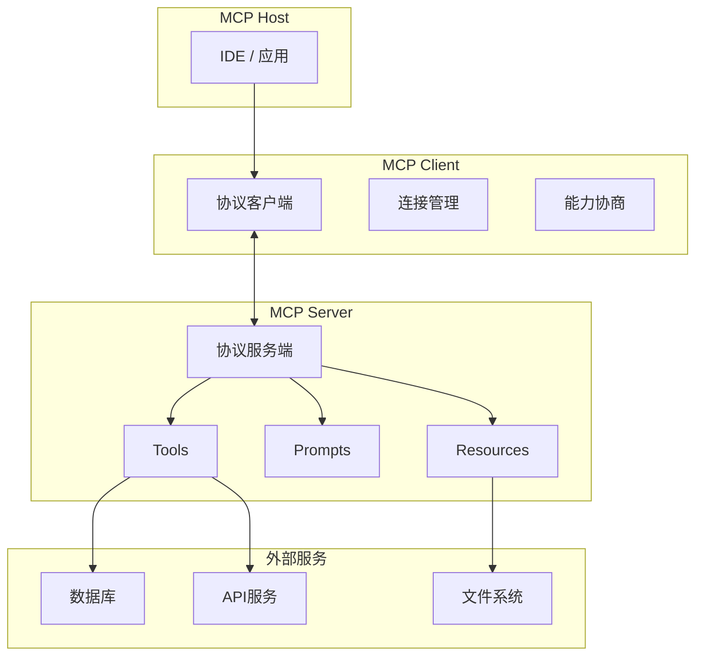
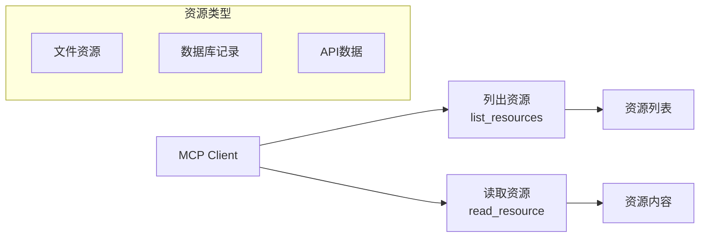
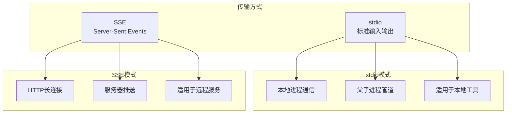
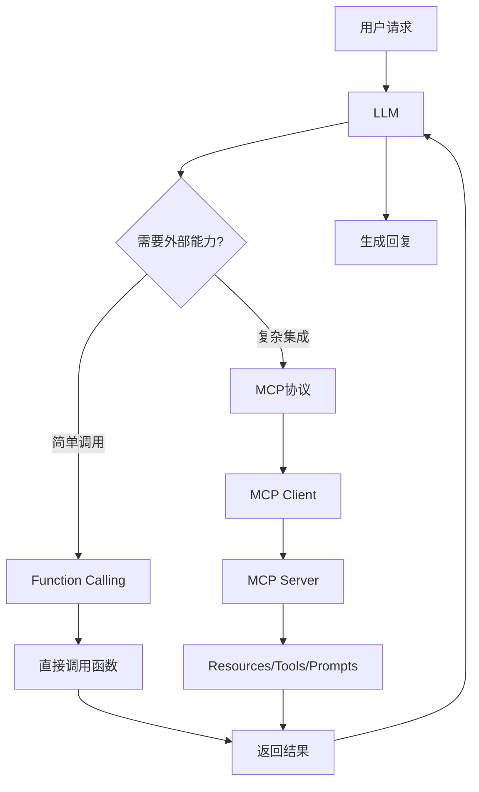
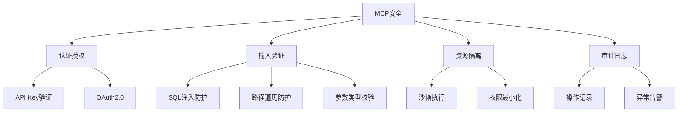

# MCP协议深度解析

MCP (Model Context Protocol) 是由Anthropic提出的标准化模型上下文协议，旨在解决AI模型与外部工具、数据源之间的互操作性问题。

## MCP核心架构

### 整体架构



### 核心概念

| 概念 | 描述 | 类比 |
|------|------|------|
| Host | 运行AI模型的应用程序 | 浏览器 |
| Client | 与Server建立连接的协议客户端 | 浏览器标签页 |
| Server | 提供能力的服务端 | Web服务器 |
| Resources | 可读取的数据资源 | 静态文件 |
| Prompts | 可复用的提示词模板 | API模板 |
| Tools | 可调用的功能函数 | API端点 |

## MCP三大能力

> **为什么恰好是这三种能力？** 想象Agent是一个新入职的员工，它需要三种东西才能工作：
> 1. **资料库**（Resources）——员工需要查阅公司文档、数据库等参考资料
> 2. **操作手册**（Prompts）——员工需要标准化的工作流程模板，避免每次从零开始
> 3. **工具箱**（Tools）——员工需要实际操作的工具（发邮件、查数据库、写代码等）
>
> 这三种能力覆盖了Agent与外部世界交互的全部需求：**读数据、用模板、调工具**。

### 1. Resources（资源）

Resources是MCP Server暴露的可读取数据，类似于REST API中的GET请求。

> **为什么Agent需要读取外部数据？** LLM的知识停留在训练截止日期，而且不可能包含你的私有数据（公司文档、数据库记录等）。Resources让Agent能够"查阅"它原本不知道的信息，就像人类员工查阅公司内部文档一样——不需要把所有知识都装在脑子里，需要时去查就行。



**资源定义示例**

```python
from mcp.server import Server
from mcp.types import Resource, TextContent

server = Server("example-server")

@server.list_resources()
async def list_resources() -> list[Resource]:
    return [
        Resource(
            uri="file:///docs/readme.md",
            name="项目说明文档",
            description="项目的README文档",
            mimeType="text/markdown"
        ),
        Resource(
            uri="db:///users/recent",
            name="最近活跃用户",
            description="最近7天活跃的用户列表",
            mimeType="application/json"
        )
    ]

@server.read_resource()
async def read_resource(uri) -> str:
    if uri == "file:///docs/readme.md":
        with open("docs/readme.md") as f:
            return f.read()
    elif uri == "db:///users/recent":
        return json.dumps(get_recent_users())
```

**资源URI规范**

| 协议 | 格式 | 示例 |
|------|------|------|
| 文件 | `file:///path` | `file:///docs/api.md` |
| 数据库 | `db:///table/query` | `db:///users/active` |
| HTTP | `https://api.example.com/data` | `https://api.company.com/orders` |
| 自定义 | `custom:///identifier` | `git:///repo/commits` |

### 2. Prompts（提示词模板）

Prompts是可复用的提示词模板，支持参数化配置。

> **为什么需要提示词模板？** 好的提示词（Prompt）往往经过反复调试才能写好。如果每次使用都重新写一遍，不仅效率低，还可能因为措辞差异导致效果不稳定。Prompts把经过验证的提示词存成模板，使用时只需传入参数即可——就像函数调用一样，定义一次、反复使用。比如"代码审查"模板，只需传入编程语言和审查重点，就能生成专业的审查提示词。

```python
@server.list_prompts()
async def list_prompts() -> list[Prompt]:
    return [
        Prompt(
            name="code_review",
            description="代码审查提示词",
            arguments=[
                PromptArgument(
                    name="language",
                    description="编程语言",
                    required=True
                ),
                PromptArgument(
                    name="focus",
                    description="审查重点",
                    required=False
                )
            ]
        )
    ]

@server.get_prompt()
async def get_prompt(name: str, arguments: dict) -> list[PromptMessage]:
    if name == "code_review":
        language = arguments["language"]
        focus = arguments.get("focus", "代码质量")
        
        return [
            PromptMessage(
                role="user",
                content=TextContent(
                    type="text",
                    text=f"""请审查以下{language}代码，重点关注{focus}：

1. 代码质量和可读性
2. 潜在的Bug和安全问题
3. 性能优化建议
4. 最佳实践遵循情况

请提供具体的改进建议。"""
                )
            )
        ]
```

### 3. Tools（工具）

Tools是MCP Server暴露的可调用函数，类似于Function Calling但具有标准化接口。

> **MCP Tools vs Function Calling的关系**：Function Calling是"一家之言"——每个AI厂商有自己的格式和调用方式。MCP的Tools则是"行业标准"——定义了统一的工具描述格式（inputSchema）和调用接口（call_tool），任何AI应用都能通过同一套协议来发现和调用工具。可以把MCP Tools理解为"标准化的Function Calling"——功能一样，但接口统一了。

```python
from mcp.types import Tool, TextContent

@server.list_tools()
async def list_tools() -> list[Tool]:
    return [
        Tool(
            name="search_documents",
            description="搜索文档库中的相关内容",
            inputSchema={
                "type": "object",
                "properties": {
                    "query": {
                        "type": "string",
                        "description": "搜索关键词"
                    },
                    "top_k": {
                        "type": "integer",
                        "description": "返回结果数量",
                        "default": 5
                    }
                },
                "required": ["query"]
            }
        ),
        Tool(
            name="execute_sql",
            description="执行SQL查询并返回结果",
            inputSchema={
                "type": "object",
                "properties": {
                    "sql": {
                        "type": "string",
                        "description": "SQL查询语句"
                    },
                    "database": {
                        "type": "string",
                        "description": "数据库名称",
                        "default": "main"
                    }
                },
                "required": ["sql"]
            }
        )
    ]

@server.call_tool()
async def call_tool(name: str, arguments: dict) -> list[TextContent]:
    if name == "search_documents":
        results = search_docs(arguments["query"], arguments.get("top_k", 5))
        return [TextContent(type="text", text=json.dumps(results, ensure_ascii=False))]
    elif name == "execute_sql":
        result = execute_query(arguments["sql"], arguments.get("database", "main"))
        return [TextContent(type="text", text=json.dumps(result, ensure_ascii=False))]
```

## MCP通信机制

### 传输协议

> **为什么需要两种传输方式？** MCP的使用场景分两种：
> - **本地工具**（如文件操作、本地数据库）：MCP Server和AI应用运行在同一台机器上，用**stdio**最简单——启动一个子进程，通过标准输入/输出管道通信，无需网络配置
> - **远程服务**（如云数据库、在线API）：MCP Server可能在另一台服务器上，需要**SSE**通过HTTP长连接通信，支持跨网络访问
>
> **选择原则**：本地用stdio（简单、低延迟、无需端口），远程用SSE（跨网络、可扩展）。大多数开发场景先用stdio，需要远程访问时再切换到SSE。



### stdio传输

```python
from mcp.server.stdio import stdio_server

async def main():
    async with stdio_server() as (read_stream, write_stream):
        await server.run(
            read_stream,
            write_stream,
            server.create_initialization_options()
        )
```

### SSE传输

```python
from mcp.server.sse import SseServerTransport
from starlette.applications import Starlette

sse = SseServerTransport("/messages/")

app = Starlette(
    routes=[
        sse.get_sse_app("/messages/")
    ],
    lifespan=lifespan
)

async def lifespan(app):
    async with sse.run_server() as (read_stream, write_stream):
        await server.run(
            read_stream,
            write_stream,
            server.create_initialization_options()
        )
```

### 消息格式

**JSON-RPC 2.0协议**

> **为什么选择JSON-RPC？** JSON-RPC 2.0是一个轻量级的远程调用协议，MCP选择它有三个原因：
> 1. **简单**：只有请求和响应两种消息格式，没有REST那样复杂的HTTP语义
> 2. **双向**：支持双向通信——Client可以调Server，Server也可以主动通知Client（比如资源变更通知）
> 3. **标准化**：JSON-RPC是成熟的标准协议，各语言都有现成的库，不需要自己造轮子

```json
{
    "jsonrpc": "2.0",
    "id": 1,
    "method": "tools/call",
    "params": {
        "name": "search_documents",
        "arguments": {
            "query": "MCP协议",
            "top_k": 3
        }
    }
}
```

**响应格式**

```json
{
    "jsonrpc": "2.0",
    "id": 1,
    "result": {
        "content": [
            {
                "type": "text",
                "text": "[{\"title\": \"MCP协议介绍\", \"content\": \"...\"}]"
            }
        ]
    }
}
```

## MCP Client开发

### 连接管理

```python
from mcp import ClientSession, StdioServerParameters
from mcp.client.stdio import stdio_client

class MCPClientManager:
    """MCP客户端管理器，管理多个MCP Server连接"""
    
    def __init__(self):
        self.sessions: dict[str, ClientSession] = {}
        self.tools: list[dict] = []
    
    async def connect_server(self, name: str, command: str, args: list[str] = None):
        """连接到MCP Server"""
        server_params = StdioServerParameters(
            command=command,
            args=args or []
        )
        
        read_stream, write_stream = await stdio_client(server_params).__aenter__()
        session = await ClientSession(read_stream, write_stream).__aenter__()
        await session.initialize()
        
        self.sessions[name] = session
        
        tools_result = await session.list_tools()
        for tool in tools_result.tools:
            self.tools.append({
                "server": name,
                "tool": tool
            })
    
    async def call_tool(self, tool_name: str, arguments: dict):
        """调用指定工具"""
        for item in self.tools:
            if item["tool"].name == tool_name:
                session = self.sessions[item["server"]]
                result = await session.call_tool(tool_name, arguments)
                return result
        raise ValueError(f"工具 {tool_name} 不存在")
    
    async def list_all_tools(self):
        """列出所有可用工具"""
        return [
            {
                "name": item["tool"].name,
                "description": item["tool"].description,
                "server": item["server"],
                "schema": item["tool"].inputSchema
            }
            for item in self.tools
        ]
```

### 与LLM集成

```python
from openai import OpenAI

class MCPAgent:
    """基于MCP的智能Agent"""
    
    def __init__(self, mcp_manager: MCPClientManager):
        self.mcp = mcp_manager
        self.client = OpenAI()
    
    async def chat(self, user_message: str) -> str:
        """处理用户消息"""
        tools = await self._build_openai_tools()
        
        messages = [{"role": "user", "content": user_message}]
        
        response = self.client.chat.completions.create(
            model="gpt-4",
            messages=messages,
            tools=tools
        )
        
        while response.choices[0].message.tool_calls:
            tool_call = response.choices[0].message.tool_calls[0]
            messages.append(response.choices[0].message)
            
            result = await self.mcp.call_tool(
                tool_call.function.name,
                json.loads(tool_call.function.arguments)
            )
            
            messages.append({
                "role": "tool",
                "tool_call_id": tool_call.id,
                "content": result.content[0].text
            })
            
            response = self.client.chat.completions.create(
                model="gpt-4",
                messages=messages,
                tools=tools
            )
        
        return response.choices[0].message.content
    
    async def _build_openai_tools(self) -> list[dict]:
        """将MCP工具转换为OpenAI Function Calling格式"""
        mcp_tools = await self.mcp.list_all_tools()
        return [
            {
                "type": "function",
                "function": {
                    "name": tool["name"],
                    "description": tool["description"],
                    "parameters": tool["schema"]
                }
            }
            for tool in mcp_tools
        ]
```

## MCP Server开发实战

### 文件系统Server

```python
import os
from mcp.server import Server
from mcp.types import Resource, Tool, TextContent
from mcp.server.stdio import stdio_server

server = Server("filesystem-server")

@server.list_resources()
async def list_resources() -> list[Resource]:
    """列出工作目录下的文件资源"""
    resources = []
    for root, dirs, files in os.walk("./workspace"):
        for f in files:
            filepath = os.path.join(root, f)
            resources.append(Resource(
                uri=f"file://{filepath}",
                name=os.path.basename(filepath),
                description=f"文件: {filepath}",
                mimeType=_guess_mime_type(filepath)
            ))
    return resources

@server.read_resource()
async def read_resource(uri) -> str:
    """读取文件内容"""
    filepath = uri.replace("file://", "")
    with open(filepath, "r", encoding="utf-8") as f:
        return f.read()

@server.list_tools()
async def list_tools() -> list[Tool]:
    return [
        Tool(
            name="write_file",
            description="写入文件内容",
            inputSchema={
                "type": "object",
                "properties": {
                    "path": {"type": "string", "description": "文件路径"},
                    "content": {"type": "string", "description": "文件内容"}
                },
                "required": ["path", "content"]
            }
        ),
        Tool(
            name="search_in_files",
            description="在文件中搜索关键词",
            inputSchema={
                "type": "object",
                "properties": {
                    "pattern": {"type": "string", "description": "搜索模式"},
                    "directory": {"type": "string", "description": "搜索目录"}
                },
                "required": ["pattern"]
            }
        )
    ]

@server.call_tool()
async def call_tool(name: str, arguments: dict) -> list[TextContent]:
    if name == "write_file":
        with open(arguments["path"], "w", encoding="utf-8") as f:
            f.write(arguments["content"])
        return [TextContent(type="text", text=f"文件已写入: {arguments['path']}")]
    elif name == "search_in_files":
        results = _search_files(arguments["pattern"], arguments.get("directory", "."))
        return [TextContent(type="text", text=json.dumps(results))]
```

### 数据库Server

```python
import sqlite3
from mcp.server import Server
from mcp.types import Resource, Tool, TextContent

server = Server("database-server")

def get_db():
    return sqlite3.connect("app.db")

@server.list_resources()
async def list_resources() -> list[Resource]:
    """列出数据库表"""
    db = get_db()
    cursor = db.execute("SELECT name FROM sqlite_master WHERE type='table'")
    tables = cursor.fetchall()
    db.close()
    
    return [
        Resource(
            uri=f"db:///{table[0]}/schema",
            name=f"{table[0]}表结构",
            description=f"数据库表 {table[0]} 的Schema信息"
        )
        for table in tables
    ]

@server.list_tools()
async def list_tools() -> list[Tool]:
    return [
        Tool(
            name="query",
            description="执行SQL查询（只读）",
            inputSchema={
                "type": "object",
                "properties": {
                    "sql": {"type": "string", "description": "SELECT查询语句"}
                },
                "required": ["sql"]
            }
        )
    ]

@server.call_tool()
async def call_tool(name: str, arguments: dict) -> list[TextContent]:
    if name == "query":
        sql = arguments["sql"].strip()
        if not sql.upper().startswith("SELECT"):
            return [TextContent(type="text", text="仅允许SELECT查询")]
        
        db = get_db()
        try:
            cursor = db.execute(sql)
            columns = [desc[0] for desc in cursor.description]
            rows = cursor.fetchall()
            result = [dict(zip(columns, row)) for row in rows]
            return [TextContent(type="text", text=json.dumps(result, ensure_ascii=False))]
        finally:
            db.close()
```

## MCP vs Function Calling

### 详细对比

| 维度 | Function Calling | MCP |
|------|-----------------|-----|
| 标准化 | 各厂商自定义 | 统一开放协议 |
| 工具发现 | 需硬编码工具列表 | 动态发现可用工具 |
| 资源访问 | 无原生支持 | Resources原生支持 |
| 提示词管理 | 无原生支持 | Prompts模板管理 |
| 连接管理 | 无 | 多Server连接管理 |
| 传输协议 | API调用 | stdio / SSE |
| 跨应用复用 | 困难 | 标准化可复用 |
| 生态 | 封闭 | 开放 |

### 协同使用



**选择建议**

| 场景 | 推荐方案 | 原因 |
|------|---------|------|
| 单一模型简单工具调用 | Function Calling | 简单直接 |
| 多工具多数据源集成 | MCP | 标准化互操作 |
| IDE/编辑器集成 | MCP | 动态发现能力 |
| 企业级多系统对接 | MCP | 统一协议管理 |
| 快速原型开发 | Function Calling | 开发速度快 |

## MCP生态工具

### 主流MCP Server

| Server | 功能 | 适用场景 |
|--------|------|---------|
| @anthropic/filesystem | 文件系统操作 | 代码编辑、文档管理 |
| @anthropic/github | GitHub操作 | 代码管理、PR审查 |
| @anthropic/postgres | PostgreSQL数据库 | 数据查询分析 |
| @anthropic/brave-search | 网络搜索 | 信息检索 |
| @anthropic/slack | Slack消息 | 团队协作 |
| @anthropic/google-maps | 地图服务 | 位置相关应用 |

### Claude Desktop配置

```json
{
    "mcpServers": {
        "filesystem": {
            "command": "npx",
            "args": [
                "-y",
                "@anthropic/mcp-filesystem",
                "/path/to/workspace"
            ]
        },
        "github": {
            "command": "npx",
            "args": [
                "-y",
                "@anthropic/mcp-github"
            ],
            "env": {
                "GITHUB_TOKEN": "your-token"
            ]
        },
        "postgres": {
            "command": "npx",
            "args": [
                "-y",
                "@anthropic/mcp-postgres",
                "postgresql://localhost/mydb"
            ]
        }
    }
}
```

## 安全与最佳实践

### 安全考虑

> **MCP安全为什么比普通API更关键？** 因为Agent可以**自主决定**调用哪些工具、传什么参数。普通API的调用者是程序员写的代码，行为可预测；但MCP的工具调用者是LLM，它的行为不完全可控——可能被恶意输入诱导去执行危险操作（比如读取敏感文件、删除数据库记录）。因此MCP的安全防护必须更加严格。



### 安全实现

```python
import os
from pathlib import Path

ALLOWED_DIRECTORIES = ["/workspace", "/tmp/uploads"]

def validate_path(path: str) -> bool:
    """验证文件路径是否在允许范围内"""
    resolved = Path(path).resolve()
    return any(
        str(resolved).startswith(allowed)
        for allowed in ALLOWED_DIRECTORIES
    )

def sanitize_sql(sql: str) -> str:
    """SQL安全检查"""
    forbidden = ["DROP", "DELETE", "UPDATE", "INSERT", "ALTER", "CREATE"]
    upper_sql = sql.upper().strip()
    for keyword in forbidden:
        if upper_sql.startswith(keyword):
            raise ValueError(f"禁止执行 {keyword} 操作")
    return sql
```

### 最佳实践

1. **工具设计原则**
   - 单一职责：每个工具只做一件事
   - 清晰描述：提供准确的工具描述和参数说明
   - 错误处理：返回有意义的错误信息
   - 幂等性：相同输入产生相同结果

   > **什么是幂等性？** 幂等性是指同一个操作执行一次和执行多次的效果相同。比如"查询天气"是幂等的（查多少次结果一样），但"发送邮件"不是幂等的（调用三次就发三封邮件）。在MCP中，Agent可能因为网络超时而重试调用，如果工具不是幂等的，重试就会导致重复操作。设计工具时尽量让操作幂等，或者提供去重机制。

2. **资源管理**
   - 使用URI规范标识资源
   - 实现资源变更通知
   - 控制资源访问权限

   > **路径遍历攻击**：如果MCP Server的文件读取工具没有校验路径，攻击者可以构造`../../../etc/passwd`这样的路径来读取系统敏感文件。因此必须验证所有文件操作都在允许的目录范围内。

3. **性能优化**
   - 工具结果缓存
   - 异步非阻塞处理
   - 合理的超时设置

## 小结

MCP协议是AI应用互操作性的重要标准：

1. **三大能力**：Resources、Prompts、Tools
2. **通信机制**：stdio和SSE两种传输方式
3. **开发模式**：Client-Server架构，支持动态发现
4. **生态工具**：文件系统、数据库、搜索等现成Server
5. **安全实践**：认证授权、输入验证、资源隔离
