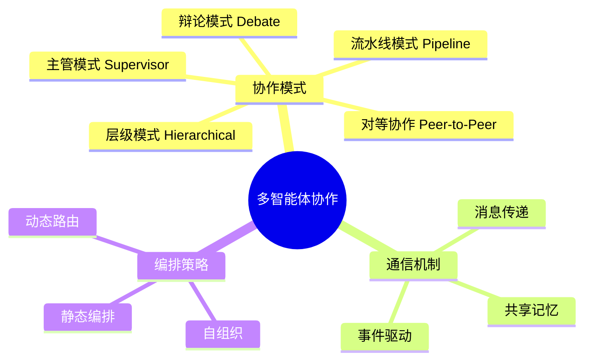
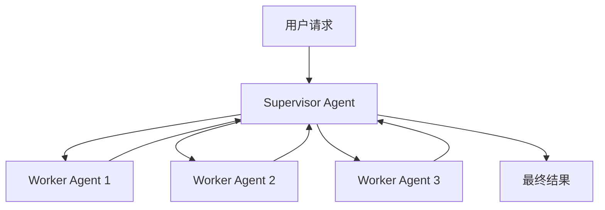
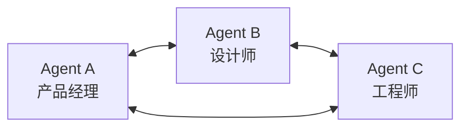
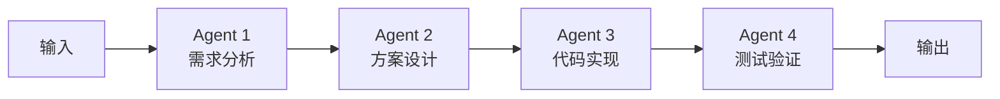
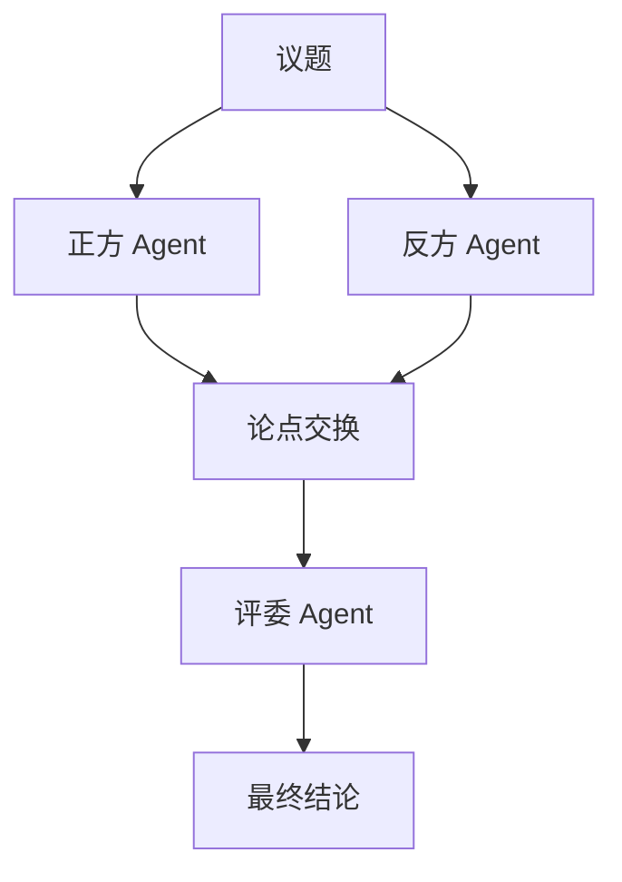
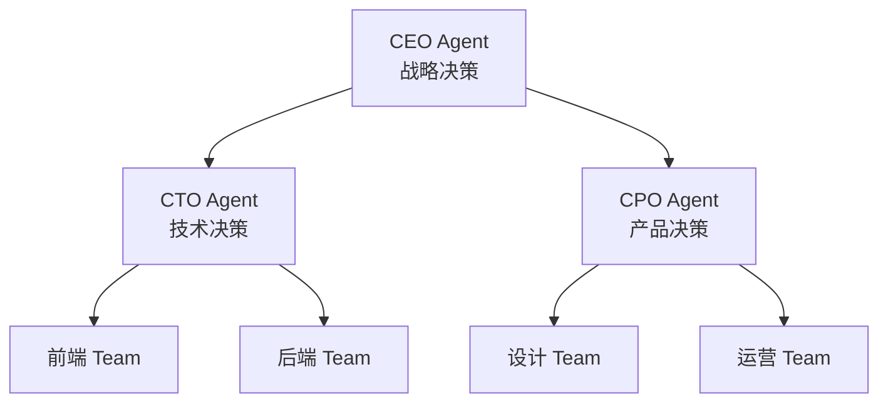

# 多智能体协作模式

多智能体系统（Multi-Agent System, MAS）通过多个Agent的协作与分工，解决单一Agent难以处理的复杂任务。

> **为什么需要多Agent？** 单个Agent的能力有上限——一个Agent很难同时擅长写代码、做设计、搞分析。就像一个人不可能同时是顶级程序员、顶级设计师和顶级产品经理。多Agent系统的核心思想是**分而治之**：让每个Agent专注自己擅长的领域，通过协作完成超出任何单个Agent能力范围的复杂任务。
>
> **单Agent的局限**：
> - **上下文窗口有限**：任务越复杂，需要的背景信息越多，容易超出Token限制
> - **角色冲突**：让一个Agent同时扮演多个角色，提示词会变得混乱，输出质量下降
> - **单点故障**：一个Agent出错，整个任务就失败了
>
> **多Agent的优势**：每个Agent的Prompt更短更聚焦、角色分工更清晰、可以并行处理子任务、一个Agent失败不影响其他Agent。

## 协作模式概览



## 五种核心协作模式

### 1. 主管模式 (Supervisor)

一个中央Agent负责分配任务和汇总结果。

> **核心原理**：就像公司里的项目经理——他不一定亲自干活，但负责理解需求、分配任务、汇总结果。主管Agent接收用户请求后，判断应该交给哪个Worker处理，Worker完成后把结果汇报给主管，主管再整合成最终答案。
>
> **优势**：全局视角、统一调度，避免多个Worker各自为政。**风险**：主管成为瓶颈——如果主管判断失误（分错任务），整个流程就会走偏。



```python
from typing import Annotated
from langchain_openai import ChatOpenAI
from langgraph.graph import StateGraph, START, END
from langgraph.graph.message import add_messages
from typing_extensions import TypedDict

class State(TypedDict):
    messages: Annotated[list, add_messages]

model = ChatOpenAI(model="gpt-4")

def supervisor_node(state: State):
    """主管Agent：分析任务并分配给合适的Worker"""
    last_message = state["messages"][-1]
    
    prompt = f"""你是一个任务分配主管。分析用户请求，决定分配给哪个Worker处理。
    
    可用Worker：
    - researcher: 负责信息搜索和研究
    - coder: 负责代码编写
    - analyst: 负责数据分析
    
    用户请求：{last_message.content}
    
    请以JSON格式输出：{{"worker": "worker名称", "task": "具体任务描述"}}
    """
    
    response = model.invoke(prompt)
    return {"messages": [response]}

def researcher_node(state: State):
    """研究Agent"""
    task = state["messages"][-1].content
    response = model.invoke(f"作为研究员，请完成以下任务：{task}")
    return {"messages": [response]}

def coder_node(state: State):
    """编码Agent"""
    task = state["messages"][-1].content
    response = model.invoke(f"作为程序员，请完成以下任务：{task}")
    return {"messages": [response]}

def analyst_node(state: State):
    """分析Agent"""
    task = state["messages"][-1].content
    response = model.invoke(f"作为分析师，请完成以下任务：{task}")
    return {"messages": [response]}

def route_to_worker(state: State) -> str:
    """根据主管决策路由到对应Worker"""
    last_message = state["messages"][-1].content
    if "researcher" in last_message:
        return "researcher"
    elif "coder" in last_message:
        return "coder"
    elif "analyst" in last_message:
        return "analyst"
    return END

workflow = StateGraph(State)
workflow.add_node("supervisor", supervisor_node)
workflow.add_node("researcher", researcher_node)
workflow.add_node("coder", coder_node)
workflow.add_node("analyst", analyst_node)

workflow.add_edge(START, "supervisor")
workflow.add_conditional_edges("supervisor", route_to_worker)
workflow.add_edge("researcher", END)
workflow.add_edge("coder", END)
workflow.add_edge("analyst", END)

app = workflow.compile()
```

### 2. 对等协作模式 (Peer-to-Peer)

多个Agent平等协作，通过消息传递共享信息。

> **核心原理**：没有"领导"，所有Agent地位平等，像圆桌会议一样各抒己见。每个Agent都可以主动发言、回应他人、提出建议。通过多轮讨论逐渐达成共识，或者由一个汇总Agent整理各方观点。
>
> **优势**：多视角碰撞容易产生创新方案，灵活性高。**风险**：可能陷入"无限讨论"无法收敛——就像开会没有主持人，大家各说各的，最后没有结论。



```python
class PeerAgent:
    """对等协作Agent"""
    
    def __init__(self, name: str, role: str, model):
        self.name = name
        self.role = role
        self.model = model
        self.shared_memory = []
    
    async def process(self, message: str, context: list) -> str:
        """处理消息并生成回复"""
        prompt = f"""你是{self.role}。
        
        共享上下文：
        {self._format_context(context)}
        
        收到消息：{message}
        
        请从你的专业角度给出回复，并在需要时@其他Agent协作。"""
        
        response = await self.model.ainvoke(prompt)
        self.shared_memory.append({
            "agent": self.name,
            "content": response.content
        })
        return response.content
    
    def _format_context(self, context: list) -> str:
        return "\n".join(
            f"[{item['agent']}]: {item['content']}" 
            for item in context
        )

class PeerCollaboration:
    """对等协作管理器"""
    
    def __init__(self, agents: list[PeerAgent], max_rounds: int = 5):
        self.agents = {agent.name: agent for agent in agents}
        self.max_rounds = max_rounds
        self.global_context = []
    
    async def collaborate(self, task: str) -> str:
        """启动协作流程"""
        self.global_context.append({
            "agent": "user",
            "content": task
        })
        
        for round_num in range(self.max_rounds):
            for agent in self.agents.values():
                response = await agent.process(task, self.global_context)
                self.global_context.append({
                    "agent": agent.name,
                    "content": response
                })
                
                if self._is_consensus_reached():
                    return self._summarize()
        
        return self._summarize()
    
    def _is_consensus_reached(self) -> bool:
        """检查是否达成共识"""
        if len(self.global_context) < len(self.agents):
            return False
        recent = self.global_context[-len(self.agents):]
        return any("同意" in item["content"] for item in recent)
    
    def _summarize(self) -> str:
        """汇总协作结果"""
        return "\n".join(
            f"[{item['agent']}]: {item['content']}" 
            for item in self.global_context
        )
```

### 3. 流水线模式 (Pipeline)

任务按顺序经过多个Agent，每个Agent负责一个阶段。

> **核心原理**：像工厂流水线一样——原材料（用户需求）依次经过每道工序（Agent），每个Agent只负责自己的环节，处理完传给下一个。上一个Agent的输出就是下一个Agent的输入，环环相扣。
>
> **优势**：流程清晰、易于追踪、每个Agent的职责单一。**风险**：灵活性低——如果中间某一步出了问题，后续步骤都要等待；而且无法根据情况跳过或重排步骤。



```python
class PipelineOrchestrator:
    """流水线编排器"""
    
    def __init__(self):
        self.stages = []
    
    def add_stage(self, name: str, agent, input_key: str, output_key: str):
        """添加流水线阶段"""
        self.stages.append({
            "name": name,
            "agent": agent,
            "input_key": input_key,
            "output_key": output_key
        })
        return self
    
    async def execute(self, initial_input: dict) -> dict:
        """执行流水线"""
        context = initial_input.copy()
        
        for stage in self.stages:
            input_data = context.get(stage["input_key"], "")
            
            result = await stage["agent"].process(input_data, context)
            context[stage["output_key"]] = result
            
            context["pipeline_log"] = context.get("pipeline_log", [])
            context["pipeline_log"].append({
                "stage": stage["name"],
                "input": input_data[:200],
                "output": result[:200]
            })
        
        return context

pipeline = PipelineOrchestrator()
pipeline.add_stage("需求分析", requirement_agent, "task", "requirements")
pipeline.add_stage("方案设计", design_agent, "requirements", "design")
pipeline.add_stage("代码实现", coding_agent, "design", "code")
pipeline.add_stage("测试验证", testing_agent, "code", "test_results")

result = await pipeline.execute({"task": "开发一个用户登录功能"})
```

### 4. 辩论模式 (Debate)

多个Agent从不同角度讨论，通过辩论达成更优决策。

> **核心原理**：单一Agent做决策容易有偏见和盲区。辩论模式让不同Agent站在对立面互相"挑刺"——正方提出论点，反方反驳，正方再反驳反方的反驳……经过多轮交锋，弱点和漏洞会被充分暴露。最后由一个"评委Agent"综合双方观点做出判断。
>
> **为什么对抗能提升质量？** 这和学术界的"同行评审"原理一样——你的论文写得再好，也要经过同行挑剔才能发表。对抗性思考能迫使每个Agent更严谨地论证，减少"自圆其说"的偏见。



```python
class DebateAgent:
    """辩论Agent"""
    
    def __init__(self, name: str, stance: str, model):
        self.name = name
        self.stance = stance
        self.model = model
    
    async def argue(self, topic: str, opponent_argument: str = None) -> str:
        """提出论点"""
        prompt = f"""你是辩论的{self.stance}方。
        
        辩题：{topic}
        你的立场：{self.stance}
        
        {"对方论点：" + opponent_argument if opponent_argument else ""}
        
        请提出你的论点和论据。"""
        
        response = await self.model.ainvoke(prompt)
        return response.content

class DebateOrchestrator:
    """辩论编排器"""
    
    def __init__(self, topic: str, rounds: int = 3):
        self.topic = topic
        self.rounds = rounds
        self.proponent = DebateAgent("正方", "支持方", model)
        self.opponent = DebateAgent("反方", "反对方", model)
        self.judge = ChatOpenAI(model="gpt-4")
    
    async def run(self) -> str:
        """执行辩论"""
        pro_argument = None
        con_argument = None
        transcript = []
        
        for round_num in range(self.rounds):
            pro_argument = await self.proponent.argue(self.topic, con_argument)
            transcript.append(f"[正方-第{round_num+1}轮]: {pro_argument}")
            
            con_argument = await self.opponent.argue(self.topic, pro_argument)
            transcript.append(f"[反方-第{round_num+1}轮]: {con_argument}")
        
        verdict = await self._judge(transcript)
        return verdict
    
    async def _judge(self, transcript: list) -> str:
        """评委裁决"""
        prompt = f"""作为评委，请根据以下辩论内容给出结论。

        辩题：{self.topic}
        
        辩论记录：
        {chr(10).join(transcript)}
        
        请给出：
        1. 各方论点总结
        2. 最终结论
        3. 建议方案"""
        
        response = await self.judge.ainvoke(prompt)
        return response.content
```

### 5. 层级模式 (Hierarchical)

多层级Agent组织，高层负责战略决策，低层负责具体执行。

> **核心原理**：模仿公司的组织架构——CEO定战略，CTO/CPO做战术决策，一线团队执行具体任务。高层Agent不需要知道实现细节，只需要把任务分解并分配下去；低层Agent不需要理解全局战略，只需要完成分配给自己的子任务。
>
> **优势**：可扩展性强——增加新的下属Agent就能扩大团队规模，不影响上层结构。职责清晰——每层只关心自己层级的事。**风险**：信息在层层传递中可能失真，就像公司里"传话游戏"一样，CEO的意思传到一线可能走样。



```python
class HierarchicalAgent:
    """层级Agent"""
    
    def __init__(self, name: str, role: str, level: int, model):
        self.name = name
        self.role = role
        self.level = level
        self.model = model
        self.subordinates: list['HierarchicalAgent'] = []
        self.superior: 'HierarchicalAgent' = None
    
    def add_subordinate(self, agent: 'HierarchicalAgent'):
        """添加下属"""
        agent.superior = self
        self.subordinates.append(agent)
    
    async def delegate(self, task: str) -> dict:
        """向下级分配任务"""
        if not self.subordinates:
            return await self._execute(task)
        
        prompt = f"""你是{self.role}，需要将任务分配给下属。
        
        任务：{task}
        下属：{[s.role for s in self.subordinates]}
        
        请为每个下属分配子任务。"""
        
        response = await self.model.ainvoke(prompt)
        assignments = self._parse_assignments(response.content)
        
        results = {}
        for subordinate, sub_task in assignments.items():
            agent = next(s for s in self.subordinates if s.role == subordinate)
            results[subordinate] = await agent.delegate(sub_task)
        
        return results
    
    async def _execute(self, task: str) -> str:
        """执行具体任务"""
        response = await self.model.ainvoke(
            f"你是{self.role}，请完成以下任务：{task}"
        )
        return response.content
    
    def _parse_assignments(self, content: str) -> dict:
        """解析任务分配"""
        return {self.subordinates[0].role: content}
```

## 通信机制

> **为什么Agent间需要通信机制？** 多个Agent要协作，就必须能交换信息。但Agent不像人类可以面对面说话——它们是独立的程序，需要明确的通信协议来传递消息。选择不同的通信方式，会直接影响协作的效率和可靠性。

### 消息传递

> **原理**：像发邮件一样——Agent A把消息发给Agent B，B收到后处理再回复。每个Agent有自己的"收件箱"（消息队列），消息总线负责路由和投递。支持点对点发送和广播（一次发给所有人）。
>
> **适用场景**：Agent之间需要**明确的请求-响应**交互，比如主管分配任务、Worker汇报结果。消息传递的好处是职责清晰、异步解耦，缺点是信息分散在各个Agent的对话中，新加入的Agent无法快速了解全局上下文。

```python
from dataclasses import dataclass, field
from datetime import datetime
from enum import Enum
import uuid

class MessageType(Enum):
    TASK = "task"
    RESULT = "result"
    QUERY = "query"
    BROADCAST = "broadcast"
    CONTROL = "control"

@dataclass
class AgentMessage:
    """Agent间通信消息"""
    id: str = field(default_factory=lambda: str(uuid.uuid4()))
    sender: str = ""
    receiver: str = ""
    msg_type: MessageType = MessageType.TASK
    content: str = ""
    metadata: dict = field(default_factory=dict)
    timestamp: datetime = field(default_factory=datetime.now)

class MessageBus:
    """消息总线"""
    
    def __init__(self):
        self.queues: dict[str, list[AgentMessage]] = {}
        self.subscriptions: dict[str, list[str]] = {}
    
    def register(self, agent_name: str):
        """注册Agent"""
        self.queues[agent_name] = []
    
    def send(self, message: AgentMessage):
        """发送消息"""
        if message.receiver == "broadcast":
            for name in self.queues:
                if name != message.sender:
                    self.queues[name].append(message)
        else:
            if message.receiver in self.queues:
                self.queues[message.receiver].append(message)
    
    def receive(self, agent_name: str) -> list[AgentMessage]:
        """接收消息"""
        messages = self.queues.get(agent_name, [])
        self.queues[agent_name] = []
        return messages
```

### 共享记忆

> **原理**：像共享文档（如Google Docs）一样——所有Agent都能读写同一个"记忆空间"。一个Agent写入的事实、产出物，其他Agent可以直接读取，无需通过消息传递。共享记忆让所有Agent都能快速了解全局状态。
>
> **共享记忆 vs 消息传递**：
>
> | 维度 | 消息传递 | 共享记忆 |
> |------|---------|---------|
> | 通信方式 | 点对点/广播 | 读写共享空间 |
> | 信息获取 | 需要对方主动发送 | 主动去查，随时可读 |
> | 新Agent加入 | 需要重新建立通信 | 直接读取共享记忆即可 |
> | 一致性 | 天然一致（消息是确定的） | 需要处理并发写入冲突 |
> | 适用场景 | 请求-响应、任务分配 | 状态共享、知识积累 |

```python
class SharedMemory:
    """Agent共享记忆空间"""
    
    def __init__(self):
        self.facts: dict[str, str] = {}
        self.artifacts: dict[str, dict] = {}
        self.history: list[dict] = []
    
    def add_fact(self, key: str, value: str, agent: str):
        """添加共享事实"""
        self.facts[key] = value
        self.history.append({
            "action": "add_fact",
            "key": key,
            "agent": agent,
            "timestamp": datetime.now().isoformat()
        })
    
    def add_artifact(self, name: str, content: dict, agent: str):
        """添加工作产物"""
        self.artifacts[name] = content
        self.history.append({
            "action": "add_artifact",
            "name": name,
            "agent": agent
        })
    
    def get_context(self, query: str = None) -> dict:
        """获取共享上下文"""
        return {
            "facts": self.facts,
            "artifacts": self.artifacts,
            "recent_history": self.history[-10:]
        }
```

## LangGraph多Agent实战

> **什么是LangGraph？** LangGraph是LangChain团队推出的多Agent编排框架。它的核心思想是用**有向图（Directed Graph）**来定义Agent之间的协作流程——图中的每个**节点（Node）**是一个Agent，**边（Edge）**定义了Agent之间的执行顺序和条件跳转。
>
> **为什么用图来编排？** 因为真实的协作流程不是简单的线性顺序——可能有条件分支（代码审查通过就测试，不通过就打回修改）、可能有循环（测试不通过再改代码再测）。图结构天然支持这些复杂流程，而普通的"顺序执行"做不到。
>
> **三个核心概念**：
> - **StateGraph**：状态图，管理整个流程的共享状态（所有Agent都能读写的"共享记忆"）
> - **Node**：节点，每个节点是一个Agent的处理函数，接收当前状态、返回状态更新
> - **Edge**：边，定义节点之间的流转规则，包括普通边（A完成后一定执行B）和条件边（根据状态决定下一步走哪条路）

### 完整软件开发团队

```python
from langgraph.graph import StateGraph, START, END
from typing import TypedDict, Annotated
from langgraph.graph.message import add_messages

class DevTeamState(TypedDict):
    messages: Annotated[list, add_messages]
    requirements: str
    design: str
    code: str
    review_comments: list[str]
    test_results: str
    iteration: int

def product_manager(state: DevTeamState) -> dict:
    """产品经理：分析需求"""
    task = state["messages"][-1].content
    prompt = f"""作为产品经理，请分析以下需求并输出需求文档：
    
    用户需求：{task}
    
    请输出：
    1. 功能需求列表
    2. 非功能需求
    3. 验收标准"""
    
    response = model.invoke(prompt)
    return {"requirements": response.content, "iteration": state.get("iteration", 0)}

def architect(state: DevTeamState) -> dict:
    """架构师：设计方案"""
    prompt = f"""作为架构师，请根据需求设计技术方案：
    
    需求文档：{state['requirements']}
    
    请输出：
    1. 系统架构图描述
    2. 技术选型
    3. 接口设计"""
    
    response = model.invoke(prompt)
    return {"design": response.content}

def developer(state: DevTeamState) -> dict:
    """开发者：编写代码"""
    prompt = f"""作为开发者，请根据设计文档编写代码：
    
    设计文档：{state['design']}
    
    请输出完整的代码实现。"""
    
    response = model.invoke(prompt)
    return {"code": response.content}

def reviewer(state: DevTeamState) -> dict:
    """代码审查员"""
    prompt = f"""请审查以下代码：
    
    {state['code']}
    
    请列出问题（如果没有问题，输出"LGTM"）。"""
    
    response = model.invoke(prompt)
    comments = [] if "LGTM" in response.content else [response.content]
    return {"review_comments": comments}

def tester(state: DevTeamState) -> dict:
    """测试工程师"""
    prompt = f"""请为以下代码编写测试用例并执行：
    
    {state['code']}
    
    请输出测试结果。"""
    
    response = model.invoke(prompt)
    return {"test_results": response.content}

def should_revise(state: DevTeamState) -> str:
    """判断是否需要修改"""
    if state.get("review_comments") and len(state["review_comments"]) > 0:
        if state.get("iteration", 0) < 3:
            return "revise"
    return "pass"

# should_revise 是"条件边"的典型应用——它根据当前状态决定流程走向：
# - 审查有意见 + 迭代次数 < 3 → 回到developer修改（形成反馈循环）
# - 审查通过或迭代次数达到上限 → 进入tester测试
# 这种"审查→修改→再审查"的循环，正是图结构比线性流程强大的地方

workflow = StateGraph(DevTeamState)

workflow.add_node("pm", product_manager)
workflow.add_node("architect", architect)
workflow.add_node("developer", developer)
workflow.add_node("reviewer", reviewer)
workflow.add_node("tester", tester)

workflow.add_edge(START, "pm")
workflow.add_edge("pm", "architect")
workflow.add_edge("architect", "developer")
workflow.add_edge("developer", "reviewer")
workflow.add_conditional_edges("reviewer", should_revise, {
    "revise": "developer",
    "pass": "tester"
})
workflow.add_edge("tester", END)

app = workflow.compile()

result = app.invoke({
    "messages": [{"role": "user", "content": "开发一个用户注册登录系统"}],
    "iteration": 0
})
```

## 模式选择指南

| 模式 | 适用场景 | 优点 | 缺点 |
|------|---------|------|------|
| 主管模式 | 任务明确、需统一调度 | 控制力强、结果一致 | 主管成为瓶颈 |
| 对等协作 | 创意讨论、方案评审 | 多视角、灵活性高 | 可能无法收敛 |
| 流水线 | 顺序处理、阶段清晰 | 效率高、易追踪 | 灵活性低 |
| 辩论模式 | 决策分析、方案选择 | 深度思考、减少偏见 | 耗时较长 |
| 层级模式 | 大型项目、组织模拟 | 可扩展、职责清晰 | 通信开销大 |

## 最佳实践

### 1. Agent角色设计

> **为什么"单一职责"在多Agent中特别重要？** 在单Agent中，角色混乱只是让输出质量下降；但在多Agent中，角色重叠会导致**重复劳动和相互矛盾**——两个Agent都觉得自己该写代码，产出的代码风格不一致甚至冲突。因此每个Agent的职责边界必须清晰定义，就像公司里不能有两个人的岗位职责完全重叠一样。

- **单一职责**：每个Agent专注一个领域
- **清晰边界**：明确Agent的能力范围
- **可组合性**：Agent可灵活组合协作

### 2. 通信优化

> **信息过载问题**：Agent的上下文窗口是有限的。如果Agent之间传递的信息太多太杂，反而会降低表现——LLM在大量无关信息中容易"分心"，抓不住重点。就像开会时如果每个人把所有细节都讲一遍，反而不如每个人只说关键结论高效。

- 避免信息过载，只传递必要信息
- 使用结构化消息格式
- 设置通信超时和重试机制

### 3. 容错处理

> **反思机制**：Agent出错后，不是简单地重试同样的操作，而是让Agent**分析错误原因并调整策略**。比如调用API返回404，Agent应该反思"是不是URL拼错了？"然后修正URL再试，而不是盲目重试同一个请求。这种"反思→调整→重试"的循环，是让Agent从错误中学习的关键。

```python
class RobustAgent:
    """具有容错能力的Agent"""
    
    def __init__(self, name: str, max_retries: int = 3):
        self.name = name
        self.max_retries = max_retries
    
    async def execute_with_retry(self, task: str) -> str:
        """带重试的任务执行"""
        for attempt in range(self.max_retries):
            try:
                result = await self._do_task(task)
                if self._validate(result):
                    return result
            except Exception as e:
                if attempt == self.max_retries - 1:
                    return f"[ERROR] {self.name} 执行失败: {str(e)}"
                await self._reflect_on_error(task, str(e))
        
        return "[ERROR] 达到最大重试次数"
    
    def _validate(self, result: str) -> bool:
        """验证结果有效性"""
        return bool(result and len(result) > 10)
    
    async def _reflect_on_error(self, task: str, error: str):
        """错误反思"""
        pass
```

### 4. 监控与调试

> **为什么多Agent系统比单Agent更需要监控？** 单Agent的执行路径是线性的，出错容易定位。但多Agent系统中，问题可能出在任何Agent之间的交互上——消息没送到、状态不一致、死循环……没有监控，就像在黑箱中调试分布式系统，几乎不可能找到问题根源。监控记录每个Agent的输入输出和交互过程，是排查问题的"行车记录仪"。

```python
class AgentMonitor:
    """Agent运行监控"""
    
    def __init__(self):
        self.logs: list[dict] = []
    
    def log_interaction(self, sender: str, receiver: str, content: str):
        """记录Agent交互"""
        self.logs.append({
            "timestamp": datetime.now().isoformat(),
            "sender": sender,
            "receiver": receiver,
            "content_length": len(content),
            "content_preview": content[:100]
        })
    
    def get_summary(self) -> dict:
        """获取运行摘要"""
        return {
            "total_interactions": len(self.logs),
            "agents_involved": len(set(
                log["sender"] for log in self.logs
            )),
            "avg_content_length": sum(
                log["content_length"] for log in self.logs
            ) / max(len(self.logs), 1)
        }
```

## 小结

多智能体协作是解决复杂任务的关键模式：

1. **五种模式**：主管、对等、流水线、辩论、层级
2. **通信机制**：消息传递、共享记忆、事件驱动
3. **LangGraph实战**：构建完整开发团队
4. **最佳实践**：角色设计、通信优化、容错处理、监控调试
