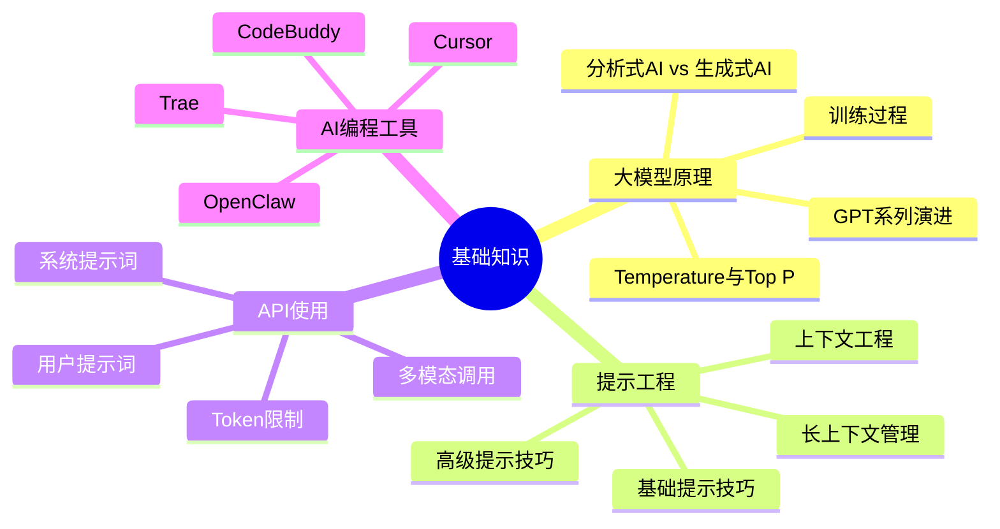
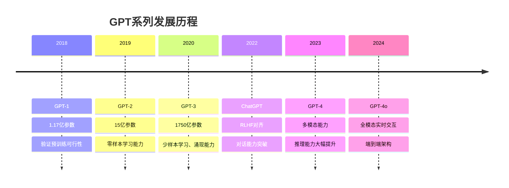
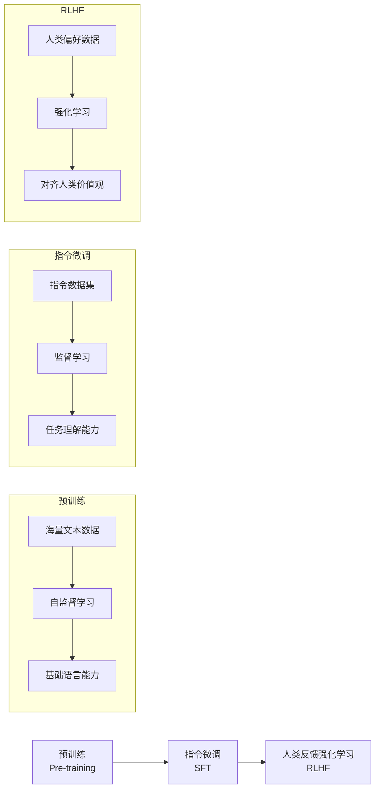
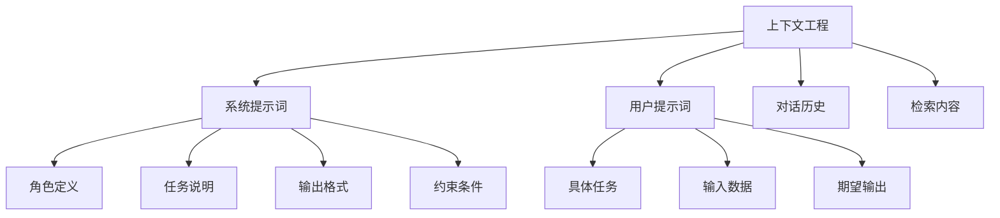

# AI大模型基础知识

掌握AI大模型的核心原理与基础技能，为后续开发打下坚实基础。

## 知识图谱



## 核心内容

### 大模型基本原理

#### 分析式AI vs 生成式AI

| 特性 | 分析式AI | 生成式AI |
|------|---------|---------|
| 核心能力 | 分类、预测、识别 | 创造、生成、理解 |
| 输出类型 | 标签、数值、概率 | 文本、图像、代码 |
| 典型应用 | 推荐系统、风控模型 | ChatGPT、DALL-E |
| 训练方式 | 监督学习为主 | 自监督学习 |

#### GPT系列演进



#### LLM训练过程



#### Temperature与Top P

**Temperature（温度）**
- 控制输出的随机性
- 低温度（0.1-0.3）：更确定、更一致
- 高温度（0.7-1.0）：更随机、更有创意

**Top P（核采样）**
- 控制候选token的范围
- 从概率最高的token开始累加，直到总和达到P
- 常用值：0.9

### 提示工程

#### 基础提示技巧

```markdown
1. 明确指令
   - 使用清晰的动词开头
   - 指定输出格式
   - 提供必要的上下文

2. 角色设定
   - "你是一个专业的..."
   - 定义专家身份和职责

3. 示例驱动
   - 提供输入输出示例
   - Few-shot Learning
```

#### 高级提示技巧

| 技巧 | 描述 | 适用场景 |
|------|------|---------|
| Chain of Thought | 分步骤推理 | 复杂推理任务 |
| Tree of Thoughts | 多路径探索 | 创意生成 |
| Self-Consistency | 多次采样取共识 | 提高准确性 |
| ReAct | 推理+行动 | Agent任务 |

#### 上下文工程



### API使用

#### 系统提示词与用户提示词

```python
from openai import OpenAI

client = OpenAI()

response = client.chat.completions.create(
    model="gpt-4",
    messages=[
        {"role": "system", "content": "你是一个专业的Python开发工程师"},
        {"role": "user", "content": "请帮我写一个快速排序算法"}
    ]
)
```

#### Token限制

| 模型 | 上下文窗口 | 输入限制 | 输出限制 |
|------|-----------|---------|---------|
| GPT-3.5-turbo | 16K | 16,384 | 4,096 |
| GPT-4 | 8K/32K | 8,192/32,768 | 4,096 |
| GPT-4-turbo | 128K | 131,072 | 4,096 |
| GPT-4o | 128K | 131,072 | 16,384 |

#### 多模态调用示例

```python
response = client.chat.completions.create(
    model="gpt-4o",
    messages=[
        {
            "role": "user",
            "content": [
                {"type": "text", "text": "这张图片里有什么？"},
                {
                    "type": "image_url",
                    "image_url": {"url": "image_url_here"}
                }
            ]
        }
    ]
)
```

### AI编程工具

#### Cursor核心功能

- **代码补全**：智能代码建议
- **代码解释**：解释复杂代码逻辑
- **代码重构**：优化代码结构
- **Bug修复**：自动检测和修复问题
- **Chat模式**：自然语言编程

#### Trae与CodeBuddy

| 工具 | 特点 | 适用场景 |
|------|------|---------|
| Trae | IDE集成、实时辅助 | 日常开发 |
| CodeBuddy | 代码审查、建议 | 代码质量提升 |

## 学习资源

- [大模型原理详解](/ai-llm-dev/basics/llm-principles/)
- [提示工程实践](/ai-llm-dev/basics/prompt-engineering/)
- [API使用指南](/ai-llm-dev/basics/api-usage/)
