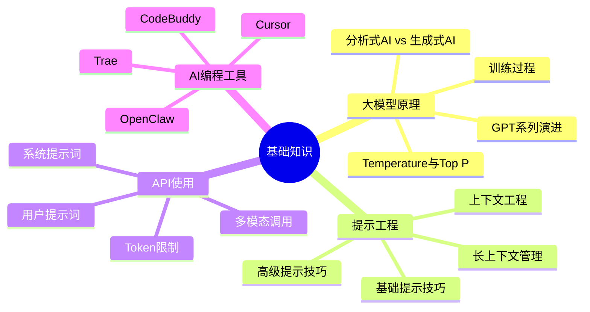
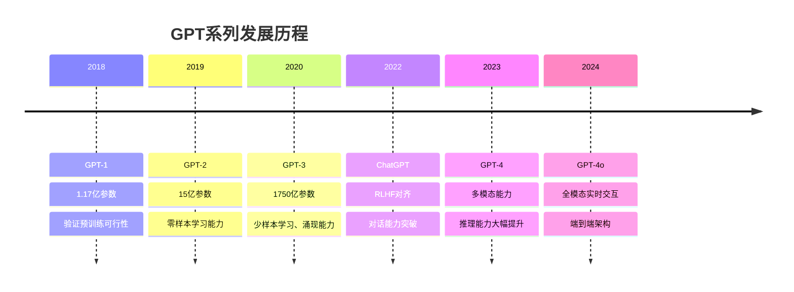
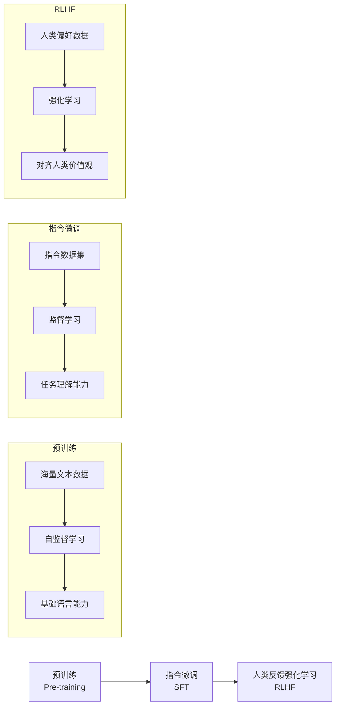
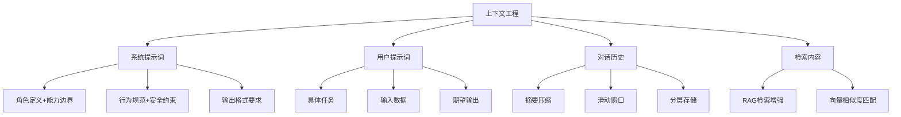

# AI大模型基础知识

掌握AI大模型的核心原理与基础技能，为后续开发打下坚实基础。

## 知识图谱



## 核心内容

### 大模型基本原理

#### 分析式AI vs 生成式AI

**分析式AI**像"质检员"——从已有数据中找规律做判断（如垃圾邮件过滤、人脸识别）；**生成式AI**像"创作者"——理解意图并创造新内容（如ChatGPT对话、DALL-E画图）。

| 特性 | 分析式AI | 生成式AI |
|------|---------|---------|
| 核心能力 | 分类、预测、识别 | 创造、生成、理解 |
| 输出类型 | 标签、数值、概率 | 文本、图像、代码 |
| 典型应用 | 推荐系统、风控模型 | ChatGPT、DALL-E |
| 训练方式 | 监督学习为主 | 自监督学习 |
| 数据需求 | 需要人工标注数据 | 海量无标注数据即可 |
| 输出确定性 | 确定性强，同样输入同样输出 | 有随机性，同样输入可能不同输出 |
| 通俗比喻 | 做选择题——从选项中选答案 | 做作文题——根据题目自由发挥 |

#### GPT系列演进



#### LLM训练过程



#### Temperature与Top P

**Temperature（温度）**
- 控制输出的随机性
- 低温度（0.1-0.3）：更确定、更一致
- 高温度（0.7-1.0）：更随机、更有创意

**Top P（核采样）**
- 控制候选token的范围
- 从概率最高的token开始累加，直到总和达到P
- 常用值：0.9

### 提示工程

提示工程是和大模型高效沟通的关键——同样的模型，不同的提示词可能产生天差地别的输出。它就像你和大模型之间的"翻译官"，把你的需求翻译成模型最容易理解的语言。

#### 基础提示技巧

| 技巧 | 核心要点 | 示例 |
|------|---------|------|
| 明确指令 | 用清晰的动词开头，避免模糊表述 | ❌ "写个函数" → ✅ "用Python编写一个计算偶数平方和的函数" |
| 角色设定 | 定义专家身份，激活模型相关知识区域 | "你是一位资深前端架构师，拥有10年React开发经验" |
| 输出格式指定 | 明确输出结构，便于后续处理 | "请以JSON格式输出，包含summary、issues、priority字段" |
| 提供上下文 | 给足背景信息，帮助模型理解场景 | "背景：电商平台推荐系统，技术栈：Python+TensorFlow" |
| 分步指令 | 将复杂任务拆解为明确步骤，降低模型认知负担 | "第一步：分析需求；第二步：设计方案；第三步：编写代码" |

#### 高级提示技巧

| 技巧 | 核心思想 | 适用场景 | 使用难度 |
|------|---------|---------|---------|
| Chain of Thought | 让模型"说出思考过程"，像让学生写出解题步骤 | 数学推理、逻辑分析、复杂问题拆解 | ⭐⭐ |
| Few-shot Learning | 提供几个示例帮助模型理解任务格式 | 格式转换、分类任务、风格模仿 | ⭐⭐ |
| Tree of Thoughts | 像下棋一样，每步考虑多种可能走法，选最优路径 | 创意生成、方案设计、决策分析 | ⭐⭐⭐⭐ |
| Self-Consistency | 多次采样取投票，少数服从多数 | 提高准确性、减少随机性 | ⭐⭐⭐ |
| ReAct | 推理+行动循环：思考→行动→观察→再思考 | 需要外部信息的任务、工具调用、Agent | ⭐⭐⭐ |

#### 上下文工程

上下文工程是提示工程的升级版——不仅关注"说什么"，更关注"在什么环境中说"。如果说提示词是你对助手说的话，那上下文就是助手在回答之前已经知道的所有信息。



**核心策略**：

| 策略 | 描述 | 适用场景 |
|------|------|---------|
| 系统提示词设计 | 定义角色、能力边界、行为规范、输出格式 | 所有应用的基础设定 |
| 对话历史管理 | 摘要压缩/滑动窗口/分层存储，控制上下文长度 | 长对话场景 |
| RAG检索增强 | 给AI配一个"图书馆"，先查资料再回答 | 需要准确知识的问答场景 |
| 上下文窗口优化 | 精简提示词、合并重复信息、优先级排序 | Token受限场景 |

### API使用

#### 系统提示词与用户提示词

```python
from openai import OpenAI

client = OpenAI()

response = client.chat.completions.create(
    model="gpt-4",
    messages=[
        {"role": "system", "content": "你是一个专业的Python开发工程师"},
        {"role": "user", "content": "请帮我写一个快速排序算法"}
    ]
)
```

#### Token限制

| 模型 | 上下文窗口 | 输入限制 | 输出限制 |
|------|-----------|---------|---------|
| GPT-3.5-turbo | 16K | 16,384 | 4,096 |
| GPT-4 | 8K/32K | 8,192/32,768 | 4,096 |
| GPT-4-turbo | 128K | 131,072 | 4,096 |
| GPT-4o | 128K | 131,072 | 16,384 |

#### 多模态调用示例

```python
response = client.chat.completions.create(
    model="gpt-4o",
    messages=[
        {
            "role": "user",
            "content": [
                {"type": "text", "text": "这张图片里有什么？"},
                {
                    "type": "image_url",
                    "image_url": {"url": "image_url_here"}
                }
            ]
        }
    ]
)
```

### AI编程工具

#### Cursor核心功能

- **代码补全**：智能代码建议
- **代码解释**：解释复杂代码逻辑
- **代码重构**：优化代码结构
- **Bug修复**：自动检测和修复问题
- **Chat模式**：自然语言编程

#### Trae与CodeBuddy

| 工具 | 特点 | 适用场景 |
|------|------|---------|
| Trae | IDE集成、实时辅助 | 日常开发 |
| CodeBuddy | 代码审查、建议 | 代码质量提升 |

## 学习资源

- [大模型原理详解](/ai-llm-dev/basics/llm-principles/)
- [提示工程实践](/ai-llm-dev/basics/prompt-engineering/)
- [API使用指南](/ai-llm-dev/basics/api-usage/)
