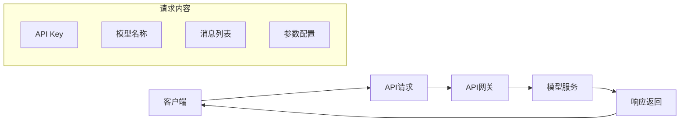

# 大模型API使用指南

掌握主流大模型API的调用方法，构建AI应用的基础能力。

## API调用基础

### 请求结构



### 基本调用示例

```python
from openai import OpenAI

client = OpenAI(api_key="your-api-key")

response = client.chat.completions.create(
    model="gpt-4",
    messages=[
        {"role": "system", "content": "你是一个有帮助的助手。"},
        {"role": "user", "content": "你好！"}
    ]
)

print(response.choices[0].message.content)
```

## 消息结构

### 角色类型

| 角色 | 描述 | 使用场景 |
|------|------|---------|
| system | 系统提示词 | 设定AI角色和行为规范 |
| user | 用户输入 | 用户的提问或指令 |
| assistant | AI回复 | 历史对话中的AI回复 |
| function | 函数调用 | 工具调用的结果 |

### 多轮对话

```python
messages = [
    {"role": "system", "content": "你是一个Python专家。"},
    {"role": "user", "content": "如何读取JSON文件？"},
    {"role": "assistant", "content": "可以使用json模块..."},
    {"role": "user", "content": "那如何处理异常？"}
]

response = client.chat.completions.create(
    model="gpt-4",
    messages=messages
)
```

## 核心参数

### Temperature

```python
response = client.chat.completions.create(
    model="gpt-4",
    messages=[...],
    temperature=0.7  # 0-2，默认1
)
```

| 值 | 效果 | 适用场景 |
|---|------|---------|
| 0.1-0.3 | 确定性高 | 代码生成、事实问答 |
| 0.5-0.7 | 平衡 | 一般对话 |
| 0.8-1.0 | 随机性高 | 创意写作 |

### Top P

```python
response = client.chat.completions.create(
    model="gpt-4",
    messages=[...],
    top_p=0.9  # 0-1，默认1
)
```

### Max Tokens

```python
response = client.chat.completions.create(
    model="gpt-4",
    messages=[...],
    max_tokens=1000  # 限制输出长度
)
```

### 其他参数

| 参数 | 描述 | 默认值 |
|------|------|--------|
| presence_penalty | 话题重复惩罚 | 0 |
| frequency_penalty | 频率重复惩罚 | 0 |
| stop | 停止词 | None |
| n | 生成数量 | 1 |

## 多模态API

### 图像理解

```python
response = client.chat.completions.create(
    model="gpt-4o",
    messages=[
        {
            "role": "user",
            "content": [
                {"type": "text", "text": "这张图片里有什么？"},
                {
                    "type": "image_url",
                    "image_url": {
                        "url": "https://example.com/image.jpg"
                    }
                }
            ]
        }
    ]
)
```

### 本地图片处理

```python
import base64

def encode_image(image_path):
    with open(image_path, "rb") as f:
        return base64.b64encode(f.read()).decode("utf-8")

base64_image = encode_image("path/to/image.jpg")

response = client.chat.completions.create(
    model="gpt-4o",
    messages=[
        {
            "role": "user",
            "content": [
                {"type": "text", "text": "描述这张图片"},
                {
                    "type": "image_url",
                    "image_url": {
                        "url": f"data:image/jpeg;base64,{base64_image}"
                    }
                }
            ]
        }
    ]
)
```

## 流式输出

### 基本流式调用

```python
stream = client.chat.completions.create(
    model="gpt-4",
    messages=[...],
    stream=True
)

for chunk in stream:
    if chunk.choices[0].delta.content:
        print(chunk.choices[0].delta.content, end="")
```

### 异步流式调用

```python
from openai import AsyncOpenAI

async def stream_chat():
    client = AsyncOpenAI()
    
    stream = await client.chat.completions.create(
        model="gpt-4",
        messages=[...],
        stream=True
    )
    
    async for chunk in stream:
        if chunk.choices[0].delta.content:
            yield chunk.choices[0].delta.content
```

## Function Calling

### 定义函数

```python
tools = [
    {
        "type": "function",
        "function": {
            "name": "get_weather",
            "description": "获取指定城市的天气信息",
            "parameters": {
                "type": "object",
                "properties": {
                    "city": {
                        "type": "string",
                        "description": "城市名称"
                    }
                },
                "required": ["city"]
            }
        }
    }
]
```

### 调用函数

```python
response = client.chat.completions.create(
    model="gpt-4",
    messages=[
        {"role": "user", "content": "北京今天天气怎么样？"}
    ],
    tools=tools
)

if response.choices[0].message.tool_calls:
    tool_call = response.choices[0].message.tool_calls[0]
    function_name = tool_call.function.name
    arguments = json.loads(tool_call.function.arguments)
    
    if function_name == "get_weather":
        result = get_weather(arguments["city"])
        
        messages.append(response.choices[0].message)
        messages.append({
            "role": "tool",
            "tool_call_id": tool_call.id,
            "content": str(result)
        })
        
        final_response = client.chat.completions.create(
            model="gpt-4",
            messages=messages
        )
```

## 国内大模型API

### 通义千问（Qwen）

```python
from dashscope import Generation

response = Generation.call(
    model="qwen-turbo",
    messages=[
        {"role": "user", "content": "你好"}
    ]
)
print(response.output.text)
```

### 文心一言

```python
import qianfan

chat = qianfan.ChatCompletion()
response = chat.do(
    model="ERNIE-Bot-4",
    messages=[
        {"role": "user", "content": "你好"}
    ]
)
print(response.body["result"])
```

### DeepSeek

```python
from openai import OpenAI

client = OpenAI(
    api_key="your-deepseek-api-key",
    base_url="https://api.deepseek.com/v1"
)

response = client.chat.completions.create(
    model="deepseek-chat",
    messages=[...]
)
```

## Token计算与成本优化

### Token计算

```python
import tiktoken

def count_tokens(text, model="gpt-4"):
    encoding = tiktoken.encoding_for_model(model)
    return len(encoding.encode(text))

text = "你好，世界！"
print(f"Token数量: {count_tokens(text)}")
```

### 成本优化策略

| 策略 | 描述 |
|------|------|
| 精简提示词 | 删除冗余内容 |
| 使用小模型 | 简单任务用gpt-3.5 |
| 缓存结果 | 相同请求复用 |
| 批量处理 | 合并多个请求 |
| 流式输出 | 提前终止不需要的内容 |

## 错误处理

### 常见错误

| 错误码 | 描述 | 处理方式 |
|--------|------|---------|
| 401 | API Key无效 | 检查Key配置 |
| 429 | 请求过于频繁 | 添加重试逻辑 |
| 500 | 服务器错误 | 重试或联系支持 |
| 400 | 请求参数错误 | 检查参数格式 |

### 重试机制

```python
from tenacity import retry, stop_after_attempt, wait_exponential

@retry(stop=stop_after_attempt(3), wait=wait_exponential(multiplier=1, min=4, max=10))
def call_api_with_retry(messages):
    return client.chat.completions.create(
        model="gpt-4",
        messages=messages
    )
```

## 最佳实践

### 1. 安全性

```python
import os

client = OpenAI(api_key=os.environ.get("OPENAI_API_KEY"))
```

### 2. 超时设置

```python
client = OpenAI(timeout=30.0)
```

### 3. 日志记录

```python
import logging

logging.basicConfig(level=logging.INFO)
logger = logging.getLogger(__name__)

def call_api(messages):
    logger.info(f"调用API: {messages}")
    response = client.chat.completions.create(...)
    logger.info(f"API响应: {response}")
    return response
```

## 小结

API使用是AI应用开发的基础：

1. **消息结构**：理解system、user、assistant角色
2. **参数控制**：Temperature、Top P、Max Tokens
3. **多模态**：图像理解、本地图片处理
4. **流式输出**：实时响应、异步处理
5. **Function Calling**：工具调用能力
6. **成本优化**：Token计算、缓存策略
