# AI大模型基本原理

深入理解大语言模型的工作原理，为应用开发打下理论基础。

## 从分析式AI到生成式AI

### 什么是分析式AI？

分析式AI（Analytical AI），也叫判别式AI，它的核心任务是**"从已有数据中找规律，然后做判断"**。你可以把它想象成一个经验丰富的质检员——它见过成千上万的产品，学会了区分"合格"和"不合格"，当新产品出现时，它能快速给出判断结果。

**工作方式**：分析式AI接收输入数据，提取其中的关键特征，然后根据学到的规律将数据归入某个类别或预测一个数值。它的输出是"选择题"式的——从已知的选项中选一个。

从技术角度看，分析式AI的核心是**判别函数**——模型学习到的是类别之间的决策边界。以二分类为例，模型的目标是找到一条线（或超平面），将不同类别的数据尽可能准确地分开。支持向量机（SVM）就是这种思想的典型代表——它寻找的是使两类数据间隔最大的那个超平面。

**生活中的例子**：

| 应用场景 | 输入 | AI做什么 | 输出 |
|---------|------|---------|------|
| 垃圾邮件过滤 | 一封邮件 | 分析邮件特征，判断是否为垃圾邮件 | "垃圾邮件"或"正常邮件" |
| 人脸识别 | 一张照片 | 提取面部特征，与数据库比对 | "是张三"或"不是张三" |
| 信用评分 | 用户的财务数据 | 分析还款能力，评估风险 | 信用分数（如750分） |
| 医学影像诊断 | 一张X光片 | 识别异常区域，判断病变类型 | "肺炎"或"健康" |
| 商品推荐 | 用户的浏览/购买记录 | 分析用户偏好，匹配商品 | 推荐商品列表 |
| 自动驾驶感知 | 摄像头画面 | 识别行人、车辆、交通标志 | 目标类别+位置框 |
| 工业质检 | 产品照片 | 检测表面缺陷 | "合格"或"不合格" |

**关键特点**：分析式AI的输出是**确定性的**——同样的输入通常会产生同样的输出。它像是一个"判断者"，不会创造新的东西，但能高效准确地完成分类和预测任务。

**局限性**：
- **依赖标注数据**：需要大量人工标注的训练数据，标注成本高昂。例如医学影像诊断需要专业医生逐张标注，一个高质量的数据集可能需要数月甚至数年才能完成。
- **任务单一**：一个模型通常只能完成一种任务，换个任务就需要重新训练。一个识别猫狗的模型无法识别汽车，需要从头训练。
- **泛化能力有限**：当遇到训练数据中未出现过的模式时，往往表现不佳。例如一个只在晴天数据上训练的自动驾驶模型，遇到雨雪天气可能完全失效。
- **无法创造**：只能从已有类别中选择，无法生成全新的内容。它永远只能回答"这是什么"，而不能回答"能创造什么"。

### 什么是生成式AI？

生成式AI（Generative AI）的核心任务是**"理解意图，创造新内容"**。如果说分析式AI是"质检员"，那生成式AI更像是一个"创作者"——你给它一个主题，它能写出一篇文章、画出一幅画、编出一段代码。

**工作方式**：生成式AI接收一段提示词（Prompt），理解其中的意图，然后逐字逐句地生成全新的内容。它的输出是"开放题"式的——没有预设的答案，而是根据理解自由创作。

从技术角度看，生成式AI的核心是**学习数据分布**——模型不是学习类别之间的边界，而是学习数据本身的概率分布。一旦学会了这个分布，就可以从中采样出全新的样本。大语言模型学习的是语言的概率分布——给定前文，下一个词最可能是什么。图像生成模型学习的是像素的联合概率分布——什么样的像素组合能构成有意义的图像。

**生活中的例子**：

| 应用场景 | 输入（提示词） | AI做什么 | 输出 |
|---------|--------------|---------|------|
| ChatGPT对话 | "解释量子计算" | 理解问题，组织语言，生成回答 | 一段通俗易懂的解释 |
| DALL-E画图 | "一只穿着宇航服的猫" | 理解描述，生成对应图像 | 一张全新的图片 |
| GitHub Copilot | 函数名+注释 | 理解编程意图，生成代码 | 可运行的代码片段 |
| 音乐生成 | "一段欢快的爵士乐" | 理解风格要求，创作旋律 | 一段新的音乐 |
| 视频生成 | "夕阳下的海边" | 理解场景描述，生成动态画面 | 一段视频 |
| 3D模型生成 | "一把中世纪风格的椅子" | 理解描述，生成3D几何体 | 一个3D模型 |
| 药物分子生成 | "针对某靶点的抑制剂" | 理解化学约束，生成分子结构 | 候选药物分子 |

**关键特点**：生成式AI的输出具有**随机性和创造性**——同样的提示词可能产生不同的结果。它像是一个"创作者"，每次都可能带来意想不到的惊喜，但也可能偶尔"跑偏"。

**核心优势**：
- **无需标注数据**：通过自监督学习从海量无标注数据中学习，不再需要人工逐条标注。模型从互联网上的海量文本中自动学习语言的规律和知识。
- **通用能力**：一个模型可以处理多种任务，无需为每个任务单独训练。GPT既能翻译、又能写代码、还能做数学题。
- **涌现能力**：当规模足够大时，会出现训练目标中未明确包含的新能力，如逻辑推理、数学计算等。
- **交互式使用**：通过自然语言对话即可使用，极大降低了AI的使用门槛。不需要编程知识，任何人都可以通过对话来使用AI。

### 核心区别对比

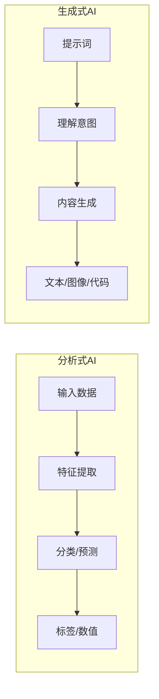

| 维度 | 分析式AI | 生成式AI |
|------|---------|---------|
| 核心思想 | 从数据中**找规律**，做判断 | 从数据中**学分布**，做创造 |
| 学习目标 | 模式识别——"这是什么？" | 内容创造——"能生成什么？" |
| 数学本质 | 学习决策边界 P(y\|x) | 学习数据分布 P(x) 或 P(x\|context) |
| 数据需求 | 标注数据（需要人工打标签） | 海量无标注数据（自监督学习） |
| 输出类型 | 标签、数值、概率（从已知选项中选择） | 文本、图像、代码（创造全新内容） |
| 输出确定性 | 相对确定——同样的输入通常产生同样的输出 | 具有随机性——同样的输入可能产生不同的输出 |
| 典型算法 | SVM、随机森林、CNN分类器 | GPT、Diffusion Model、VAE |
| 典型架构 | CNN、RNN + 分类头 | Transformer、U-Net、VAE |
| 应用场景 | 分类、预测、推荐、检测 | 创作、对话、编程、设计 |
| 评估方式 | 准确率、精确率、召回率 | 人工评估、BLEU、人类偏好 |
| 通俗比喻 | 考试做选择题——从选项中选正确答案 | 考试做作文题——根据题目自由发挥 |

### 从分析式到生成式：AI的范式转变

AI的发展经历了从"分析"到"生成"的重要转变，这个转变不仅仅是技术升级，更是AI能力本质的飞跃：

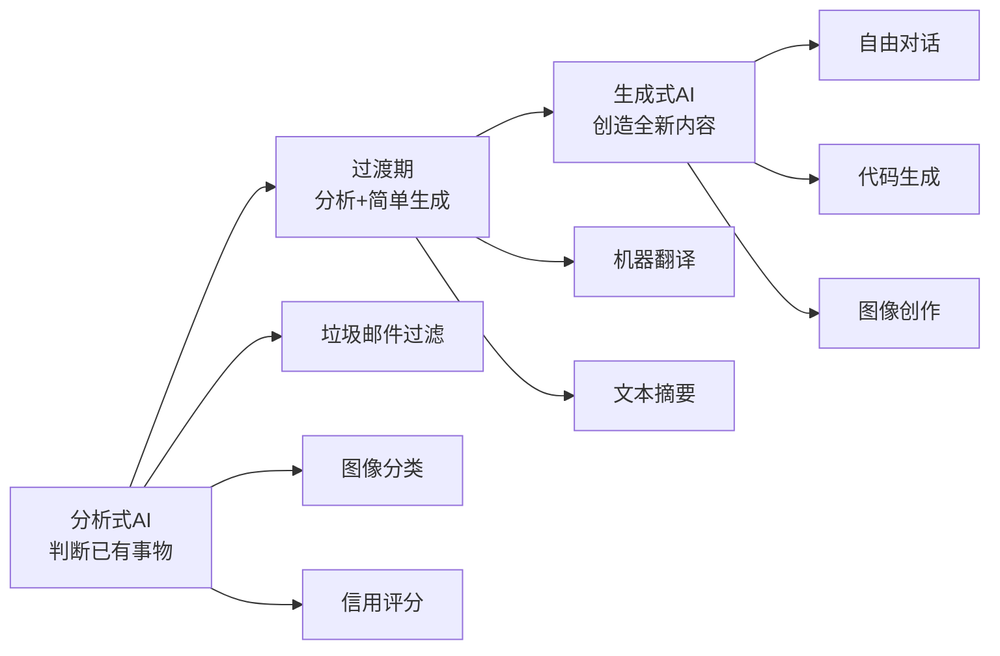

**为什么这个转变如此重要？**

1. **从"被动"到"主动"**：分析式AI只能回答"这是什么"，生成式AI却能回答"能创造什么"。这就像从只能做判断题的学生，变成了能写论文的学者。分析式AI需要你把问题精确地定义好，它才能给出答案；而生成式AI可以理解模糊的意图，主动思考并给出创造性的回答。

2. **从"专用"到"通用"**：分析式AI通常一个模型只能做一件事（比如专门识别猫狗的分类器），而生成式AI一个模型可以处理多种任务（GPT既能写诗又能写代码）。这意味着部署成本大幅降低——过去需要维护十几个专用模型，现在一个通用模型就能搞定。

3. **从"需要标注"到"自主学习"**：分析式AI依赖大量人工标注的数据，而生成式AI通过自监督学习从海量文本中自动学习，不再需要人工逐条标注。这是生成式AI能够快速发展的关键——互联网上有几乎无限的文本数据可供学习。

4. **从"工具"到"助手"**：分析式AI更像是一个工具——你输入数据，它输出结果；生成式AI更像是一个助手——你可以和它对话，它能理解上下文，甚至能主动追问和澄清。这种人机交互方式的变革，使AI真正走进了普通人的日常生活。

**发展时间线**：

| 时间 | 里程碑 | 意义 |
|------|--------|------|
| 2012年 | AlexNet图像分类突破 | 深度学习时代开启，分析式AI快速发展 |
| 2014年 | GAN（生成对抗网络）提出 | 首次实现高质量图像生成，生成式AI萌芽 |
| 2017年 | Transformer架构提出 | 奠定大语言模型基础，Attention Is All You Need |
| 2018年 | GPT-1 / BERT发布 | 预训练范式确立，NLP领域革命 |
| 2020年 | GPT-3发布 | 1750亿参数，涌现能力震惊世界 |
| 2022年 | ChatGPT发布 | 生成式AI走向大众，掀起全球AI热潮 |
| 2023年 | GPT-4发布 | 多模态能力，推理能力大幅提升 |
| 2024年 | GPT-4o / Claude 3.5 | 实时交互、长上下文、Agent能力增强 |

### 生成式AI的突破

生成式AI之所以能在近年取得巨大突破，主要得益于以下几个关键因素：

- **规模效应（Scaling Law）**：当模型参数量从百万级增长到千亿级时，AI不仅变得"更准确"，还会"涌现"出全新的能力——就像一个人读的书越多，不仅知识更丰富，还会产生全新的见解。例如，GPT-3在参数量达到1750亿后，突然展现出了零样本学习的能力，这是小模型完全不具备的。Scaling Law的发现（由OpenAI在2020年的论文中系统阐述）揭示了一个重要规律：模型性能与计算量、参数量、数据量之间存在幂律关系——只要持续增加这三个要素，模型性能就会可预测地提升。这意味着AI能力的提升不再是随机的，而是可以规划和预测的。

- **泛化能力**：传统AI需要为每个任务单独训练模型，而生成式AI具备零样本（Zero-shot）和少样本（Few-shot）学习能力——即使从未见过某类任务，也能通过简单的提示词理解并完成。比如，你不需要专门训练一个"写藏头诗"的模型，只需告诉GPT"请用'春天来了'写一首藏头诗"，它就能完成。这种泛化能力的来源是模型在海量数据中学习到了极其丰富的模式和知识，当遇到新任务时，它能够将已有的知识迁移和应用。

- **多任务能力**：一个模型就能处理翻译、编程、写作、分析等多种任务，不再需要为每个场景部署不同的模型。这大大降低了AI应用的门槛和成本。从工程角度看，这意味着只需要维护一个模型服务，而不是十几个；从用户体验角度看，不需要在不同工具之间切换，一个对话窗口就能完成所有任务。

- **涌现能力**：当模型规模足够大时，会自发出现一些训练目标中并未明确包含的能力，如逻辑推理、数学计算、代码理解等。这些能力不是被"教"出来的，而是随着规模增长自然"涌现"的，这也是大模型最令人兴奋的特性之一。涌现能力的典型表现包括：上下文学习（In-Context Learning）——仅通过在提示中给出几个示例就能学会新任务；思维链推理（Chain-of-Thought）——能够分步骤推理解决复杂问题；指令遵循（Instruction Following）——理解并执行复杂的多步指令。

- **对齐技术**：通过RLHF（基于人类反馈的强化学习）等技术，模型不仅能生成内容，还能使生成的内容更符合人类的期望和价值观。这使得AI从"能说话"进化到"说人话"，从"能回答"进化到"回答得好"。对齐技术是ChatGPT成功的关键因素之一——它让模型的回答变得有帮助、诚实和无害。

## Transformer架构：大模型的基石

### 为什么需要Transformer？

在Transformer出现之前，自然语言处理主要依赖RNN（循环神经网络）和LSTM（长短期记忆网络）。这些架构存在几个根本性问题：

- **顺序计算瓶颈**：RNN必须逐个处理序列中的词，无法并行计算。一个1000词的句子，必须从第1个词算到第1000个词，无法加速。
- **长距离依赖困难**：虽然LSTM通过门控机制缓解了梯度消失问题，但在处理超长文本时，仍然难以捕捉远距离的依赖关系。当句子超过100个词时，模型往往"忘记"了开头的内容。
- **信息压缩损失**：RNN将所有历史信息压缩到一个固定大小的隐藏状态中，信息不可避免地会丢失。

2017年，Google团队在论文《Attention Is All You Need》中提出了Transformer架构，彻底解决了这些问题，开启了大模型时代。

### 自注意力机制（Self-Attention）

自注意力机制是Transformer的核心创新，它让模型在处理每个词时，能够"看到"并"关注"输入序列中的所有其他词。

**核心思想**：对于序列中的每个词，计算它与其他所有词的关联程度（注意力权重），然后根据这些权重聚合信息。

**计算过程**：

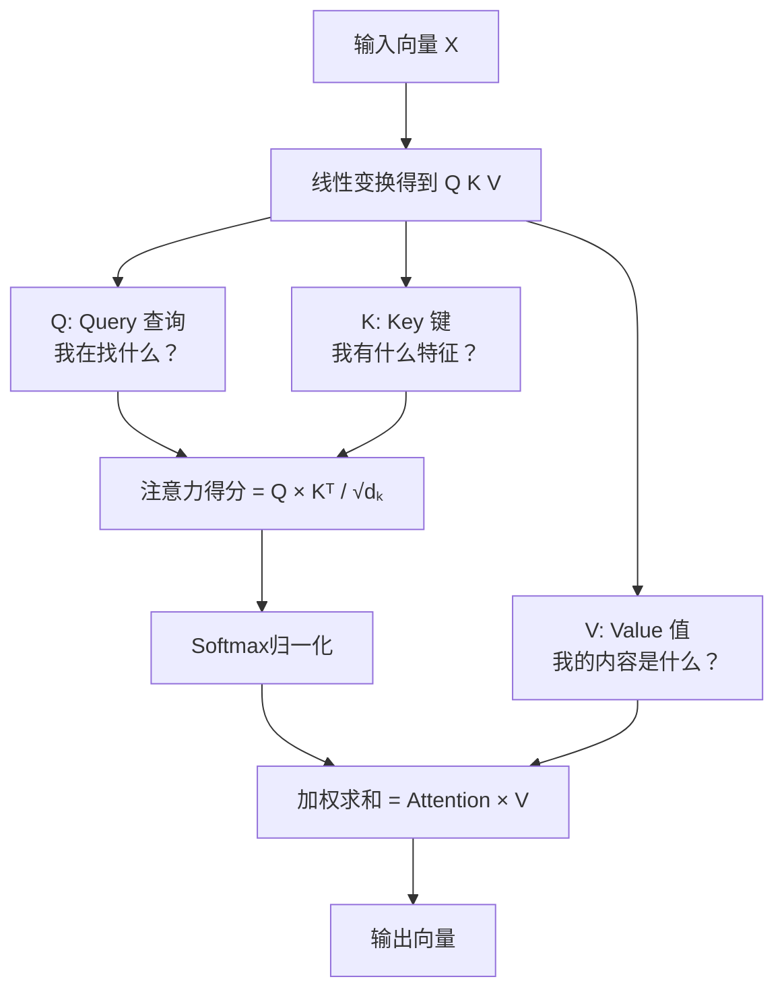

**通俗理解**：想象你在阅读一篇文章，读到"它"这个词时，你需要回顾前文来确定"它"指的是什么。自注意力机制就是在做这件事——对于每个词，它会自动计算与序列中其他词的关联度，然后重点关注最相关的词。

例如在句子"小明养了一只猫，**它**很可爱"中，自注意力机制会让"它"这个词重点关注"猫"（因为"它"和"猫"的关联度最高），从而理解"它"指的是猫。

**多头注意力**：Transformer不仅使用一组注意力，而是使用多组（即多个"头"），每组关注不同的方面。就像阅读时，你同时关注语法结构、语义关系、情感色彩等多个维度。GPT-3使用了96个注意力头，每个头关注不同的模式和关系。

### Transformer的整体架构

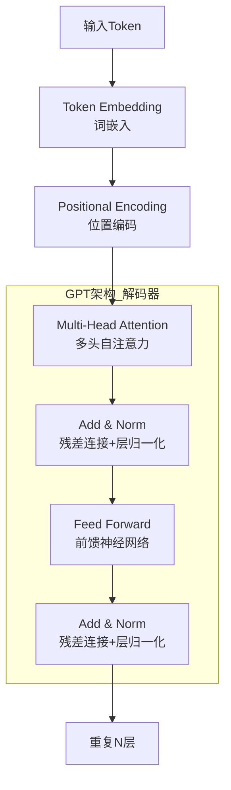

**关键组件解析**：

| 组件 | 作用 | 为什么重要 |
|------|------|-----------|
| Token Embedding | 将离散的词转换为连续向量 | 让模型能够用数学方式处理语言 |
| Positional Encoding | 为每个位置添加位置信息 | Transformer本身没有顺序概念，需要显式注入位置信息 |
| Multi-Head Attention | 让每个词关注序列中的所有词 | 解决长距离依赖问题，实现并行计算 |
| Feed Forward | 对每个位置进行非线性变换 | 增加模型的表达能力 |
| Add & Norm | 残差连接 + 层归一化 | 缓解梯度消失，稳定训练过程 |

**GPT vs BERT的架构差异**：

| 维度 | GPT（解码器） | BERT（编码器） |
|------|-------------|---------------|
| 注意力方向 | 只看前文（因果注意力） | 看前后文（双向注意力） |
| 训练目标 | 预测下一个词 | 预测被遮盖的词 |
| 生成能力 | 天然支持文本生成 | 不适合文本生成 |
| 理解能力 | 通过大规模预训练弥补 | 双向理解更深入 |
| 典型应用 | ChatGPT、Claude | 文本分类、命名实体识别 |

### Tokenization：文本的数字化

在进入Transformer之前，文本需要先被"切分"成Token（标记）。Tokenization是大模型处理文本的第一步，也是最容易被忽视的一步。

**常见的Tokenization方法**：

| 方法 | 原理 | 优点 | 缺点 |
|------|------|------|------|
| 词级切分 | 按空格和标点切分 | 直观、简单 | 词汇表过大、无法处理未登录词 |
| 字符级切分 | 每个字符一个Token | 词汇表极小 | 序列过长、缺乏语义信息 |
| 子词切分（BPE） | 按频率合并字符对 | 平衡词汇表大小和序列长度 | 需要预训练分词器 |

**BPE（Byte Pair Encoding）** 是目前最主流的方法，GPT系列使用的BPE变体的工作原理：

1. 初始化：将每个字符作为基础Token
2. 统计：找出频率最高的相邻Token对
3. 合并：将最高频的Token对合并为新Token
4. 重复：直到达到预设的词汇表大小

**实际例子**：

```
原始文本: "lower lower newest"

步骤1（字符级）: l o w e r   l o w e r   n e w e s t
步骤2（合并"l"+"o"→"lo"）: lo w e r   lo w e r   n e w e s t
步骤3（合并"lo"+"w"→"low"）: low e r   low e r   n e w e s t
步骤4（合并"low"+"e"→"lowe"）: lowe r   lowe r   n e w e s t
步骤5（合并"lowe"+"r"→"lower"）: lower   lower   n e w e s t
...
```

**Token数量与成本**：理解Token的概念对API使用至关重要。一般规则：
- 1个英文单词 ≈ 1-2个Token
- 1个中文字 ≈ 1-2个Token
- 1行代码 ≈ 5-15个Token
- API按Token数量计费，所以Token效率直接影响成本

## GPT系列演进

### 发展历程

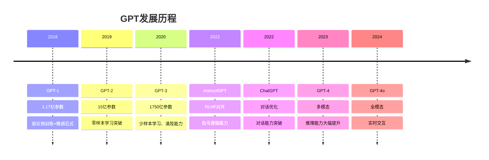

### 各版本详解

#### GPT-1（2018年6月）：验证范式

- **参数量**：1.17亿
- **训练数据**：约5GB文本（BookCorpus数据集）
- **核心贡献**：首次验证了"预训练+微调"的范式——先在海量文本上进行无监督预训练，再在特定任务上进行有监督微调。这种"先学通识，再学专业"的思路，与人类的学习方式高度一致。
- **架构创新**：使用了12层Transformer解码器，每个层包含带掩码的自注意力机制（确保只能看到前文）。
- **局限**：模型规模较小，泛化能力有限；微调阶段仍需要大量标注数据；每个任务需要单独微调。

#### GPT-2（2019年2月）：零样本学习

- **参数量**：15亿（比GPT-1大13倍）
- **训练数据**：约40GB文本（WebText数据集，来自Reddit高质量链接）
- **核心贡献**：证明了足够大的语言模型可以在**零样本**（Zero-shot）条件下完成多种任务——不需要任何微调，只需给出合适的提示词，模型就能理解任务并完成。例如，输入"将以下英文翻译成法语："，模型就能进行翻译。
- **关键发现**：当模型足够大时，语言建模（预测下一个词）这个看似简单的目标，实际上迫使模型学会了翻译、摘要、问答等多种能力——因为这些能力都是理解语言的必要组成部分。
- **社会影响**：因担心被滥用（生成虚假新闻等），OpenAI最初只发布了小版本模型，引发了关于AI安全的广泛讨论。

#### GPT-3（2020年6月）：涌现能力

- **参数量**：1750亿（比GPT-2大100倍以上）
- **训练数据**：约570GB文本（混合了Common Crawl、WebText2、书籍、维基百科等）
- **核心贡献**：
  - **涌现能力**：首次系统展示了大模型的涌现能力——当参数量超过一定阈值后，模型突然获得了小模型完全不具备的能力，如少样本学习、复杂推理、代码生成等。
  - **少样本学习（Few-shot Learning）**：只需在提示词中给出几个示例，模型就能学会新任务。例如，给出2-3个翻译示例后，模型就能翻译新的句子，不需要任何参数更新。
  - **In-Context Learning**：开创了"上下文学习"的新范式——通过在输入中提供示例和指令来引导模型行为，而不是修改模型参数。
- **技术细节**：使用了96层Transformer，96个注意力头，上下文窗口2048个Token。训练消耗约355个GPU年的计算量。
- **影响**：GPT-3的发布标志着大模型时代的正式到来，催生了整个大模型应用生态。

#### InstructGPT / ChatGPT（2022年）：对齐人类意图

- **参数量**：与GPT-3相当的1750亿（但实际使用的InstructGPT是1.3B参数的优化模型）
- **核心贡献**：
  - **RLHF（基于人类反馈的强化学习）**：这是让AI从"能说话"变成"说人话"的关键技术。通过三个步骤实现人类意图对齐。
  - **指令遵循**：模型学会了理解并遵循用户的指令，而不是简单地续写文本。这是ChatGPT成功的核心——用户说"帮我写一封邮件"，模型真的写邮件，而不是续写"帮我写一封邮件"后面的文字。
  - **对话能力**：ChatGPT在InstructGPT基础上增加了对话格式的训练，使模型能够进行多轮对话，理解上下文，保持对话连贯性。
- **社会影响**：ChatGPT在发布两个月内用户突破1亿，成为历史上增长最快的消费级应用，彻底改变了公众对AI的认知。

#### GPT-4（2023年3月）：多模态推理

- **参数量**：未公开（推测为万亿级别，采用MoE混合专家架构）
- **核心贡献**：
  - **多模态理解**：能够同时处理文本和图像输入。可以看图说话、解读图表、从截图中提取代码。
  - **推理能力飞跃**：在各类考试中表现接近人类顶尖水平——律师资格考试排名前10%，SAT数学考试排名前20%，生物学奥赛排名前1%。
  - **长上下文**：支持32K Token的上下文窗口（后续版本支持128K），可以处理约300页的文档。
  - **可靠性提升**：在内部对抗性测试中，产生不当内容的概率比GPT-3.5降低了82%。
- **技术亮点**：据推测采用了MoE（Mixture of Experts）架构——模型包含多个"专家"子网络，每次推理只激活其中一部分，既保持了大规模参数的知识容量，又控制了推理成本。

#### GPT-4o（2024年5月）：全模态实时交互

- **核心贡献**：
  - **原生多模态**：不再将视觉、语音作为独立模块，而是在一个模型中原生处理文本、图像、音频和视频。这意味着模型可以实时"看"和"听"，响应延迟低至232毫秒。
  - **实时语音对话**：能够感知说话者的情绪、语速、语气，并以相应的情感回应，实现了接近真人对话的体验。
  - **效率提升**：在保持GPT-4级别智能的同时，速度提升2倍，成本降低50%。
  - **多语言改进**：非英语语言的Token效率大幅提升，降低了非英语用户的使用成本。

### 关键技术突破

#### 1. 预训练范式

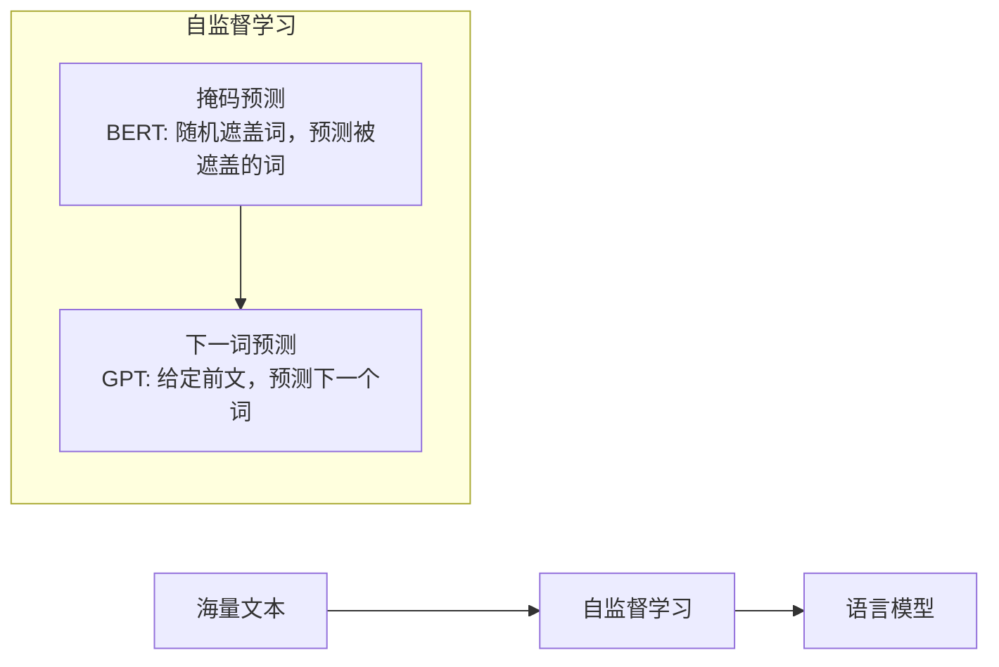

**预训练范式的核心洞察**：语言中蕴含了关于世界的大量知识——语法、逻辑、常识、事实、推理模式。通过让模型预测文本中的下一个词，实际上是在强迫模型理解语言的深层结构，从而间接地学习到了这些知识。这就像一个学生通过大量阅读来学习——他不仅学会了语言本身，还从文本中获取了丰富的世界知识。

**为什么"预测下一个词"如此强大？**

1. **数据无限**：互联网上有几乎无限的文本可供学习，不需要人工标注
2. **任务通用**：理解语言是所有语言任务的基础，学好这个基础任务就能迁移到各种下游任务
3. **知识压缩**：模型被迫将海量知识压缩到有限的参数中，这个过程本身就是一种深度理解

#### 2. 涌现能力

当模型规模达到一定阈值后，突然出现的新能力：

- **上下文学习（In-Context Learning）**：从示例中学习新任务。只需在提示词中给出几个输入-输出示例，模型就能理解任务模式并泛化到新的输入。这不同于传统的模型微调——不需要更新任何参数，完全通过提示词中的上下文来实现学习。

- **思维链推理（Chain-of-Thought, CoT）**：分步骤解决复杂问题。当模型被要求"一步一步思考"时，它能够将复杂问题分解为多个简单步骤，逐步推理得出正确答案。这种能力在数学推理、逻辑推理等任务上表现尤为突出。例如：
  ```
  问题：一个商店有23个苹果，卖了15个，又进货了8个，现在有多少个？
  思维链：商店原来有23个苹果 → 卖了15个，剩下23-15=8个 → 又进货8个，现在有8+8=16个
  答案：16个
  ```

- **指令遵循（Instruction Following）**：理解并执行复杂指令。模型能够理解多步骤、多约束的复杂指令，并按照要求完成任务。例如"请用200字以内，以科学家的口吻，解释黑洞的形成原理"——模型能同时满足字数限制、角色设定和内容要求。

**涌现能力的意义**：它意味着AI的发展可能不仅仅是"量变"——随着规模增长，会出现质的飞跃。这为AI的持续进步提供了理论依据，也引发了关于AI安全的深入讨论——我们无法完全预测更大规模的模型会涌现出什么能力。

#### 3. RLHF对齐

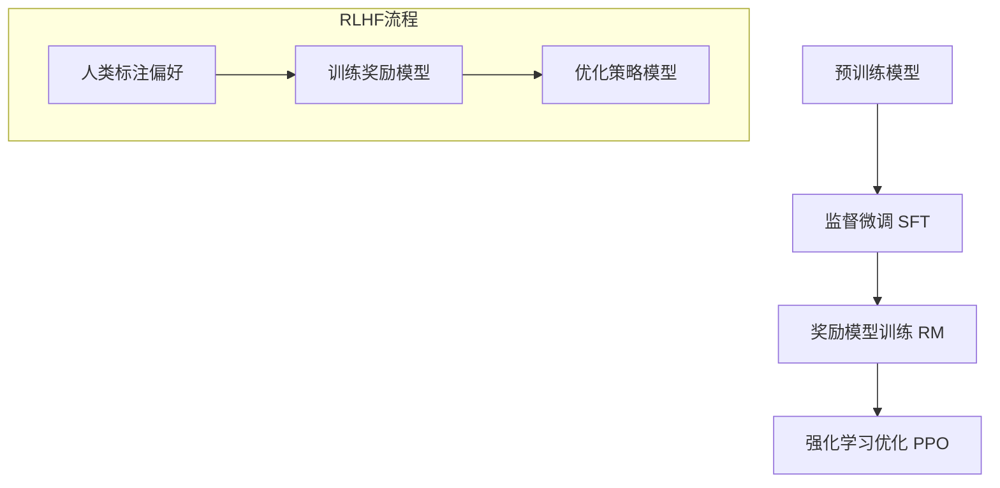

**RLHF三步详解**：

**第一步：监督微调（SFT）**
- 收集人类编写的优质对话数据（提示词+期望回答）
- 用这些数据对预训练模型进行监督学习
- 目标：让模型学会"对话格式"和基本的指令遵循
- 数据量：通常1-10万条高质量对话

**第二步：训练奖励模型（RM）**
- 让模型对同一提示词生成多个回答
- 人类标注者对这些回答进行排序（哪个更好）
- 训练一个奖励模型，学习人类的偏好模式
- 目标：将人类的偏好量化为一个可计算的分数
- 关键洞察：排序比打分更可靠——人类更容易判断"A比B好"，而不是给A打8分、给B打6分

**第三步：强化学习优化（PPO）**
- 使用奖励模型作为"裁判"，对模型的输出打分
- 用PPO（近端策略优化）算法优化语言模型
- 目标：让模型生成奖励模型（代表人类偏好）认为更好的回答
- 关键技巧：加入KL散度惩罚，防止模型过度优化奖励模型而偏离原始语言能力（即"奖励黑客"问题）

**RLHF的效果**：
- 回答更有帮助：直接回答用户问题，而不是绕弯子
- 回答更安全：拒绝有害请求，避免产生危险内容
- 回答更符合期望：格式规范、逻辑清晰、语气适当

## LLM训练过程

### 三阶段训练

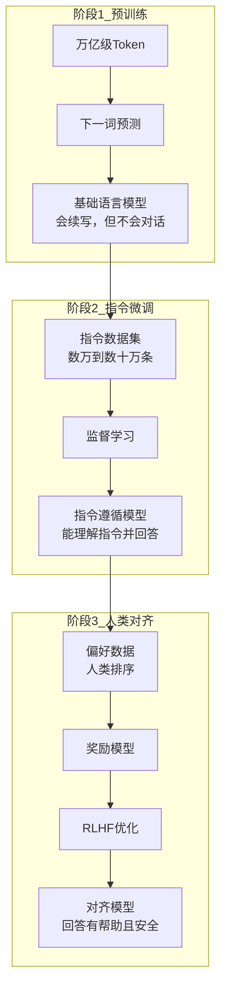

**三阶段的类比理解**：

| 阶段 | 类比 | 目标 | 数据量 | 计算量 |
|------|------|------|--------|--------|
| 预训练 | 读万卷书——广泛阅读，积累知识 | 学习语言和世界知识 | 万亿级Token | 极大（数千GPU月） |
| 指令微调 | 学会考试——理解题目要求，规范作答 | 学会遵循指令 | 数万到数十万条 | 中等（数GPU日） |
| 人类对齐 | 学会做人——回答有礼貌、有帮助、有底线 | 对齐人类偏好 | 数千到数万条偏好对 | 中等（数GPU日） |

### 预训练详解

**数据准备**

预训练数据的质量直接决定模型的上限。数据准备是预训练中最耗时也最关键的环节之一。

- **数据来源**：
  - 网页文本（Common Crawl等）：体量最大，但质量参差不齐
  - 书籍：高质量的长文本，逻辑连贯
  - 代码（GitHub等）：结构化、逻辑严密，有助于推理能力
  - 论文（arXiv等）：专业领域知识
  - 百科（Wikipedia等）：高质量的事实性知识
  - 社交媒体：对话风格、口语化表达

- **数据处理**：
  - **清洗**：去除HTML标签、特殊字符、乱码等噪声
  - **去重**：使用MinHash等算法去除重复和近似重复内容，防止模型记忆重复数据
  - **质量过滤**：使用分类器过滤低质量内容（如广告、垃圾信息）
  - **有害内容过滤**：去除暴力、色情等有害内容
  - **个人隐私脱敏**：去除个人身份信息（PII）

- **数据配比**：平衡不同类型数据至关重要。例如：
  - 网页文本：60-70%（提供广度）
  - 书籍：10-15%（提供深度）
  - 代码：10-15%（增强推理能力）
  - 论文：5-10%（专业知识）
  - 百科：3-5%（事实性知识）

**训练目标**

- **下一词预测（Next Token Prediction）**：给定前文，预测下一个Token的概率分布
- **损失函数**：交叉熵损失——衡量模型预测的概率分布与真实分布之间的差距

```
损失 = -Σ log(P(真实Token | 前文))
```

模型的目标是最小化这个损失，即最大化预测正确Token的概率。

**计算资源**

- 训练GPT-3约需3.14×10²³ FLOPS（浮点运算次数）
- 需要数千张GPU进行分布式训练
- 训练时间：数周到数月
- 估算成本：数百万到数千万美元
- 关键挑战：训练稳定性——在如此大规模的训练中，硬件故障、梯度爆炸、损失尖峰等问题随时可能发生，需要精心设计容错和恢复机制

### 指令微调详解

指令微调是将"会续写文本"的基础模型转变为"能理解指令并回答问题"的助手模型的关键步骤。

**数据格式**
```json
{
  "instruction": "将以下句子翻译成英文",
  "input": "你好，世界",
  "output": "Hello, World"
}
```

**指令数据的构建**：

| 数据类型 | 示例 | 作用 |
|---------|------|------|
| 开放式问答 | "什么是光合作用？" | 培养知识问答能力 |
| 创意写作 | "写一首关于秋天的诗" | 培养创作能力 |
| 代码生成 | "写一个排序函数" | 培养编程能力 |
| 数学推理 | "解方程 2x+3=7" | 培养推理能力 |
| 角色扮演 | "作为营养师，给我建议" | 培养角色适应能力 |
| 多轮对话 | 包含上下文的对话序列 | 培养对话连贯性 |

**微调策略**

| 策略 | 原理 | 优点 | 缺点 | 适用场景 |
|------|------|------|------|---------|
| 全参数微调 | 更新模型所有参数 | 效果最好 | 显存需求大，容易过拟合 | 数据充足、资源充足 |
| LoRA | 冻结原始参数，训练低秩矩阵 | 高效、显存需求低 | 表达能力有限 | 大多数微调场景 |
| QLoRA | 量化+LoRA | 极低显存需求 | 精度略有损失 | 消费级GPU微调 |
| P-Tuning v2 | 只训练前缀向量 | 参数极少 | 效果不稳定 | 特定任务适配 |

**LoRA原理图解**：

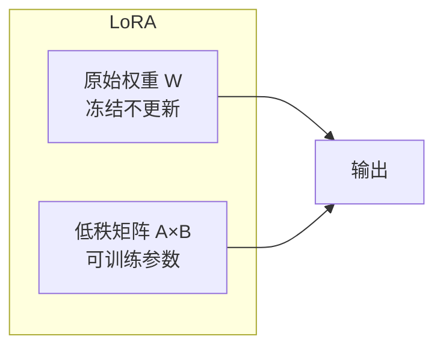

LoRA的核心思想：不直接修改原始的大权重矩阵W，而是添加一个低秩的"增量"矩阵ΔW = A×B，其中A和B的维度远小于W。训练时只更新A和B，推理时将ΔW合并到W中，不增加推理开销。

## Temperature与Top P

### Temperature（温度）

**作用**：控制输出的随机性

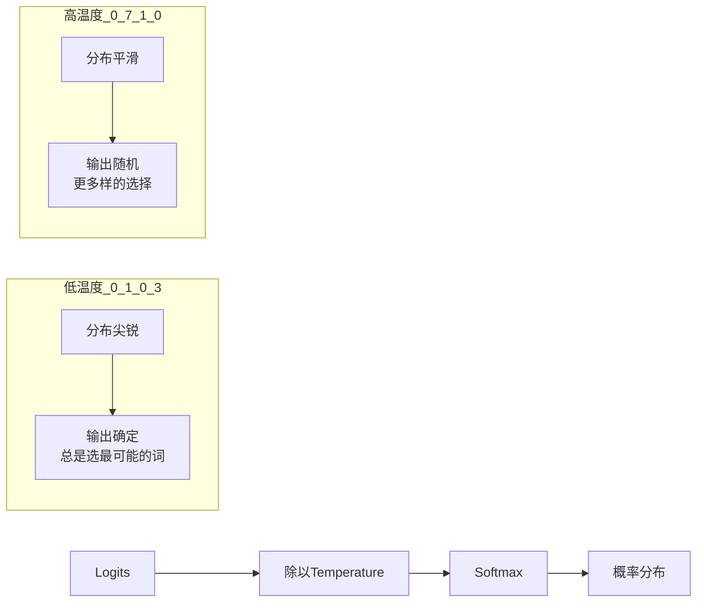

**数学原理**：

模型输出的原始分数称为Logits，经过Softmax函数转换为概率分布：

```
P(xi) = exp(logiti / T) / Σ exp(logitj / T)
```

其中T就是Temperature。当T→0时，概率集中在最高分的Token上（贪心解码）；当T→∞时，所有Token的概率趋于均匀（随机选择）。

**具体例子**：

假设模型对下一个词的Logits为：`[5.0, 3.0, 1.0]`（对应词A、B、C）

| Temperature | 词A概率 | 词B概率 | 词C概率 | 效果 |
|-------------|---------|---------|---------|------|
| 0.1 | 0.99 | 0.01 | 0.00 | 几乎总选A |
| 0.5 | 0.84 | 0.14 | 0.02 | 大多选A |
| 1.0 | 0.67 | 0.24 | 0.09 | 正常分布 |
| 2.0 | 0.42 | 0.33 | 0.25 | 较均匀 |

**参数选择建议**

| 任务类型 | 推荐Temperature | 说明 |
|---------|----------------|------|
| 代码生成 | 0.1-0.3 | 需要准确、一致，代码不能有"创意" |
| 数据提取 | 0.0-0.1 | 需要精确提取，不允许随机性 |
| 文本摘要 | 0.3-0.5 | 平衡准确与流畅 |
| 日常对话 | 0.5-0.7 | 自然但不过于随机 |
| 创意写作 | 0.7-1.0 | 需要多样性和创意 |
| 头脑风暴 | 0.8-1.2 | 激发创意，鼓励非常规想法 |
| 诗歌创作 | 1.0-1.5 | 追求出人意料的效果 |

### Top P（核采样）

**原理**：从概率最高的Token开始累加，直到总和达到P，然后只从这些Token中采样。

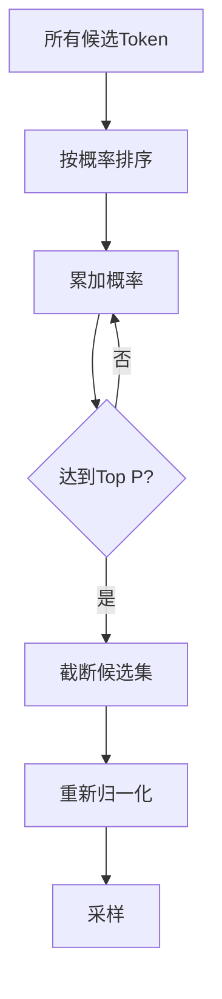

**具体例子**：

假设模型对下一个词的概率分布为：

| Token | 概率 | 累计概率 |
|-------|------|---------|
| "的" | 0.40 | 0.40 |
| "了" | 0.25 | 0.65 |
| "是" | 0.15 | 0.80 |
| "在" | 0.10 | 0.90 |
| "和" | 0.05 | 0.95 |
| "有" | 0.03 | 0.98 |
| "不" | 0.02 | 1.00 |

- **Top P = 0.8**：只保留"的"、"了"、"是"（累计概率0.80），截断后面的Token
- **Top P = 0.9**：保留"的"、"了"、"是"、"在"（累计概率0.90）
- **Top P = 1.0**：保留所有Token

**参数选择建议**

| Top P值 | 效果 | 适用场景 |
|---------|------|---------|
| 0.5-0.7 | 非常保守，只选高概率词 | 需要高度确定的输出 |
| 0.9 | 平衡多样性和质量 | 大多数场景的默认选择 |
| 0.95 | 较多样，允许低概率词 | 创意性任务 |
| 1.0 | 不过滤，完全由Temperature控制 | 配合低Temperature使用 |

### 其他采样策略

除了Temperature和Top P，还有其他常用的采样控制方法：

| 策略 | 原理 | 优点 | 缺点 |
|------|------|------|------|
| Top K | 只从概率最高的K个Token中采样 | 简单直观 | K值固定，不够灵活 |
| Beam Search | 同时维护多个候选序列 | 找到全局更优解 | 生成速度慢，可能缺乏多样性 |
| Repetition Penalty | 对已出现的Token施加惩罚 | 减少重复 | 可能过度惩罚 |
| Frequency Penalty | 惩罚高频Token | 增加词汇多样性 | 可能产生不自然的表达 |
| Presence Penalty | 惩罚已出现的Token | 鼓励话题多样性 | 可能偏离主题 |

**Top K vs Top P**：

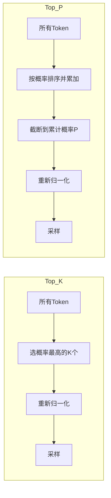

Top K的问题：当概率分布集中时，K=50可能包含太多低质量Token；当概率分布均匀时，K=50可能又太少。Top P自适应地解决了这个问题——概率集中时自动减少候选，概率分散时自动增加候选。

### 组合使用

```python
response = client.chat.completions.create(
    model="gpt-4",
    messages=[...],
    temperature=0.7,
    top_p=0.9,
    frequency_penalty=0.0,
    presence_penalty=0.0,
)
```

**最佳实践**：
- **不要同时调整Temperature和Top P**：OpenAI官方建议只调整其中一个。通常先设定Top P=0.9，然后通过调整Temperature来控制随机性。
- **代码场景**：Temperature=0.1, Top P=0.9——确保代码准确性
- **创意场景**：Temperature=0.8, Top P=0.95——增加多样性
- **精确场景**：Temperature=0.0, Top P=1.0——贪心解码，最确定性的输出

## 模型能力边界

### 擅长的任务

| 能力 | 说明 | 示例 |
|------|------|------|
| 文本生成与改写 | 生成流畅、连贯的文本，改写风格和语气 | 将口语改写为正式书面语 |
| 代码编写与解释 | 编写代码、解释代码逻辑、调试代码 | 根据需求描述生成Python函数 |
| 知识问答 | 回答各领域的问题 | "量子纠缠是什么？" |
| 翻译与摘要 | 多语言翻译、长文本摘要 | 将英文论文摘要翻译为中文 |
| 创意写作 | 写诗、写故事、写文案 | "写一段咖啡品牌广告语" |
| 逻辑推理 | 多步骤推理、因果分析 | 分析商业案例的因果关系 |
| 数据分析 | 理解数据、生成洞察 | 分析销售数据趋势 |
| 角色扮演 | 扮演特定角色进行对话 | "作为面试官提问" |

### 不擅长/需要注意的任务

| 局限 | 原因 | 解决方案 |
|------|------|---------|
| 数学计算 | LLM是语言模型，不是计算器，可能产生计算错误 | 使用代码解释器或外部计算工具 |
| 实时信息 | 训练数据有截止日期，无法获取最新信息 | 联网搜索（如Bing插件） |
| 私有知识 | 没有见过企业内部数据 | RAG（检索增强生成） |
| 精确事实 | 可能"幻觉"出不存在的事实 | 交叉验证、提供信息来源 |
| 长文档一致性 | 超长文本中可能遗忘前文 | 分段处理、使用长上下文模型 |
| 空间推理 | 语言模型对空间关系的理解有限 | 结合视觉模型 |
| 精确计数 | Token化破坏了精确的字符/词计数 | 使用代码工具辅助 |

### 幻觉问题（Hallucination）

幻觉是大模型最突出的局限之一，指的是模型生成看似合理但实际上不正确的内容。

**幻觉的类型**：

| 类型 | 描述 | 示例 |
|------|------|------|
| 事实性幻觉 | 编造不存在的事实 | 虚构不存在的论文引用 |
| 推理性幻觉 | 逻辑推理出错 | 在多步推理中某一步出错导致最终答案错误 |
| 一致性幻觉 | 前后矛盾 | 先说A是对的，后来又说A是错的 |
| 指令幻觉 | 忽略或歪曲用户指令 | 要求输出JSON但输出了纯文本 |

**幻觉的根源**：

1. **训练数据的噪声**：互联网数据中本身就包含错误信息，模型可能学到了这些错误
2. **知识过时**：训练数据有截止日期，对于训练后发生的事件，模型可能编造答案
3. **过度自信**：模型倾向于给出"看起来合理"的答案，而不是承认"我不知道"
4. **概率生成**：模型本质上是根据概率生成文本，不保证事实正确性

**缓解幻觉的策略**：

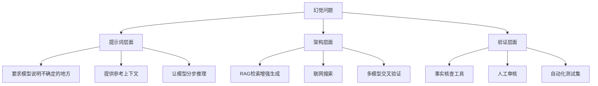

### RAG（检索增强生成）

RAG是解决模型知识局限的重要方案，它将"检索"和"生成"结合起来：

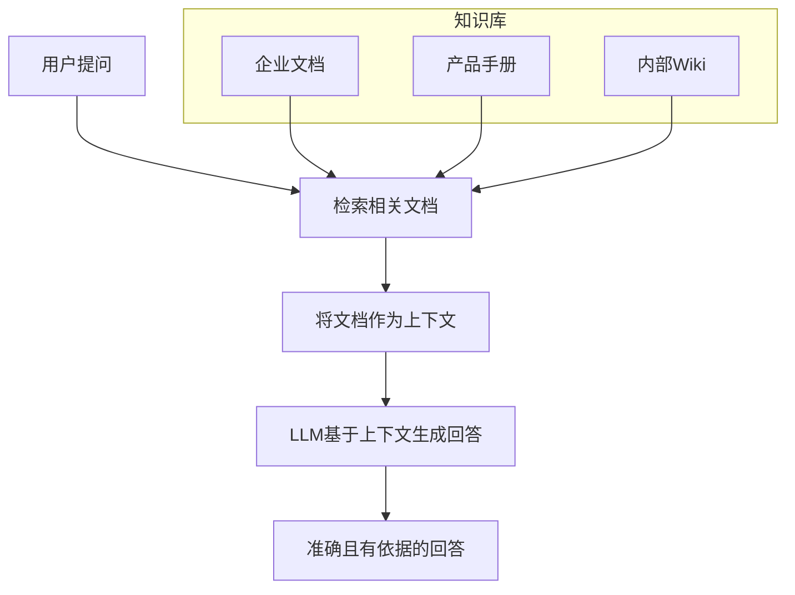

**RAG的优势**：
- **知识可更新**：只需更新知识库，无需重新训练模型
- **回答可溯源**：可以引用来源文档，增加可信度
- **私有数据安全**：数据保留在本地，不需要发送给模型训练
- **成本可控**：比微调模型便宜得多

### 上下文窗口

上下文窗口决定了模型一次能处理的最大文本长度，是影响模型能力的重要参数。

| 模型 | 上下文窗口 | 约等于 |
|------|-----------|--------|
| GPT-3 | 4K Token | 约3000字 |
| GPT-3.5 | 16K Token | 约12000字 |
| GPT-4 | 128K Token | 约10万字（一本书） |
| Claude 3 | 200K Token | 约15万字 |
| Gemini 1.5 Pro | 1M Token | 约75万字（多本书） |

**上下文窗口的影响**：
- **短窗口**：无法处理长文档，需要分块处理，可能丢失全局信息
- **长窗口**：可以处理完整文档，但计算成本随长度二次增长（注意力机制的特性）
- **实际注意**：即使模型支持长上下文，也不意味着它能"注意到"上下文中的所有信息——研究表明，模型对上下文开头和结尾的信息关注度更高，中间部分的信息容易被"忽略"（Lost in the Middle现象）

## 小结

理解大模型原理是应用开发的基础：

1. **生成式AI**通过大规模预训练获得语言理解和生成能力，实现了从"判断"到"创造"的范式转变
2. **Transformer架构**是现代大模型的基石，自注意力机制解决了长距离依赖问题，实现了并行计算
3. **三阶段训练**使模型从"会续写"进化到"会对话"再到"对齐人类偏好"，每一步都至关重要
4. **涌现能力**是大模型最令人兴奋的特性——规模增长不仅带来量变，还会产生质变
5. **Temperature和Top P**是控制输出质量和多样性的关键参数，需要根据任务类型合理选择
6. 了解模型**能力边界**有助于正确使用模型——知道什么时候该用AI，什么时候该用工具辅助
7. **幻觉问题**是大模型的主要局限，RAG、联网搜索等技术可以有效缓解

**学习路径建议**：

| 阶段 | 目标 | 建议行动 |
|------|------|---------|
| 入门 | 理解基本概念 | 阅读本文，使用ChatGPT体验各种能力 |
| 进阶 | 理解技术原理 | 阅读《Attention Is All You Need》论文，了解Transformer细节 |
| 实践 | 掌握应用开发 | 学习Prompt Engineering，使用API开发应用 |
| 深入 | 理解训练过程 | 学习深度学习基础，尝试微调开源模型 |
| 专家 | 参与模型研发 | 研究模型架构创新，参与开源社区贡献 |
