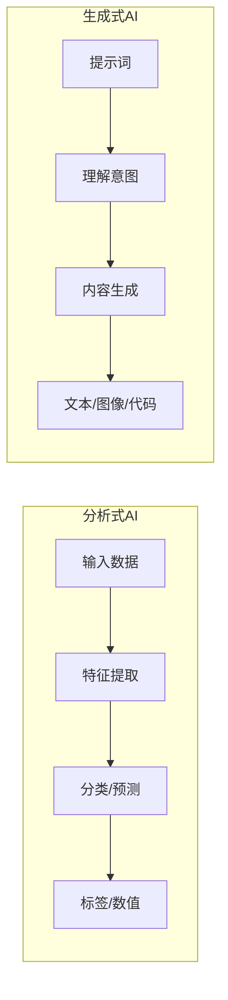
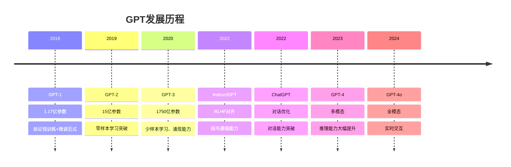
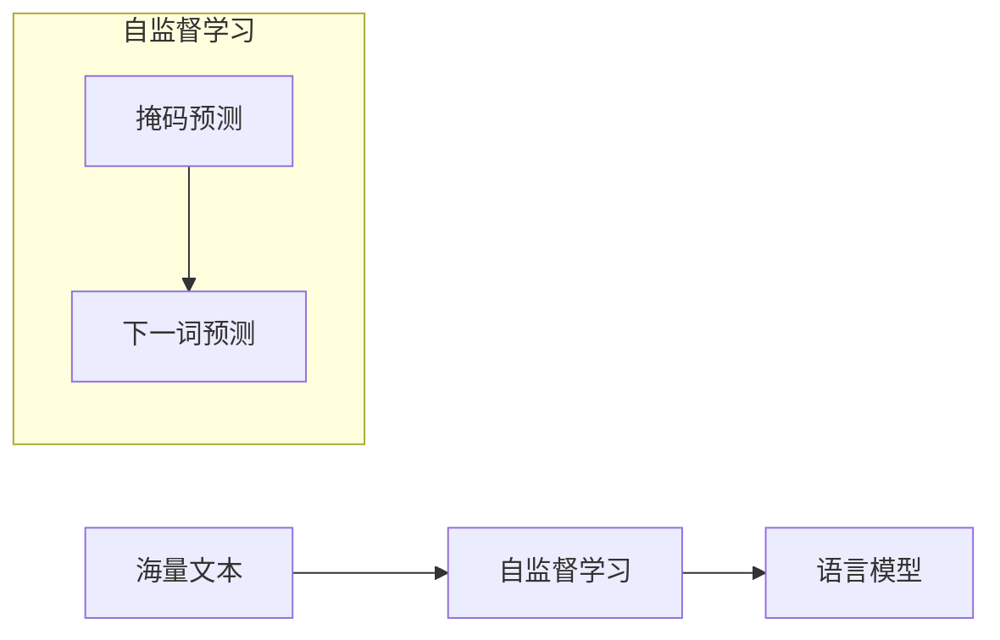
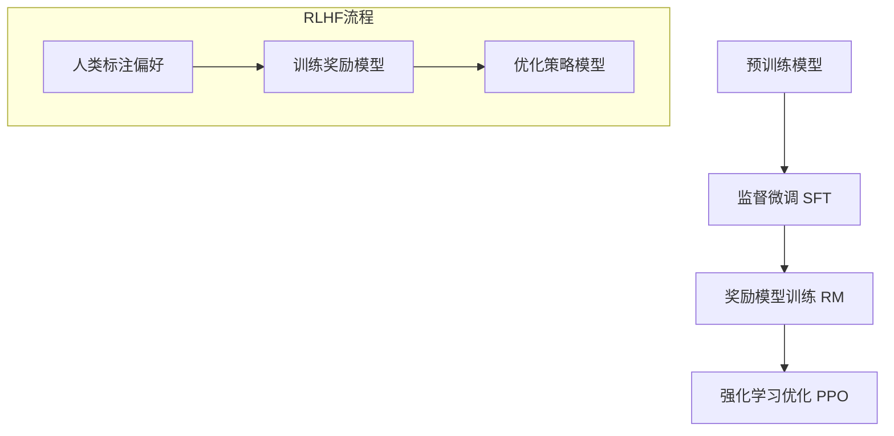
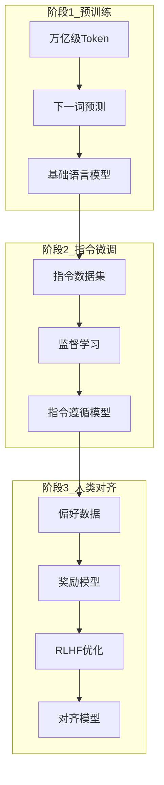
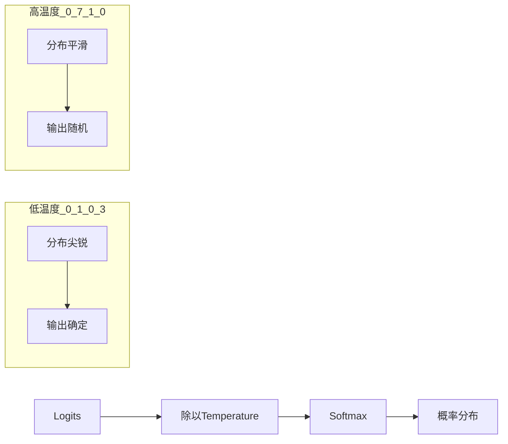
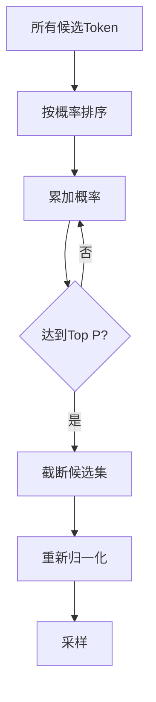

# AI大模型基本原理

深入理解大语言模型的工作原理，为应用开发打下理论基础。

## 从分析式AI到生成式AI

### 核心区别



| 维度 | 分析式AI | 生成式AI |
|------|---------|---------|
| 学习目标 | 模式识别 | 内容创造 |
| 数据需求 | 标注数据 | 海量无标注数据 |
| 输出确定性 | 相对确定 | 具有随机性 |
| 应用场景 | 分类、预测、推荐 | 创作、对话、编程 |

### 生成式AI的突破

- **规模效应**：参数量达到一定规模后涌现新能力
- **泛化能力**：零样本/少样本学习能力
- **多任务能力**：一个模型处理多种任务

## GPT系列演进

### 发展历程



### 关键技术突破

#### 1. 预训练范式



#### 2. 涌现能力

当模型规模达到一定阈值后，突然出现的新能力：

- **上下文学习**：从示例中学习新任务
- **思维链推理**：分步骤解决复杂问题
- **指令遵循**：理解并执行复杂指令

#### 3. RLHF对齐



## LLM训练过程

### 三阶段训练



### 预训练详解

**数据准备**
- 数据来源：网页、书籍、代码、论文
- 数据处理：清洗、去重、质量过滤
- 数据配比：平衡不同类型数据

**训练目标**
- 下一词预测（Next Token Prediction）
- 损失函数：交叉熵损失

**计算资源**
- 训练GPT-3约需3.14×10²³ FLOPS
- 需要数千张GPU进行分布式训练

### 指令微调详解

**数据格式**
```json
{
  "instruction": "将以下句子翻译成英文",
  "input": "你好，世界",
  "output": "Hello, World"
}
```

**微调策略**
- 全参数微调：更新所有参数
- LoRA：低秩适配，高效微调
- QLoRA：量化LoRA，降低显存需求

## Temperature与Top P

### Temperature（温度）

**作用**：控制输出的随机性



**参数选择建议**

| 任务类型 | 推荐Temperature | 说明 |
|---------|----------------|------|
| 代码生成 | 0.1-0.3 | 需要准确、一致 |
| 文本摘要 | 0.3-0.5 | 平衡准确与流畅 |
| 创意写作 | 0.7-1.0 | 需要多样性 |
| 头脑风暴 | 0.8-1.2 | 激发创意 |

### Top P（核采样）

**原理**：从概率最高的token开始累加，直到总和达到P



**参数选择建议**
- 常用值：0.9
- 与Temperature配合使用
- 较低的Top P会限制输出多样性

### 组合使用

```python
response = client.chat.completions.create(
    model="gpt-4",
    messages=[...],
    temperature=0.7,  # 控制随机性
    top_p=0.9,        # 控制候选范围
)
```

## 模型能力边界

### 擅长的任务

- 文本生成与改写
- 代码编写与解释
- 知识问答
- 翻译与摘要
- 创意写作

### 不擅长/需要注意的任务

- 数学计算（需要工具辅助）
- 实时信息（需要联网搜索）
- 私有知识（需要RAG）
- 精确事实（可能产生幻觉）

## 小结

理解大模型原理是应用开发的基础：

1. **生成式AI**通过大规模预训练获得语言理解和生成能力
2. **三阶段训练**使模型具备指令遵循和人类对齐能力
3. **Temperature和Top P**是控制输出质量的关键参数
4. 了解模型**能力边界**有助于正确使用模型
