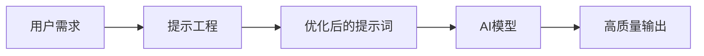
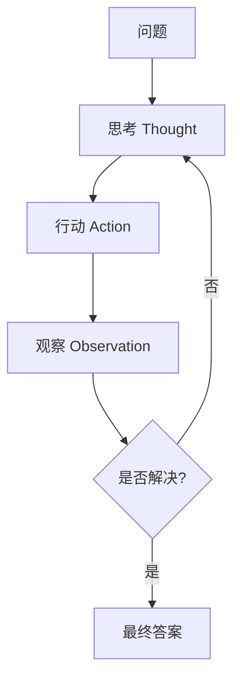
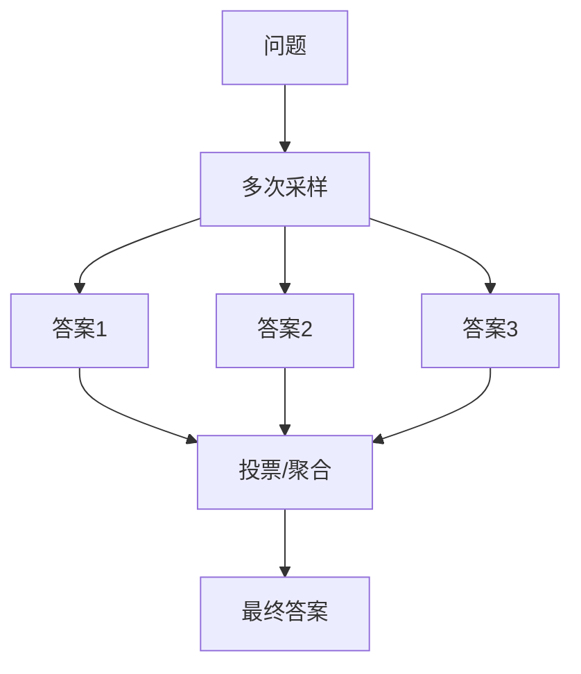
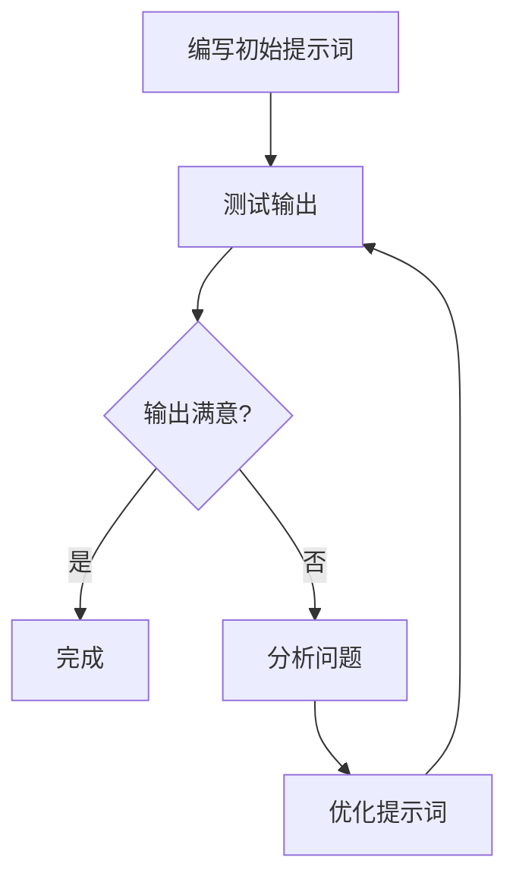

# 提示工程（Prompt Engineering）

掌握与AI大模型高效沟通的艺术，通过精心设计的提示词激发模型的最佳性能。

## 提示工程概述

### 什么是提示工程

提示工程是设计和优化输入给AI模型的文本提示，以获得期望输出的技术和方法。



### 核心价值

| 价值 | 描述 |
|------|------|
| 提升准确性 | 减少模型误解，获得精确输出 |
| 控制输出格式 | 指定JSON、表格、代码等格式 |
| 激发能力 | 引导模型使用特定能力 |
| 降低成本 | 减少迭代次数，节省Token |

## 基础提示技巧

### 1. 明确指令

**原则**：使用清晰的动词开头，明确指定任务

```markdown
❌ 不好的提示：
这个代码有什么问题？

✅ 好的提示：
请分析以下Python代码的潜在问题，包括：
1. 性能瓶颈
2. 安全隐患
3. 代码风格问题
并给出具体的改进建议。
```

### 2. 角色设定

**原则**：定义专家身份，引导专业输出

```markdown
✅ 角色设定示例：
你是一位资深的前端架构师，拥有10年以上的React开发经验。
请从架构设计的角度，评估以下技术方案的可扩展性和维护性。
```

### 3. 输出格式指定

**原则**：明确输出结构，便于后续处理

```markdown
✅ 格式指定示例：
请以JSON格式输出分析结果，包含以下字段：
{
  "summary": "问题概述",
  "issues": [
    {
      "type": "问题类型",
      "description": "问题描述",
      "solution": "解决方案"
    }
  ],
  "priority": "优先级（高/中/低）"
}
```

### 4. 提供上下文

**原则**：给足背景信息，帮助模型理解

```markdown
✅ 上下文示例：
背景：我们正在开发一个电商平台的商品推荐系统。
技术栈：Python、TensorFlow、Redis
当前问题：推荐结果的相关性不够高
目标：提升推荐准确率至少15%
```

## 高级提示技巧

### Chain of Thought（思维链）

**原理**：引导模型分步骤推理

```markdown
✅ CoT示例：
请一步步分析以下问题：

问题：小明有5个苹果，给了小红2个，又买了3个，现在有几个？

请按以下步骤思考：
1. 首先确定初始数量
2. 计算给出后的数量
3. 计算买入后的数量
4. 给出最终答案
```

**适用场景**：
- 数学推理
- 逻辑分析
- 复杂问题拆解

### Few-shot Learning（少样本学习）

**原理**：提供示例帮助模型理解任务

```markdown
✅ Few-shot示例：
请根据示例进行情感分析：

示例1：
输入：这个产品太棒了，非常喜欢！
输出：正面

示例2：
输入：质量一般，不太满意。
输出：负面

示例3：
输入：物流很快，但包装有破损。
输出：中性

现在请分析：
输入：服务态度很好，但产品功能还需要改进。
输出：
```

### ReAct（推理+行动）

**原理**：结合推理和行动的循环



```markdown
✅ ReAct示例：
问题：北京今天的天气如何？

思考1：我需要查询北京今天的天气信息
行动1：搜索"北京天气"

观察1：北京今天晴，气温15-25°C，空气质量良好

思考2：我已经获得了天气信息，可以回答问题了
答案：北京今天天气晴朗，气温15-25摄氏度，空气质量良好。
```

### Self-Consistency（自一致性）

**原理**：多次采样取共识，提高准确性



## 上下文工程

### 系统提示词设计

```python
system_prompt = """
你是一个专业的代码审查助手，具有以下特点：
1. 严格遵循代码规范
2. 关注性能和安全性
3. 提供具体可行的改进建议

在审查代码时，请：
- 首先概述代码的整体质量
- 列出发现的问题（按严重程度排序）
- 为每个问题提供修复建议
- 给出改进后的代码示例
"""
```

### 长上下文管理

**策略**：

| 策略 | 描述 | 适用场景 |
|------|------|---------|
| 摘要压缩 | 压缩历史对话 | 长对话场景 |
| 滑动窗口 | 保留最近N轮 | 实时对话 |
| 分层存储 | 重要信息长期保存 | 知识积累 |
| 向量检索 | 按需检索相关内容 | RAG场景 |

### 提示词模板

```python
from langchain.prompts import ChatPromptTemplate

template = ChatPromptTemplate.from_messages([
    ("system", "你是一个{role}，专注于{domain}领域。"),
    ("user", "{task}\n\n上下文：{context}\n\n请给出你的分析和建议。")
])

prompt = template.format_messages(
    role="技术架构师",
    domain="微服务架构",
    task="评估系统设计方案",
    context="系统需要支持百万级并发..."
)
```

## 常见问题与解决方案

### 问题1：输出不稳定

**原因**：Temperature过高或提示词模糊

**解决方案**：
- 降低Temperature（0.1-0.3）
- 明确输出格式要求
- 使用Few-shot示例

### 问题2：输出格式不符合预期

**原因**：格式指令不明确

**解决方案**：
```markdown
请严格按照以下JSON格式输出，不要添加任何其他内容：
{"result": "你的答案", "confidence": 0.0-1.0}
```

### 问题3：模型产生幻觉

**原因**：模型编造不存在的信息

**解决方案**：
- 添加约束："如果不确定，请说明"
- 使用RAG提供准确信息
- 要求引用来源

### 问题4：忽略指令

**原因**：指令被淹没在大量文本中

**解决方案**：
- 将关键指令放在开头或结尾
- 使用强调格式（如**重要**）
- 分步骤明确指令

## 提示词最佳实践

### 结构化模板

```markdown
# 角色
[定义AI的角色和专长]

# 任务
[明确具体任务]

# 背景
[提供必要的上下文]

# 约束
[列出限制条件]

# 输出格式
[指定输出结构]

# 示例
[提供参考示例]
```

### 迭代优化流程



## 小结

提示工程是与AI高效沟通的关键技能：

1. **基础技巧**：明确指令、角色设定、格式指定、上下文提供
2. **高级技巧**：CoT、Few-shot、ReAct、Self-Consistency
3. **上下文工程**：系统提示词设计、长上下文管理
4. **持续优化**：迭代测试、问题分析、模板积累
