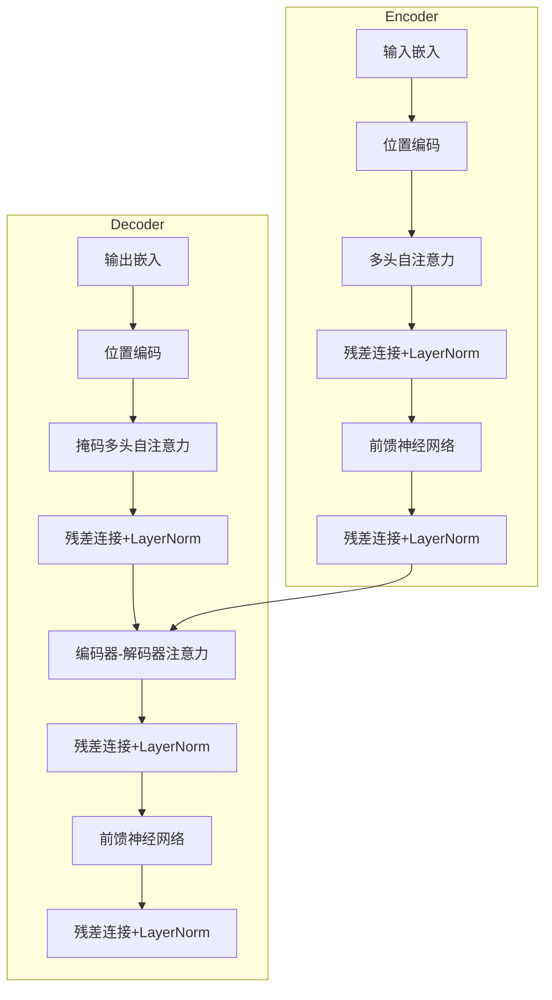
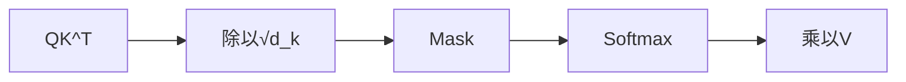
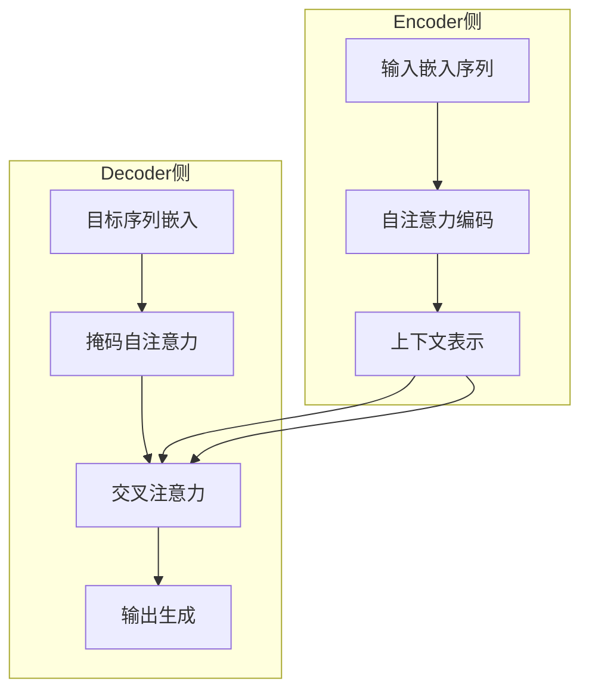

# Transformer原理详解

深入理解Transformer架构，掌握大模型的核心理论基础。

## 架构概览



## 核心组件

### 自注意力机制 (Self-Attention)

**核心思想**：允许模型在处理序列时，同时考虑序列中不同位置之间的依赖关系。

**数学表达**：

输入序列 X = [x₁, x₂, ..., xₙ]，通过线性变换得到 Q、K、V：

- Q = XW_Q（查询矩阵）
- K = XW_K（键矩阵）
- V = XW_V（值矩阵）

注意力计算：

```
Attention(Q, K, V) = softmax(QK^T / √d_k) V
```

**为什么需要Q、K、V三个矩阵？**

| 矩阵 | 作用 | 类比 |
|------|------|------|
| Q (Query) | 当前位置想要查询的信息 | 搜索关键词 |
| K (Key) | 每个位置能提供的信息标签 | 文档标题 |
| V (Value) | 每个位置的实际内容 | 文档内容 |

只使用V矩阵会限制模型的表达能力，Q和K的交互使模型能够更精确地计算注意力权重。

### 缩放点积注意力 (Scaled Dot-Product)

**为什么需要缩放？**

当 d_k 较大时，QK^T 的值会变得很大，导致softmax函数进入梯度极小的区域。除以 √d_k 可以缓解这个问题。



### 多头注意力 (Multi-Head Attention)

**核心思想**：让模型在不同的子空间中学习不同的注意力模式。

```
MultiHead(Q, K, V) = Concat(head₁, ..., headₕ) W_O
headᵢ = Attention(QW_Qᵢ, KW_Kᵢ, VW_Vᵢ)
```

| 特性 | 说明 |
|------|------|
| 头数 h | 通常为8或16 |
| 每头维度 | d_model / h |
| 优势 | 捕捉不同层次的语义关系 |

### 位置编码 (Positional Encoding)

**为什么需要位置编码？**

自注意力机制本身是位置无关的（置换不变性），需要显式注入位置信息。

**正弦/余弦编码**：

```
PE(pos, 2i)   = sin(pos / 10000^(2i/d_model))
PE(pos, 2i+1) = cos(pos / 10000^(2i/d_model))
```

**关键问题**：位置信息在不同Encoder之间会丢失吗？

**不会**。位置编码与词嵌入相加后，会随输入向量一起流经整个模型，每个Encoder/Decoder层都能接收到包含位置信息的输入。

### 前馈神经网络 (Feed-Forward Network)

```
FFN(x) = max(0, xW₁ + b₁)W₂ + b₂
```

**FFN层在训练什么？**

FFN层通过特征提取和非线性映射来学习输入序列的表示，为下游任务提供更好的输入特征。它本质上是两个线性变换加一个ReLU激活，可以看作是对注意力层输出的进一步加工。

### 层归一化 (Layer Normalization)

**为什么用Layer Norm而不是Batch Norm？**

| 特性 | Layer Norm | Batch Norm |
|------|-----------|------------|
| 归一化维度 | 每个样本的特征维度 | 批次维度 |
| 假设 | 特征独立同分布 | 批次内独立同分布 |
| 适用场景 | 序列长度可变 | 固定输入大小 |
| 批次依赖 | 不依赖批次大小 | 依赖批次大小 |

Transformer中每个位置独立处理，Batch Norm的假设不适用。Layer Norm在每个位置的特征维度上归一化，更符合Transformer的设计。

### 残差连接 (Residual Connection)

```
output = LayerNorm(x + Sublayer(x))
```

**作用**：
- 缓解梯度消失和梯度爆炸
- 使深层网络更容易训练
- 允许信息直接传递

## 复杂度分析

| 层 | 时间复杂度 | 空间复杂度 |
|----|-----------|-----------|
| Embedding | O(V × d) | O(V × d) |
| Self-Attention | O(n² × d) | O(n² + n × d) |
| Multi-Head | O(n² × d) | O(h × n² × d/h) |
| Feed-Forward | O(n × d²) | O(d²) |

其中 n 是序列长度，d 是模型维度，h 是注意力头数。

## Encoder-Decoder依赖关系



**Encoder的输出是Decoder交叉注意力层的输入**，建立了编码器到解码器的信息传递通道。

## Transformer变体

| 模型 | 架构 | 特点 |
|------|------|------|
| BERT | Encoder-only | 双向理解，适合分类/NER |
| GPT | Decoder-only | 自回归生成，适合文本生成 |
| T5 | Encoder-Decoder | 文本到文本统一框架 |
| LLaMA | Decoder-only | 开源高效 |
| Qwen | Decoder-only | 中文优化 |

## 面试高频问题

### 1. Transformer的数学假设

Transformer的训练目标是最大化下一个词的条件概率：

P(xᵢ | x₁, x₂, ..., xᵢ₋₁)

通过注意力权重的加权求和来计算预测得分，使用Scaled Dot-Product Attention机制计算注意力权重。

### 2. Self-Attention vs RNN

| 特性 | Self-Attention | RNN |
|------|---------------|-----|
| 并行性 | 完全并行 | 顺序计算 |
| 长距离依赖 | O(1)直接连接 | O(n)逐步传递 |
| 计算复杂度 | O(n²d) | O(nd²) |
| 位置信息 | 需要显式编码 | 天然有序 |

### 3. 为什么Transformer比RNN更适合大模型

- **并行计算**：自注意力机制可以并行处理所有位置
- **长距离依赖**：任意两个位置之间直接连接
- **可扩展性**：更容易利用GPU并行能力

## 小结

Transformer是大模型的理论基础：

1. **自注意力**：QKV机制捕捉序列依赖关系
2. **多头注意力**：多子空间学习不同模式
3. **位置编码**：注入序列位置信息
4. **层归一化**：稳定训练过程
5. **残差连接**：缓解梯度问题
