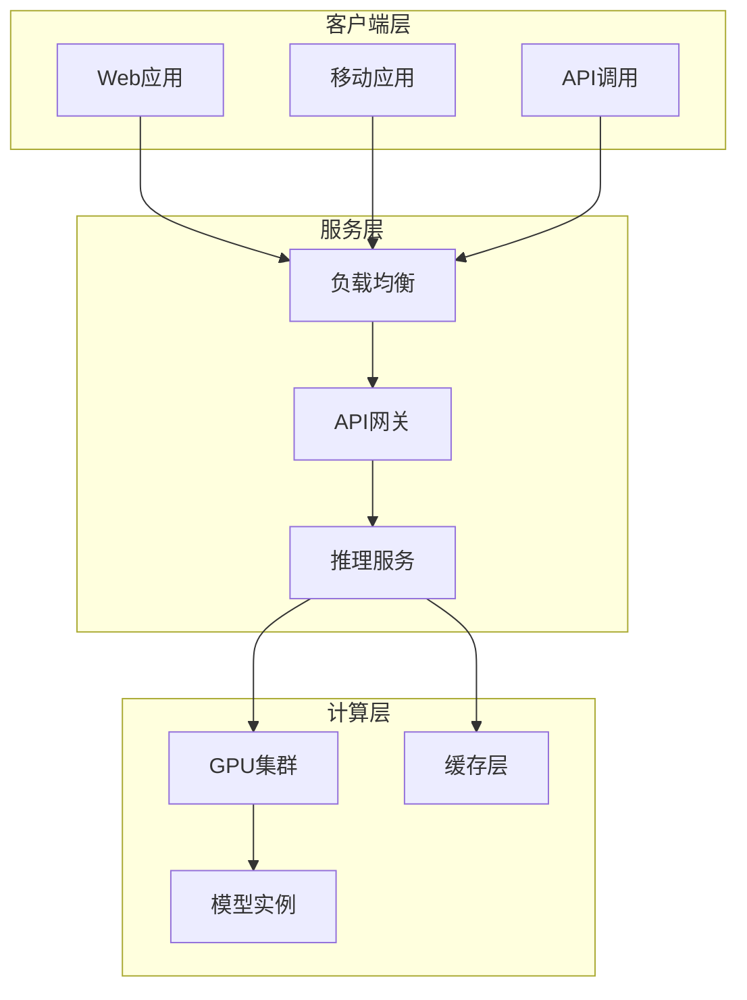
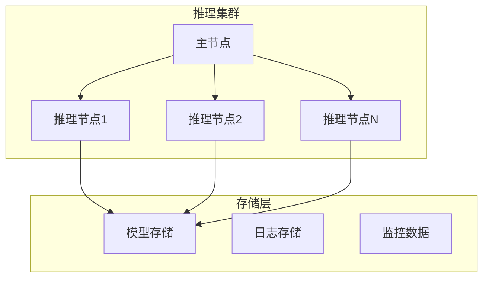
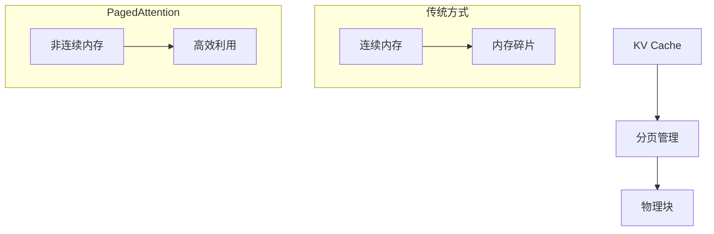
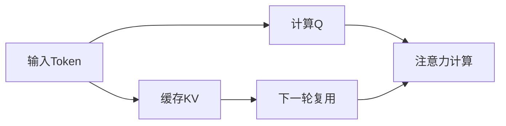
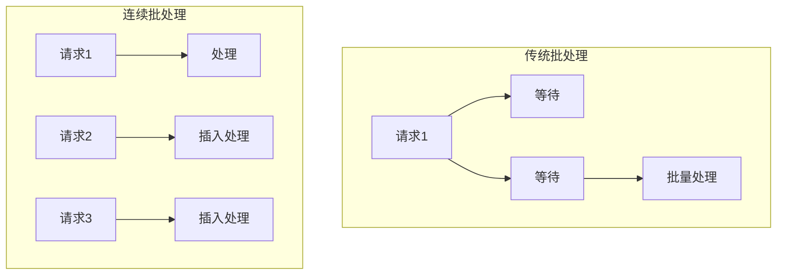

# 模型部署与高并发

企业级AI服务部署与性能优化实践。

## 部署架构概览



## 硬件选型

### GPU选型对比

| GPU | 显存 | 算力 | 适用场景 |
|-----|------|------|---------|
| H100 | 80GB | 最高 | 大规模训练 |
| A100 | 80GB | 高 | 训练/推理 |
| L40S | 48GB | 中高 | 推理优化 |
| 4090 | 24GB | 中 | 小规模推理 |

### 服务器配置

```markdown
推理服务器推荐配置：
- CPU: 32核以上
- 内存: 128GB+
- GPU: 根据模型大小选择
- 存储: NVMe SSD
- 网络: 25Gbps+
```

### 集群规划



## 部署框架

### Ollama

**特点**：易用性、本地化部署优势

```bash
ollama run qwen2:7b
```

```python
import requests

response = requests.post(
    "http://localhost:11434/api/generate",
    json={
        "model": "qwen2:7b",
        "prompt": "你好"
    }
)
```

### vLLM

**特点**：高吞吐推理引擎，PagedAttention核心优势

```python
from vllm import LLM, SamplingParams

llm = LLM(model="Qwen/Qwen2-7B")
sampling_params = SamplingParams(temperature=0.7, top_p=0.9)

outputs = llm.generate(["你好"], sampling_params)
```

**PagedAttention原理**



### SGLang

**特点**：复杂控制流任务高性能

```python
import sglang as sgl

@sgl.function
def multi_turn_chat(s, question):
    s += sgl.user(question)
    s += sgl.assistant(sgl.gen("answer", max_tokens=100))
    return s["answer"]

result = multi_turn_chat.run(question="你好")
```

### 框架对比

| 特性 | Ollama | vLLM | SGLang |
|------|--------|------|--------|
| 易用性 | ★★★★★ | ★★★★ | ★★★ |
| 吞吐量 | ★★★ | ★★★★★ | ★★★★★ |
| 延迟 | ★★★★ | ★★★★ | ★★★★★ |
| 复杂任务 | ★★★ | ★★★ | ★★★★★ |

## 高并发原理

### KV Cache

**问题**：每次生成都需要重新计算KV

**解决**：缓存已计算的KV值



### Continuous Batching



### vLLM实现

```python
from vllm import LLM, SamplingParams

llm = LLM(
    model="Qwen/Qwen2-7B",
    tensor_parallel_size=2,
    gpu_memory_utilization=0.9
)

sampling_params = SamplingParams(
    temperature=0.7,
    top_p=0.9,
    max_tokens=100
)

outputs = llm.generate(prompts, sampling_params)
```

## 性能监控

### 关键指标

| 指标 | 描述 | 目标值 |
|------|------|--------|
| TTFT | 首Token延迟 | <500ms |
| TPS | 每秒Token数 | >100 |
| 并发数 | 同时处理请求数 | 根据硬件 |
| GPU利用率 | GPU使用率 | >80% |

### 监控工具

```python
import prometheus_client
from prometheus_client import Counter, Histogram

request_counter = Counter('llm_requests_total', 'Total requests')
latency_histogram = Histogram('llm_latency_seconds', 'Request latency')

@latency_histogram.time()
def generate_response(prompt):
    request_counter.inc()
    return llm.generate(prompt)
```

### 性能调优

```python
llm = LLM(
    model="Qwen/Qwen2-7B",
    max_model_len=4096,
    gpu_memory_utilization=0.9,
    tensor_parallel_size=2,
    enforce_eager=True
)
```

## 生产部署

### Docker部署

```dockerfile
FROM nvidia/cuda:12.1.0-runtime-ubuntu22.04

RUN pip install vllm

EXPOSE 8000

CMD ["python", "-m", "vllm.entrypoints.api_server", \
     "--model", "Qwen/Qwen2-7B", \
     "--host", "0.0.0.0", \
     "--port", "8000"]
```

### Kubernetes部署

```yaml
apiVersion: apps/v1
kind: Deployment
metadata:
  name: vllm-deployment
spec:
  replicas: 3
  template:
    spec:
      containers:
      - name: vllm
        image: vllm/vllm:latest
        resources:
          limits:
            nvidia.com/gpu: 2
        args:
        - --model
        - Qwen/Qwen2-7B
        - --tensor-parallel-size
        - "2"
```

### 负载均衡

```nginx
upstream llm_backend {
    least_conn;
    server llm-1:8000;
    server llm-2:8000;
    server llm-3:8000;
}

server {
    location /v1/ {
        proxy_pass http://llm_backend;
        proxy_set_header Host $host;
    }
}
```

## 最佳实践

### 1. 模型量化

```python
from transformers import AutoModelForCausalLM, BitsAndBytesConfig

bnb_config = BitsAndBytesConfig(
    load_in_4bit=True,
    bnb_4bit_compute_dtype="float16"
)

model = AutoModelForCausalLM.from_pretrained(
    "Qwen/Qwen2-7B",
    quantization_config=bnb_config
)
```

### 2. 批处理优化

```python
from vllm import LLM

llm = LLM(
    model="Qwen/Qwen2-7B",
    max_num_batched_tokens=8192,
    max_num_seqs=256
)
```

### 3. 缓存策略

```python
from functools import lru_cache

@lru_cache(maxsize=1000)
def cached_embedding(text: str):
    return embedding_model.encode(text)
```

## 小结

模型部署是AI应用落地的关键：

1. **硬件选型**：GPU、服务器、集群规划
2. **部署框架**：Ollama、vLLM、SGLang
3. **高并发原理**：KV Cache、PagedAttention、Continuous Batching
4. **性能监控**：TTFT、TPS、GPU利用率
5. **生产部署**：Docker、Kubernetes、负载均衡
