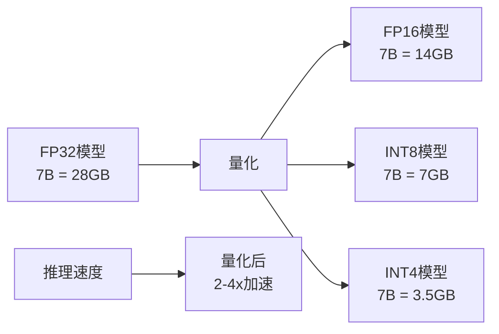
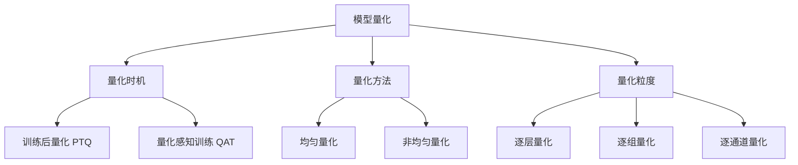
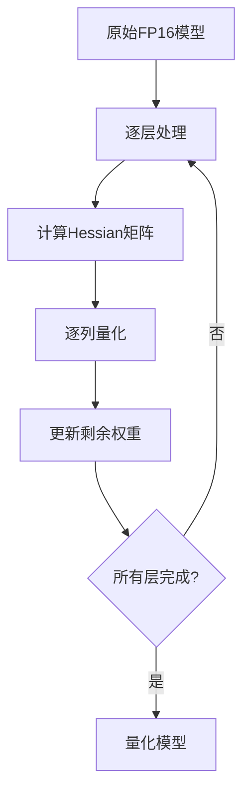
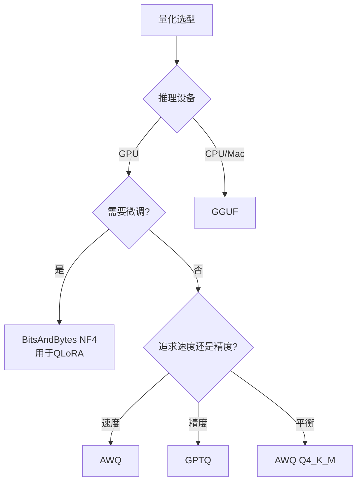

# 模型量化技术

通过降低模型参数精度来减少内存占用和加速推理，是大模型部署的关键优化手段。

## 量化概述

### 为什么需要量化



| 精度 | 每参数字节数 | 7B模型大小 | 精度损失 | 推理速度 |
|------|-----------|-----------|---------|---------|
| FP32 | 4字节 | 28GB | 无 | 基准 |
| FP16/BF16 | 2字节 | 14GB | 极小 | ~2x |
| INT8 | 1字节 | 7GB | 小 | ~3x |
| INT4 | 0.5字节 | 3.5GB | 中 | ~4x |

### 量化分类



## 量化原理

### 线性量化

将浮点数映射到整数范围：

```
量化: x_q = round(x / scale + zero_point)
反量化: x = (x_q - zero_point) * scale

scale = (x_max - x_min) / (q_max - q_min)
zero_point = q_min - round(x_min / scale)
```

```python
import numpy as np

def quantize_linear(tensor: np.ndarray, n_bits: int = 8) -> tuple:
    """线性量化"""
    q_min = 0
    q_max = 2 ** n_bits - 1
    
    x_min = tensor.min()
    x_max = tensor.max()
    
    scale = (x_max - x_min) / (q_max - q_min)
    zero_point = q_min - round(x_min / scale)
    
    quantized = np.clip(
        np.round(tensor / scale + zero_point),
        q_min, q_max
    ).astype(np.uint8)
    
    return quantized, scale, zero_point

def dequantize_linear(quantized: np.ndarray, scale: float, zero_point: int) -> np.ndarray:
    """线性反量化"""
    return (quantized.astype(np.float32) - zero_point) * scale
```

### 对称量化

零点固定为0，适用于权重分布对称的情况：

```
scale = max(|x_max|, |x_min|) / (2^(n-1) - 1)
x_q = round(x / scale)
x = x_q * scale
```

```python
def quantize_symmetric(tensor: np.ndarray, n_bits: int = 8) -> tuple:
    """对称量化"""
    q_max = 2 ** (n_bits - 1) - 1
    
    abs_max = np.max(np.abs(tensor))
    scale = abs_max / q_max
    
    quantized = np.clip(
        np.round(tensor / scale),
        -q_max, q_max
    ).astype(np.int8)
    
    return quantized, scale

def dequantize_symmetric(quantized: np.ndarray, scale: float) -> np.ndarray:
    """对称反量化"""
    return quantized.astype(np.float32) * scale
```

## 主流量化方法

### GPTQ

训练后量化方法，基于近似二阶信息逐层量化权重。



```python
from auto_gptq import AutoGPTQForCausalLM, BaseQuantizeConfig

def quantize_with_gptq(
    model_name: str = "Qwen/Qwen2-7B",
    bits: int = 4,
    group_size: int = 128,
    output_dir: str = "./qwen2-7b-gptq-4bit"
):
    """使用GPTQ量化模型"""
    
    quantize_config = BaseQuantizeConfig(
        bits=bits,
        group_size=group_size,
        desc_act=True,
        damp_percent=0.01,
        sym=True,
    )
    
    model = AutoGPTQForCausalLM.from_pretrained(
        model_name,
        quantize_config=quantize_config
    )
    
    from datasets import load_dataset
    dataset = load_dataset("wikitext", "wikitext-2-raw-v1", split="train")
    examples = [text for text in dataset["text"] if text.strip()][:128]
    
    model.quantize(examples)
    
    model.save_quantized(output_dir)
    
    return model

def load_gptq_model(model_path: str):
    """加载GPTQ量化模型"""
    model = AutoGPTQForCausalLM.from_quantized(
        model_path,
        device_map="auto",
        use_safetensors=True
    )
    return model
```

### AWQ (Activation-aware Weight Quantization)

基于激活感知的权重量化，保护重要权重通道。

```python
from awq import AutoAWQForCausalLM

def quantize_with_awq(
    model_name: str = "Qwen/Qwen2-7B",
    bits: int = 4,
    group_size: int = 128,
    output_dir: str = "./qwen2-7b-awq-4bit"
):
    """使用AWQ量化模型"""
    
    model = AutoAWQForCausalLM.from_pretrained(model_name)
    tokenizer = AutoTokenizer.from_pretrained(model_name, trust_remote_code=True)
    
    quant_config = {
        "zero_point": True,
        "q_group_size": group_size,
        "w_bit": bits,
        "version": "GEMM"
    }
    
    model.quantize(tokenizer, quant_config=quant_config)
    
    model.save_quantized(output_dir)
    tokenizer.save_pretrained(output_dir)
    
    return model
```

### GGUF (llama.cpp)

适用于CPU推理的量化格式，支持多种量化级别。

```python
def convert_to_gguf(
    model_name: str,
    output_dir: str = "./gguf-model",
    quant_type: str = "Q4_K_M"
):
    """转换为GGUF格式"""
    
    conversion_steps = f"""
    # 步骤1：下载原始模型
    huggingface-cli download {model_name} --local-dir ./original_model
    
    # 步骤2：转换为GGUF FP16
    python convert_hf_to_gguf.py ./original_model --outtype f16 --outfile model-f16.gguf
    
    # 步骤3：量化为指定精度
    ./llama-quantize model-f16.gguf model-{quant_type}.gguf {quant_type}
    """
    
    return conversion_steps
```

**GGUF量化级别**

| 量化类型 | 位宽 | 模型大小(7B) | 质量损失 | 速度 |
|---------|------|------------|---------|------|
| Q8_0 | 8bit | ~7GB | 极小 | 快 |
| Q5_K_M | 5bit | ~4.5GB | 小 | 较快 |
| Q4_K_M | 4bit | ~4GB | 中 | 快 |
| Q3_K_M | 3bit | ~3GB | 较大 | 最快 |
| Q2_K | 2bit | ~2.5GB | 大 | 最快 |

### BitsAndBytes (NF4)

用于QLoRA的4位量化方法，NormalFloat4格式。

```python
from transformers import AutoModelForCausalLM, BitsAndBytesConfig

def quantize_with_bitsandbytes(
    model_name: str = "Qwen/Qwen2-7B",
    load_in_4bit: bool = True,
    compute_dtype: str = "bfloat16"
):
    """使用BitsAndBytes量化"""
    
    if load_in_4bit:
        bnb_config = BitsAndBytesConfig(
            load_in_4bit=True,
            bnb_4bit_quant_type="nf4",
            bnb_4bit_compute_dtype=compute_dtype,
            bnb_4bit_use_double_quant=True
        )
    else:
        bnb_config = BitsAndBytesConfig(
            load_in_8bit=True
        )
    
    model = AutoModelForCausalLM.from_pretrained(
        model_name,
        quantization_config=bnb_config,
        device_map="auto",
        trust_remote_code=True
    )
    
    return model
```

## 量化方法对比

### 综合对比

| 方法 | 精度 | 显存占用 | 量化速度 | 推理速度 | 精度保持 |
|------|------|---------|---------|---------|---------|
| FP16 | 16bit | 基准 | - | 基准 | 100% |
| GPTQ | 4bit | ~25% | 慢(需校准) | 快 | 95%+ |
| AWQ | 4bit | ~25% | 中等 | 最快 | 96%+ |
| GGUF | 2-8bit | 灵活 | 快 | CPU快 | 90-98% |
| BnB NF4 | 4bit | ~25% | 即时 | 中等 | 94%+ |
| BnB INT8 | 8bit | ~50% | 即时 | 中等 | 98%+ |

### 选型指南



| 场景 | 推荐方法 | 原因 |
|------|---------|------|
| QLoRA微调 | BitsAndBytes NF4 | 专为微调设计 |
| GPU高吞吐推理 | AWQ | 推理速度最快 |
| GPU高精度推理 | GPTQ | 精度保持最好 |
| CPU推理 | GGUF Q4_K_M | CPU优化最好 |
| 边缘设备 | GGUF Q2_K/Q3_K | 最小内存占用 |
| 快速验证 | BitsAndBytes INT8 | 无需校准数据 |

## 量化实践

### 量化效果评估

```python
import torch
from transformers import AutoModelForCausalLM, AutoTokenizer

class QuantizationEvaluator:
    """量化效果评估器"""
    
    def __init__(self, model_name: str):
        self.model_name = model_name
        self.tokenizer = AutoTokenizer.from_pretrained(model_name)
    
    def evaluate_perplexity(self, model, dataset_text: str) -> float:
        """评估困惑度"""
        encodings = self.tokenizer(dataset_text, return_tensors="pt")
        max_length = model.config.max_length
        stride = 512
        
        nlls = []
        for i in range(0, encodings.input_ids.size(1), stride):
            begin_loc = max(i + stride - max_length, 0)
            end_loc = i + stride
            input_ids = encodings.input_ids[:, begin_loc:end_loc]
            target_ids = input_ids.clone()
            
            with torch.no_grad():
                outputs = model(input_ids, labels=target_ids)
                nll = outputs.loss * stride
            
            nlls.append(nll.item())
        
        ppl = torch.exp(torch.tensor(nlls).mean())
        return ppl.item()
    
    def compare_quantization(self, quantized_model, baseline_ppl: float) -> dict:
        """对比量化效果"""
        from datasets import load_dataset
        dataset = load_dataset("wikitext", "wikitext-2-raw-v1", split="test")
        text = "\n".join(dataset["text"])
        
        quant_ppl = self.evaluate_perplexity(quantized_model, text)
        
        return {
            "baseline_ppl": baseline_ppl,
            "quantized_ppl": quant_ppl,
            "ppl_increase": quant_ppl - baseline_ppl,
            "ppl_increase_pct": (quant_ppl - baseline_ppl) / baseline_ppl * 100,
        }
    
    def measure_inference_speed(self, model, prompt: str, num_runs: int = 10) -> dict:
        """测量推理速度"""
        import time
        
        inputs = self.tokenizer(prompt, return_tensors="pt").to(model.device)
        
        latencies = []
        for _ in range(num_runs):
            start = time.time()
            with torch.no_grad():
                model.generate(**inputs, max_new_tokens=100)
            latencies.append(time.time() - start)
        
        return {
            "avg_latency": sum(latencies) / len(latencies),
            "min_latency": min(latencies),
            "max_latency": max(latencies),
            "tokens_per_second": 100 / (sum(latencies) / len(latencies)),
        }
```

### 量化最佳实践

1. **量化前评估**：先确认FP16基线性能
2. **校准数据选择**：使用与目标应用相似的数据
3. **量化级别选择**：从4bit开始，精度不够再升级
4. **混合精度**：关键层用高精度，其余用低精度
5. **量化后验证**：在目标任务上验证效果

## 小结

模型量化是大模型部署的关键技术：

1. **量化原理**：线性量化、对称量化的数学基础
2. **主流量化方法**：GPTQ、AWQ、GGUF、BitsAndBytes
3. **方法对比**：根据场景选择最优方案
4. **效果评估**：困惑度、推理速度、内存占用
5. **最佳实践**：评估→选择→验证的闭环流程
