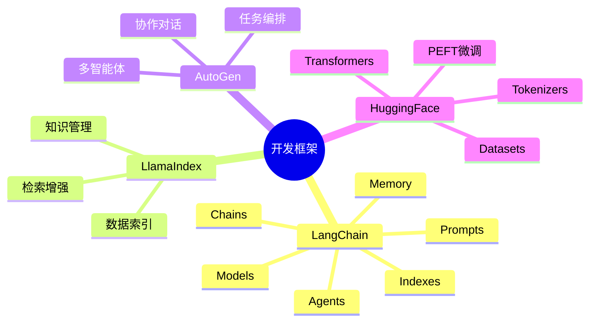
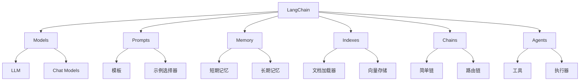
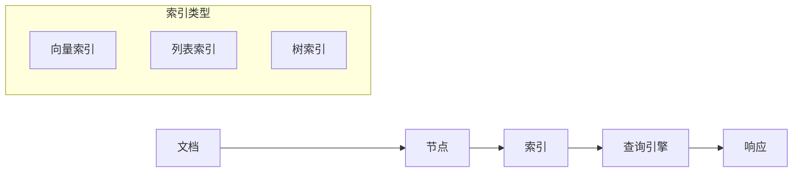
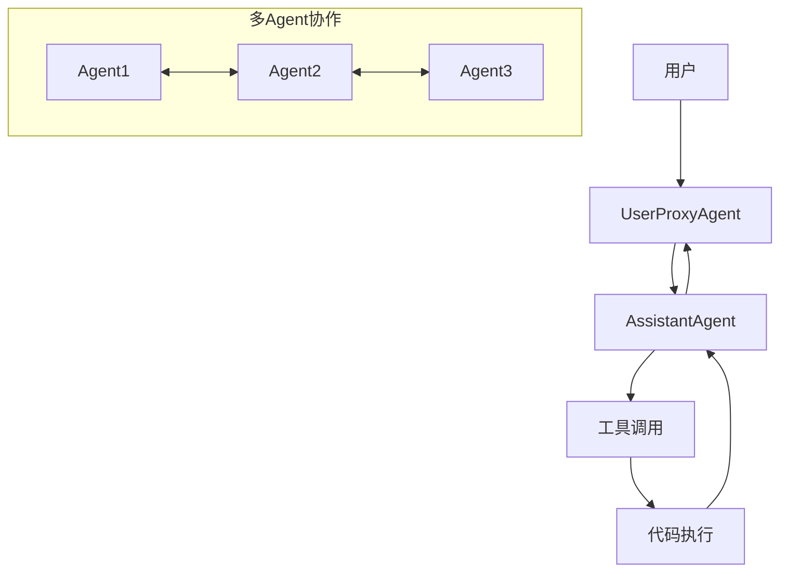
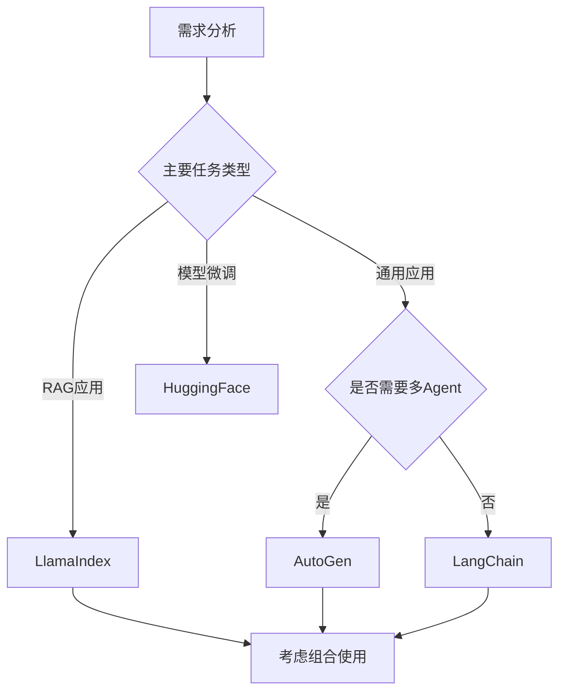

# AI开发框架

掌握主流AI开发框架，高效构建大模型应用。

## 框架概览



## 框架对比

| 特性 | LangChain | LlamaIndex | AutoGen | HuggingFace |
|------|-----------|------------|---------|-------------|
| 核心定位 | 通用应用开发 | 数据索引与RAG | 多智能体协作 | 模型生态 |
| 学习曲线 | 中等 | 较低 | 中等 | 较高 |
| 灵活性 | 高 | 中 | 高 | 高 |
| RAG支持 | 强 | 最强 | 中 | 中 |
| Agent支持 | 强 | 中 | 最强 | 弱 |
| 生产就绪 | 是 | 是 | 发展中 | 是 |

## LangChain

### 六大核心组件



### 快速开始

```python
from langchain_openai import ChatOpenAI
from langchain.prompts import ChatPromptTemplate
from langchain.schema import StrOutputParser

model = ChatOpenAI(model="gpt-4")

prompt = ChatPromptTemplate.from_messages([
    ("system", "你是一个有帮助的助手。"),
    ("user", "{input}")
])

chain = prompt | model | StrOutputParser()

response = chain.invoke({"input": "你好！"})
```

### LCEL表达式

LangChain Expression Language (LCEL) 是一种声明式方式来组合组件：

```python
from langchain_openai import ChatOpenAI
from langchain.prompts import ChatPromptTemplate
from langchain.schema.output_parser import StrOutputParser

prompt = ChatPromptTemplate.from_template("给我讲一个关于{topic}的笑话")
model = ChatOpenAI(model="gpt-4")
output_parser = StrOutputParser()

chain = prompt | model | output_parser

chain.invoke({"topic": "程序员"})
```

### Memory机制

```python
from langchain.memory import ConversationBufferMemory
from langchain.chains import ConversationChain

memory = ConversationBufferMemory()

conversation = ConversationChain(
    llm=model,
    memory=memory,
    verbose=True
)

conversation.predict(input="你好，我是小明")
conversation.predict(input="我叫什么名字？")
```

## LlamaIndex

### 核心概念



### 快速开始

```python
from llama_index import VectorStoreIndex, SimpleDirectoryReader

documents = SimpleDirectoryReader("data").load_data()
index = VectorStoreIndex.from_documents(documents)

query_engine = index.as_query_engine()
response = query_engine.query("文档的主要内容是什么？")
```

### 自定义索引

```python
from llama_index import ServiceContext, VectorStoreIndex
from llama_index.llms import OpenAI

llm = OpenAI(model="gpt-4")
service_context = ServiceContext.from_defaults(llm=llm)

index = VectorStoreIndex.from_documents(
    documents,
    service_context=service_context
)
```

## AutoGen

### 多智能体架构



### 快速开始

```python
import autogen

config_list = [
    {"model": "gpt-4", "api_key": "your-api-key"}
]

assistant = autogen.AssistantAgent(
    name="assistant",
    llm_config={"config_list": config_list}
)

user_proxy = autogen.UserProxyAgent(
    name="user_proxy",
    human_input_mode="NEVER",
    max_consecutive_auto_reply=10,
    code_execution_config={"work_dir": "coding"}
)

user_proxy.initiate_chat(
    assistant,
    message="请帮我写一个Python脚本，计算斐波那契数列"
)
```

### 群组对话

```python
from autogen import Agent, GroupChat, GroupChatManager

agent1 = autogen.AssistantAgent(
    name="product_manager",
    system_message="你是一个产品经理",
    llm_config={"config_list": config_list}
)

agent2 = autogen.AssistantAgent(
    name="engineer",
    system_message="你是一个软件工程师",
    llm_config={"config_list": config_list}
)

groupchat = GroupChat(
    agents=[agent1, agent2, user_proxy],
    messages=[],
    max_round=12
)

manager = GroupChatManager(
    groupchat=groupchat,
    llm_config={"config_list": config_list}
)

user_proxy.initiate_chat(
    manager,
    message="我们需要开发一个待办事项应用"
)
```

## HuggingFace

### Transformers核心

```python
from transformers import pipeline

classifier = pipeline("sentiment-analysis")
result = classifier("I love this product!")
```

### 文本生成

```python
from transformers import AutoModelForCausalLM, AutoTokenizer

model_name = "Qwen/Qwen2-7B"
tokenizer = AutoTokenizer.from_pretrained(model_name)
model = AutoModelForCausalLM.from_pretrained(model_name)

inputs = tokenizer("你好", return_tensors="pt")
outputs = model.generate(**inputs, max_length=50)
print(tokenizer.decode(outputs[0]))
```

### PEFT微调

```python
from peft import LoraConfig, get_peft_model
from transformers import AutoModelForCausalLM

model = AutoModelForCausalLM.from_pretrained("Qwen/Qwen2-7B")

peft_config = LoraConfig(
    r=8,
    lora_alpha=32,
    lora_dropout=0.1,
    target_modules=["q_proj", "v_proj"]
)

model = get_peft_model(model, peft_config)
model.print_trainable_parameters()
```

## 框架选型指南



### 选型建议

| 场景 | 推荐框架 | 原因 |
|------|---------|------|
| 企业知识库 | LlamaIndex | RAG能力最强 |
| 复杂工作流 | LangChain | 灵活性高 |
| 多角色协作 | AutoGen | 原生多Agent支持 |
| 模型微调 | HuggingFace | 生态完善 |
| 快速原型 | LangChain + LlamaIndex | 功能互补 |

## 学习资源

- [LangChain详解](/ai-llm-dev/frameworks/langchain/)
- [LlamaIndex详解](/ai-llm-dev/frameworks/llamaindex/)
- [AutoGen详解](/ai-llm-dev/frameworks/autogen/)
- [HuggingFace详解](/ai-llm-dev/frameworks/huggingface/)
