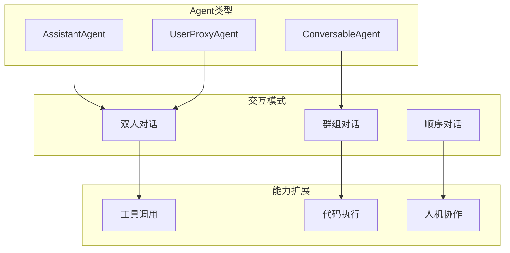

# AutoGen多智能体框架

AutoGen是微软开源的多智能体对话框架，支持构建复杂的AI协作系统。

## 核心概念



## 快速开始

### 安装

```bash
pip install pyautogen
```

### 基础对话

```python
import autogen

config_list = [
    {"model": "gpt-4", "api_key": "your-api-key"}
]

assistant = autogen.AssistantAgent(
    name="assistant",
    llm_config={"config_list": config_list}
)

user_proxy = autogen.UserProxyAgent(
    name="user_proxy",
    human_input_mode="NEVER",
    max_consecutive_auto_reply=10
)

user_proxy.initiate_chat(
    assistant,
    message="请帮我写一个Python脚本"
)
```

## Agent类型

### AssistantAgent

AI助手，负责生成回复：

```python
assistant = autogen.AssistantAgent(
    name="assistant",
    system_message="你是一个有帮助的AI助手",
    llm_config={
        "config_list": config_list,
        "temperature": 0.7
    }
)
```

### UserProxyAgent

用户代理，可执行代码和提供人工输入：

```python
user_proxy = autogen.UserProxyAgent(
    name="user_proxy",
    human_input_mode="TERMINATE",
    max_consecutive_auto_reply=10,
    code_execution_config={
        "work_dir": "coding",
        "use_docker": False
    }
)
```

### ConversableAgent

可定制的基础Agent：

```python
agent = autogen.ConversableAgent(
    name="custom_agent",
    system_message="自定义Agent",
    llm_config={"config_list": config_list},
    human_input_mode="NEVER",
    max_consecutive_auto_reply=5
)
```

## 多Agent协作

### 群组对话

```python
from autogen import GroupChat, GroupChatManager

product_manager = autogen.AssistantAgent(
    name="PM",
    system_message="产品经理，负责需求分析",
    llm_config={"config_list": config_list}
)

engineer = autogen.AssistantAgent(
    name="Engineer",
    system_message="工程师，负责技术实现",
    llm_config={"config_list": config_list}
)

qa = autogen.AssistantAgent(
    name="QA",
    system_message="测试工程师，负责质量保证",
    llm_config={"config_list": config_list}
)

groupchat = GroupChat(
    agents=[user_proxy, product_manager, engineer, qa],
    messages=[],
    max_round=20
)

manager = GroupChatManager(
    groupchat=groupchat,
    llm_config={"config_list": config_list}
)

user_proxy.initiate_chat(
    manager,
    message="我们需要开发一个待办事项应用"
)
```

### 顺序对话

```python
researcher = autogen.AssistantAgent(
    name="Researcher",
    system_message="研究员，负责收集信息",
    llm_config={"config_list": config_list}
)

writer = autogen.AssistantAgent(
    name="Writer",
    system_message="作家，负责撰写文章",
    llm_config={"config_list": config_list}
)

user_proxy.initiate_chat(
    researcher,
    message="研究AI发展趋势"
)

research_result = user_proxy.last_message()["content"]

user_proxy.initiate_chat(
    writer,
    message=f"根据以下研究内容写一篇文章：{research_result}"
)
```

### 嵌套对话

```python
def create_nested_chat():
    inner_assistant = autogen.AssistantAgent(
        name="inner_assistant",
        llm_config={"config_list": config_list}
    )
    
    inner_user = autogen.UserProxyAgent(
        name="inner_user",
        human_input_mode="NEVER"
    )
    
    return inner_user, inner_assistant
```

## 工具集成

### 注册函数工具

```python
def get_weather(city: str) -> str:
    return f"{city}今天晴，气温25°C"

assistant = autogen.AssistantAgent(
    name="assistant",
    llm_config={"config_list": config_list}
)

assistant.register_for_llm(name="get_weather")(
    get_weather
)

user_proxy.register_for_execution(name="get_weather")(
    get_weather
)
```

### 使用LangChain工具

```python
from langchain_community.tools import WikipediaQueryRun

wiki_tool = WikipediaQueryRun()

assistant.register_for_llm(name="wikipedia")(
    wiki_tool.run
)
```

## 代码执行

### 本地执行

```python
user_proxy = autogen.UserProxyAgent(
    name="user_proxy",
    code_execution_config={
        "work_dir": "coding",
        "use_docker": False
    }
)
```

### Docker执行

```python
user_proxy = autogen.UserProxyAgent(
    name="user_proxy",
    code_execution_config={
        "work_dir": "coding",
        "use_docker": True,
        "timeout": 60
    }
)
```

### 选择性执行

```python
user_proxy = autogen.UserProxyAgent(
    name="user_proxy",
    code_execution_config={
        "work_dir": "coding",
        "last_n_messages": 3
    }
)
```

## 高级功能

### 人机协作

```python
user_proxy = autogen.UserProxyAgent(
    name="user_proxy",
    human_input_mode="ALWAYS"
)
```

### 终止条件

```python
assistant = autogen.AssistantAgent(
    name="assistant",
    llm_config={"config_list": config_list},
    is_termination_msg=lambda x: x.get("content", "").endswith("TERMINATE")
)
```

### 状态保存

```python
import pickle

with open("conversation.pkl", "wb") as f:
    pickle.dump(user_proxy.chat_messages, f)
```

## 实战案例

### 代码审查团队

```python
reviewer = autogen.AssistantAgent(
    name="Reviewer",
    system_message="代码审查专家，关注代码质量和最佳实践",
    llm_config={"config_list": config_list}
)

security = autogen.AssistantAgent(
    name="Security",
    system_message="安全专家，关注安全漏洞和风险",
    llm_config={"config_list": config_list}
)

performance = autogen.AssistantAgent(
    name="Performance",
    system_message="性能专家，关注性能优化",
    llm_config={"config_list": config_list}
)

groupchat = GroupChat(
    agents=[user_proxy, reviewer, security, performance],
    messages=[],
    max_round=15
)
```

### 研究助手

```python
researcher = autogen.AssistantAgent(
    name="Researcher",
    system_message="研究员，负责搜索和整理信息",
    llm_config={"config_list": config_list}
)

analyst = autogen.AssistantAgent(
    name="Analyst",
    system_message="分析师，负责分析和总结",
    llm_config={"config_list": config_list}
)

writer = autogen.AssistantAgent(
    name="Writer",
    system_message="作家，负责撰写报告",
    llm_config={"config_list": config_list}
)
```

## 最佳实践

### 1. 明确角色定义

```python
agent = autogen.AssistantAgent(
    name="Expert",
    system_message="""
    你是一个专业的{domain}专家。
    
    你的职责：
    1. 分析问题
    2. 提供解决方案
    3. 回答相关问题
    
    你的输出格式：
    - 问题分析
    - 解决方案
    - 注意事项
    """,
    llm_config={"config_list": config_list}
)
```

### 2. 控制对话轮次

```python
groupchat = GroupChat(
    agents=[...],
    messages=[],
    max_round=20,
    send_introductions=True
)
```

### 3. 错误处理

```python
try:
    user_proxy.initiate_chat(assistant, message="...")
except Exception as e:
    print(f"对话出错: {e}")
```

## 小结

AutoGen是构建多智能体系统的强大框架：

1. **Agent类型**：Assistant、UserProxy、Conversable
2. **协作模式**：双人对话、群组对话、顺序对话
3. **能力扩展**：工具调用、代码执行、人机协作
4. **生产应用**：状态管理、错误处理、角色定义
