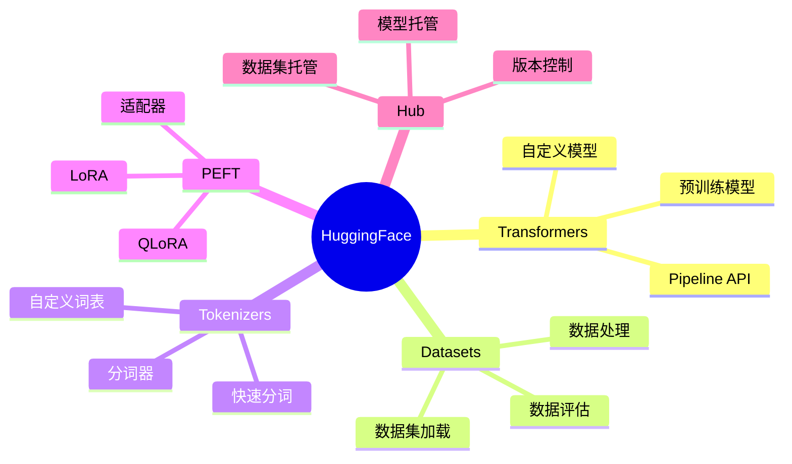

# HuggingFace生态系统

HuggingFace是AI模型和数据集的核心平台，提供完整的模型训练和部署工具链。

## 生态系统概览



## Transformers核心

### Pipeline API

最简单的模型使用方式：

```python
from transformers import pipeline

classifier = pipeline("sentiment-analysis")
result = classifier("I love this product!")
```

**支持的Pipeline类型**：

| Pipeline | 任务 | 示例 |
|----------|------|------|
| sentiment-analysis | 情感分析 | 正面/负面 |
| text-generation | 文本生成 | 续写文本 |
| question-answering | 问答 | 阅读理解 |
| translation | 翻译 | 语言翻译 |
| summarization | 摘要 | 文本摘要 |
| zero-shot-classification | 零样本分类 | 无训练分类 |

### 模型加载

```python
from transformers import AutoModel, AutoTokenizer

model_name = "bert-base-chinese"

tokenizer = AutoTokenizer.from_pretrained(model_name)
model = AutoModel.from_pretrained(model_name)

inputs = tokenizer("你好世界", return_tensors="pt")
outputs = model(**inputs)
```

### 文本生成模型

```python
from transformers import AutoModelForCausalLM, AutoTokenizer

model_name = "Qwen/Qwen2-7B"

tokenizer = AutoTokenizer.from_pretrained(model_name)
model = AutoModelForCausalLM.from_pretrained(
    model_name,
    torch_dtype="auto",
    device_map="auto"
)

inputs = tokenizer("你好", return_tensors="pt")
outputs = model.generate(**inputs, max_length=100)
print(tokenizer.decode(outputs[0]))
```

## Tokenizers

### 分词器类型

| 类型 | 描述 | 代表模型 |
|------|------|---------|
| BPE | 字节对编码 | GPT系列 |
| WordPiece | 词片分词 | BERT |
| SentencePiece | 句子片段 | T5、LLaMA |

### 使用示例

```python
from transformers import AutoTokenizer

tokenizer = AutoTokenizer.from_pretrained("bert-base-chinese")

text = "你好世界"
tokens = tokenizer.tokenize(text)
print(tokens)

encoded = tokenizer(text, return_tensors="pt")
print(encoded)

decoded = tokenizer.decode(encoded["input_ids"][0])
print(decoded)
```

### 自定义分词器

```python
from tokenizers import Tokenizer
from tokenizers.models import BPE
from tokenizers.trainers import BpeTrainer
from tokenizers.pre_tokenizers import Whitespace

tokenizer = Tokenizer(BPE())
tokenizer.pre_tokenizer = Whitespace()

trainer = BpeTrainer(
    vocab_size=30000,
    special_tokens=["[PAD]", "[UNK]", "[CLS]", "[SEP]", "[MASK]"]
)

tokenizer.train(files=["corpus.txt"], trainer=trainer)
```

## Datasets

### 数据集加载

```python
from datasets import load_dataset

dataset = load_dataset("imdb")
print(dataset)

train_data = dataset["train"]
test_data = dataset["test"]
```

### 数据处理

```python
def preprocess_function(examples):
    return tokenizer(
        examples["text"],
        truncation=True,
        padding="max_length",
        max_length=512
    )

tokenized_dataset = dataset.map(
    preprocess_function,
    batched=True,
    remove_columns=["text"]
)
```

### 自定义数据集

```python
from datasets import Dataset

data = {
    "text": ["文本1", "文本2", "文本3"],
    "label": [0, 1, 0]
}

dataset = Dataset.from_dict(data)
```

## PEFT高效微调

### LoRA微调

```python
from peft import LoraConfig, get_peft_model, TaskType
from transformers import AutoModelForCausalLM

model = AutoModelForCausalLM.from_pretrained("Qwen/Qwen2-7B")

peft_config = LoraConfig(
    task_type=TaskType.CAUSAL_LM,
    r=8,
    lora_alpha=32,
    lora_dropout=0.1,
    target_modules=["q_proj", "v_proj", "k_proj", "o_proj"]
)

model = get_peft_model(model, peft_config)
model.print_trainable_parameters()
```

### QLoRA量化微调

```python
from transformers import BitsAndBytesConfig
from peft import prepare_model_for_kbit_training

bnb_config = BitsAndBytesConfig(
    load_in_4bit=True,
    bnb_4bit_quant_type="nf4",
    bnb_4bit_compute_dtype="float16"
)

model = AutoModelForCausalLM.from_pretrained(
    "Qwen/Qwen2-7B",
    quantization_config=bnb_config,
    device_map="auto"
)

model = prepare_model_for_kbit_training(model)

model = get_peft_model(model, peft_config)
```

### 适配器保存与加载

```python
model.save_pretrained("./lora_adapter")

from peft import PeftModel

base_model = AutoModelForCausalLM.from_pretrained("Qwen/Qwen2-7B")
model = PeftModel.from_pretrained(base_model, "./lora_adapter")
```

## Trainer API

### 训练配置

```python
from transformers import TrainingArguments

training_args = TrainingArguments(
    output_dir="./results",
    num_train_epochs=3,
    per_device_train_batch_size=8,
    per_device_eval_batch_size=8,
    warmup_steps=500,
    weight_decay=0.01,
    logging_dir="./logs",
    logging_steps=100,
    evaluation_strategy="epoch",
    save_strategy="epoch",
    load_best_model_at_end=True
)
```

### 训练器

```python
from transformers import Trainer

trainer = Trainer(
    model=model,
    args=training_args,
    train_dataset=train_dataset,
    eval_dataset=eval_dataset,
    tokenizer=tokenizer
)

trainer.train()
```

### 模型评估

```python
import evaluate

metric = evaluate.load("accuracy")

def compute_metrics(eval_pred):
    logits, labels = eval_pred
    predictions = logits.argmax(axis=-1)
    return metric.compute(predictions=predictions, references=labels)

trainer = Trainer(
    model=model,
    args=training_args,
    compute_metrics=compute_metrics
)
```

## Model Hub

### 模型上传

```python
from huggingface_hub import HfApi

api = HfApi()
api.upload_folder(
    folder_path="./model",
    repo_id="your-username/your-model",
    repo_type="model"
)
```

### 模型下载

```python
from huggingface_hub import snapshot_download

snapshot_download(
    repo_id="Qwen/Qwen2-7B",
    local_dir="./local_model"
)
```

### 私有模型

```python
from huggingface_hub import login

login(token="your-hf-token")

model = AutoModel.from_pretrained(
    "your-username/private-model",
    use_auth_token=True
)
```

## 实战案例

### 文本分类微调

```python
from transformers import (
    AutoModelForSequenceClassification,
    AutoTokenizer,
    TrainingArguments,
    Trainer
)

model_name = "bert-base-chinese"
tokenizer = AutoTokenizer.from_pretrained(model_name)
model = AutoModelForSequenceClassification.from_pretrained(
    model_name,
    num_labels=2
)

def tokenize_function(examples):
    return tokenizer(
        examples["text"],
        padding="max_length",
        truncation=True
    )

tokenized_datasets = dataset.map(tokenize_function, batched=True)

trainer = Trainer(
    model=model,
    args=training_args,
    train_dataset=tokenized_datasets["train"],
    eval_dataset=tokenized_datasets["test"]
)

trainer.train()
```

### 对话模型微调

```python
from transformers import AutoModelForCausalLM, AutoTokenizer
from peft import LoraConfig, get_peft_model

model = AutoModelForCausalLM.from_pretrained(
    "Qwen/Qwen2-7B",
    torch_dtype="auto",
    device_map="auto"
)

peft_config = LoraConfig(
    r=16,
    lora_alpha=32,
    lora_dropout=0.05,
    target_modules=["q_proj", "v_proj"]
)

model = get_peft_model(model, peft_config)

trainer = Trainer(
    model=model,
    args=training_args,
    train_dataset=train_dataset
)

trainer.train()
```

## 小结

HuggingFace提供了完整的AI模型开发工具链：

1. **Transformers**：预训练模型、Pipeline API
2. **Tokenizers**：高效分词器
3. **Datasets**：数据处理工具
4. **PEFT**：高效微调方法
5. **Hub**：模型托管平台
