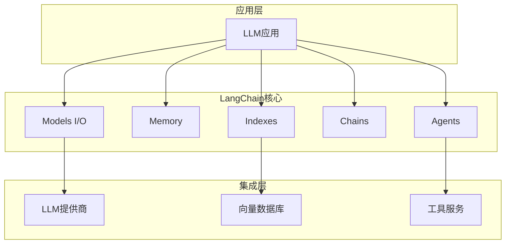

# LangChain开发框架

LangChain是一个强大的框架，用于开发由语言模型驱动的应用程序。

## 架构概览



## 六大核心组件

### 1. Models（模型）

#### LLM

```python
from langchain_openai import OpenAI

llm = OpenAI(model="gpt-3.5-turbo-instruct")
response = llm.invoke("你好")
```

#### Chat Models

```python
from langchain_openai import ChatOpenAI
from langchain.schema import HumanMessage, SystemMessage

chat = ChatOpenAI(model="gpt-4")

messages = [
    SystemMessage(content="你是一个有帮助的助手"),
    HumanMessage(content="你好")
]

response = chat.invoke(messages)
```

### 2. Prompts（提示词）

#### 提示词模板

```python
from langchain.prompts import PromptTemplate

template = PromptTemplate.from_template("给我讲一个关于{topic}的笑话")
prompt = template.format(topic="程序员")
```

#### 聊天提示词模板

```python
from langchain.prompts import ChatPromptTemplate

template = ChatPromptTemplate.from_messages([
    ("system", "你是一个{role}"),
    ("user", "{input}")
])

prompt = template.format_messages(
    role="Python专家",
    input="如何读取文件？"
)
```

#### Few-shot模板

```python
from langchain.prompts import FewShotPromptTemplate

examples = [
    {"input": "开心", "output": "悲伤"},
    {"input": "高大", "output": "矮小"}
]

example_prompt = PromptTemplate(
    input_variables=["input", "output"],
    template="输入: {input}\n输出: {output}"
)

few_shot_prompt = FewShotPromptTemplate(
    examples=examples,
    example_prompt=example_prompt,
    prefix="给出反义词",
    suffix="输入: {adjective}\n输出:",
    input_variables=["adjective"]
)
```

### 3. Memory（记忆）

#### 对话缓冲记忆

```python
from langchain.memory import ConversationBufferMemory

memory = ConversationBufferMemory()
memory.save_context({"input": "你好"}, {"output": "你好！有什么可以帮助你的？"})
print(memory.load_memory_variables({}))
```

#### 对话摘要记忆

```python
from langchain.memory import ConversationSummaryMemory

memory = ConversationSummaryMemory(llm=llm)
```

#### 向量存储记忆

```python
from langchain.memory import VectorStoreRetrieverMemory
from langchain_community.vectorstores import FAISS

vectorstore = FAISS.from_texts([], embedding)
retriever = vectorstore.as_retriever()
memory = VectorStoreRetrieverMemory(retriever=retriever)
```

### 4. Indexes（索引）

#### 文档加载器

```python
from langchain_community.document_loaders import (
    TextLoader,
    PyPDFLoader,
    WebBaseLoader
)

text_loader = TextLoader("file.txt")
pdf_loader = PyPDFLoader("file.pdf")
web_loader = WebBaseLoader("https://example.com")
```

#### 文档分割器

```python
from langchain.text_splitter import RecursiveCharacterTextSplitter

splitter = RecursiveCharacterTextSplitter(
    chunk_size=1000,
    chunk_overlap=200
)

chunks = splitter.split_documents(documents)
```

#### 向量存储

```python
from langchain_community.vectorstores import FAISS, Chroma
from langchain_openai import OpenAIEmbeddings

embeddings = OpenAIEmbeddings()
vectorstore = FAISS.from_documents(documents, embeddings)
```

### 5. Chains（链）

#### LCEL链

```python
from langchain_openai import ChatOpenAI
from langchain.prompts import ChatPromptTemplate
from langchain.schema.output_parser import StrOutputParser

prompt = ChatPromptTemplate.from_template("翻译成{language}: {text}")
model = ChatOpenAI()
output_parser = StrOutputParser()

chain = prompt | model | output_parser

chain.invoke({"language": "英文", "text": "你好世界"})
```

#### 顺序链

```python
from langchain.chains import SimpleSequentialChain

chain1 = LLMChain(llm=llm, prompt=prompt1)
chain2 = LLMChain(llm=llm, prompt=prompt2)

overall_chain = SimpleSequentialChain(
    chains=[chain1, chain2],
    verbose=True
)
```

#### 路由链

```python
from langchain.chains.router import MultiPromptChain

physics_chain = LLMChain(llm=llm, prompt=physics_prompt)
math_chain = LLMChain(llm=llm, prompt=math_prompt)

chain = MultiPromptChain(
    router_chain=router_chain,
    destination_chains={
        "physics": physics_chain,
        "math": math_chain
    },
    default_chain=default_chain
)
```

### 6. Agents（智能体）

#### 工具定义

```python
from langchain.tools import Tool

def get_word_length(word: str) -> int:
    return len(word)

tool = Tool(
    name="word_length",
    func=get_word_length,
    description="计算单词长度"
)
```

#### 内置工具

```python
from langchain_community.tools import (
    SerpAPIRun,
    WikipediaQueryRun
)

search = SerpAPIRun()
wiki = WikipediaQueryRun()
```

#### Agent执行

```python
from langchain.agents import AgentExecutor, create_openai_functions_agent

tools = [search, wiki]
agent = create_openai_functions_agent(model, tools, prompt)

agent_executor = AgentExecutor(
    agent=agent,
    tools=tools,
    verbose=True
)

agent_executor.invoke({"input": "今天北京的天气如何？"})
```

## 实战案例

### RAG系统

```python
from langchain_openai import ChatOpenAI, OpenAIEmbeddings
from langchain_community.document_loaders import TextLoader
from langchain.text_splitter import RecursiveCharacterTextSplitter
from langchain_community.vectorstores import FAISS
from langchain.chains import RetrievalQA

loader = TextLoader("knowledge.txt")
documents = loader.load()

text_splitter = RecursiveCharacterTextSplitter(
    chunk_size=1000,
    chunk_overlap=200
)
texts = text_splitter.split_documents(documents)

embeddings = OpenAIEmbeddings()
vectorstore = FAISS.from_documents(texts, embeddings)

qa = RetrievalQA.from_chain_type(
    llm=ChatOpenAI(),
    chain_type="stuff",
    retriever=vectorstore.as_retriever()
)

response = qa.invoke("文档的主要内容是什么？")
```

### 对话机器人

```python
from langchain.chains import ConversationalRetrievalChain
from langchain.memory import ConversationBufferMemory

memory = ConversationBufferMemory(
    memory_key="chat_history",
    return_messages=True
)

qa = ConversationalRetrievalChain.from_llm(
    llm=ChatOpenAI(),
    retriever=vectorstore.as_retriever(),
    memory=memory
)

chat_history = []
query = "你好"
response = qa({"question": query, "chat_history": chat_history})
chat_history.append((query, response["answer"]))
```

## 最佳实践

### 1. 使用LCEL

LCEL提供了更简洁、更强大的链组合方式：

```python
chain = (
    {"context": retriever, "question": RunnablePassthrough()}
    | prompt
    | model
    | StrOutputParser()
)
```

### 2. 流式输出

```python
for chunk in chain.stream({"input": "你好"}):
    print(chunk, end="", flush=True)
```

### 3. 异步支持

```python
async def async_chain():
    response = await chain.ainvoke({"input": "你好"})
    return response
```

### 4. 回调监控

```python
from langchain.callbacks import StdOutCallbackHandler

handler = StdOutCallbackHandler()
chain.invoke({"input": "你好"}, callbacks=[handler])
```

## 小结

LangChain是构建LLM应用的强大框架：

1. **六大组件**：Models、Prompts、Memory、Indexes、Chains、Agents
2. **LCEL**：声明式链组合语言
3. **丰富集成**：支持多种LLM、向量库、工具
4. **生产就绪**：流式输出、异步支持、回调监控
