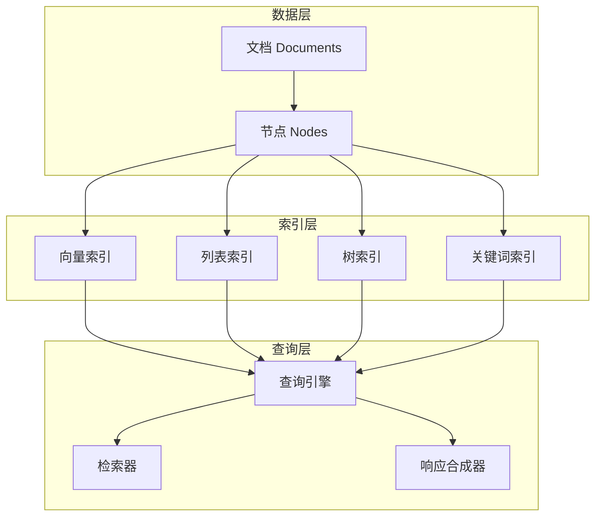

# LlamaIndex数据框架

LlamaIndex是一个专注于数据索引和检索增强的框架，特别适合构建RAG应用。

## 核心概念



## 快速开始

### 安装

```bash
pip install llama-index
```

### 基础使用

```python
from llama_index import VectorStoreIndex, SimpleDirectoryReader

documents = SimpleDirectoryReader("data").load_data()
index = VectorStoreIndex.from_documents(documents)

query_engine = index.as_query_engine()
response = query_engine.query("文档的主要内容是什么？")
print(response)
```

## 数据处理

### 文档加载器

```python
from llama_index import SimpleDirectoryReader

reader = SimpleDirectoryReader(
    input_dir="data",
    required_exts=[".pdf", ".txt", ".md"],
    exclude=[".git", ".idea"]
)

documents = reader.load_data()
```

### 节点解析

```python
from llama_index.node_parser import SimpleNodeParser

parser = SimpleNodeParser.from_defaults(
    chunk_size=1024,
    chunk_overlap=200
)

nodes = parser.get_nodes_from_documents(documents)
```

### 自定义节点

```python
from llama_index.schema import TextNode, NodeRelationship

node1 = TextNode(text="这是第一个节点", id_="node1")
node2 = TextNode(text="这是第二个节点", id_="node2")

node1.relationships[NodeRelationship.NEXT] = node2.node_id
node2.relationships[NodeRelationship.PREVIOUS] = node1.node_id
```

## 索引类型

### 1. 向量索引

最适合语义搜索：

```python
from llama_index import VectorStoreIndex

index = VectorStoreIndex(nodes)
query_engine = index.as_query_engine()
```

### 2. 列表索引

适合顺序阅读：

```python
from llama_index import ListIndex

index = ListIndex(nodes)
query_engine = index.as_query_engine()
```

### 3. 树索引

适合层次化查询：

```python
from llama_index import TreeIndex

index = TreeIndex(nodes)
query_engine = index.as_query_engine()
```

### 4. 关键词索引

适合精确匹配：

```python
from llama_index import KeywordTableIndex

index = KeywordTableIndex(nodes)
query_engine = index.as_query_engine()
```

## 向量存储集成

### Chroma

```python
import chromadb
from llama_index.vector_stores import ChromaVectorStore
from llama_index import VectorStoreIndex, StorageContext

db = chromadb.PersistentClient(path="./chroma_db")
chroma_collection = db.get_or_create_collection("my_collection")

vector_store = ChromaVectorStore(chroma_collection=chroma_collection)
storage_context = StorageContext.from_defaults(vector_store=vector_store)

index = VectorStoreIndex(
    nodes,
    storage_context=storage_context
)
```

### Pinecone

```python
import pinecone
from llama_index.vector_stores import PineconeVectorStore

pinecone.init(api_key="...", environment="...")
pinecone.create_index("my-index", dimension=1536)

vector_store = PineconeVectorStore(
    pinecone.Index("my-index")
)
```

### Milvus

```python
from llama_index.vector_stores import MilvusVectorStore

vector_store = MilvusVectorStore(
    uri="localhost:19530",
    collection_name="my_collection"
)
```

## 查询引擎

### 基础查询

```python
query_engine = index.as_query_engine()
response = query_engine.query("问题")
```

### 相似度检索

```python
query_engine = index.as_query_engine(
    similarity_top_k=5
)
```

### 流式响应

```python
query_engine = index.as_query_engine(streaming=True)
streaming_response = query_engine.query("问题")

for text in streaming_response.response_gen:
    print(text, end="")
```

### 多查询

```python
from llama_index import ComposableGraph

graph = ComposableGraph.from_indices(
    VectorStoreIndex,
    [index1, index2, index3]
)

query_engine = graph.as_query_engine()
```

## 高级功能

### 自定义提示词

```python
from llama_index import PromptTemplate

template = (
    "上下文信息如下：\n"
    "---------------------\n"
    "{context_str}\n"
    "---------------------\n"
    "根据上下文回答问题：{query_str}\n"
)

qa_template = PromptTemplate(template)

query_engine = index.as_query_engine(
    text_qa_template=qa_template
)
```

### 后处理

```python
from llama_index.postprocessor import (
    SimilarityPostprocessor,
    KeywordPostprocessor
)

query_engine = index.as_query_engine(
    node_postprocessors=[
        SimilarityPostprocessor(similarity_cutoff=0.7),
        KeywordPostprocessor(required_keywords=["关键词"])
    ]
)
```

### 重排序

```python
from llama_index.postprocessor import CohereRerank

query_engine = index.as_query_engine(
    node_postprocessors=[
        CohereRerank(api_key="...", top_n=5)
    ]
)
```

## RAG最佳实践

### 分块策略

```python
from llama_index.node_parser import SentenceSplitter

splitter = SentenceSplitter(
    chunk_size=512,
    chunk_overlap=50,
    paragraph_separator="\n\n"
)

nodes = splitter.get_nodes_from_documents(documents)
```

### 父文档检索

```python
from llama_index.retrievers import AutoMergingRetriever
from llama_index.node_parser import HierarchicalNodeParser

node_parser = HierarchicalNodeParser.from_defaults(
    chunk_sizes=[2048, 512, 128]
)

nodes = node_parser.get_nodes_from_documents(documents)

retriever = AutoMergingRetriever(
    vector_retriever,
    storage_context
)
```

### 混合检索

```python
from llama_index.retrievers import VectorIndexRetriever, KeywordTableSimpleRetriever
from llama_index.retrievers import QueryFusionRetriever

vector_retriever = VectorIndexRetriever(index=index)
keyword_retriever = KeywordTableSimpleRetriever(index=keyword_index)

retriever = QueryFusionRetriever(
    retrievers=[vector_retriever, keyword_retriever],
    similarity_top_k=5
)
```

## 评估

### 忠实度评估

```python
from llama_index.evaluation import FaithfulnessEvaluator

evaluator = FaithfulnessEvaluator()
response = query_engine.query("问题")
eval_result = evaluator.evaluate_response(response=response)
```

### 相关性评估

```python
from llama_index.evaluation import RelevancyEvaluator

evaluator = RelevancyEvaluator()
eval_result = evaluator.evaluate_response(
    query="问题",
    response=response
)
```

## 小结

LlamaIndex是构建RAG应用的强大框架：

1. **数据索引**：支持多种索引类型
2. **向量存储**：集成主流向量数据库
3. **查询引擎**：灵活的检索和生成配置
4. **高级功能**：重排序、后处理、评估
