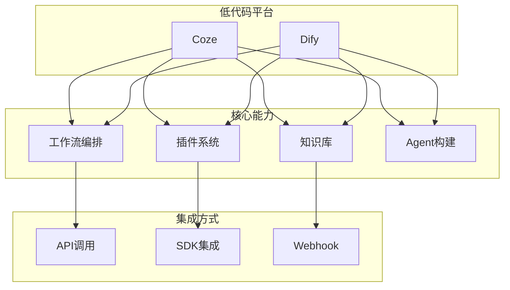
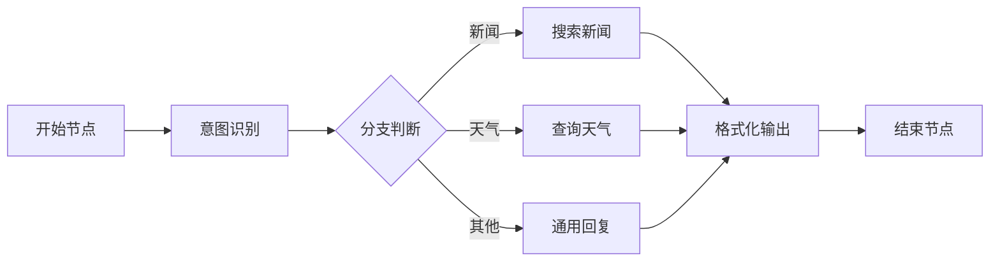
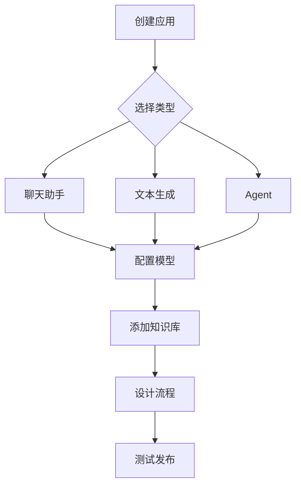
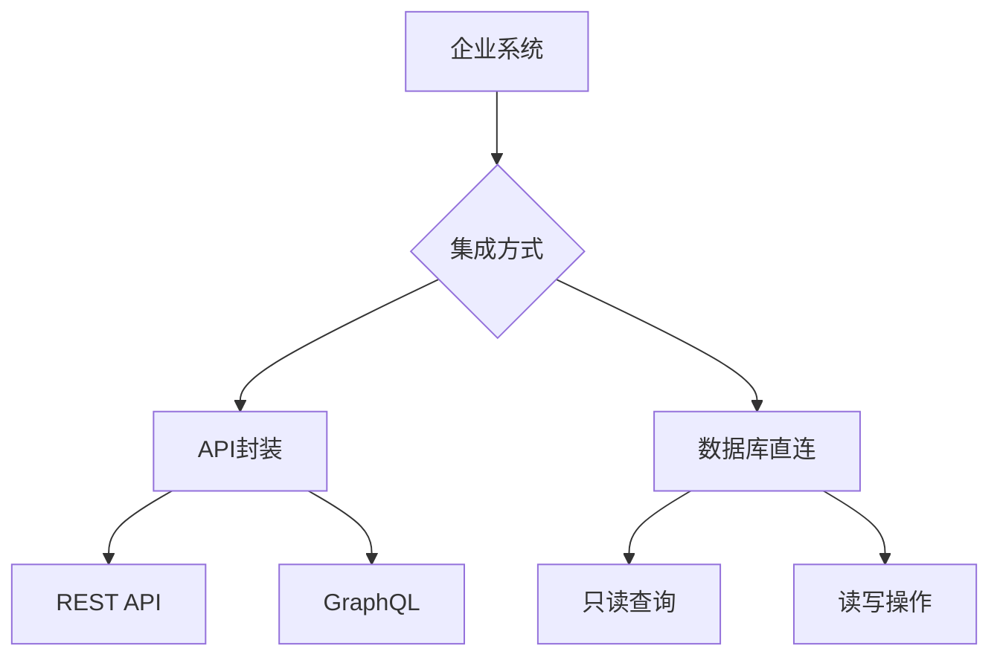
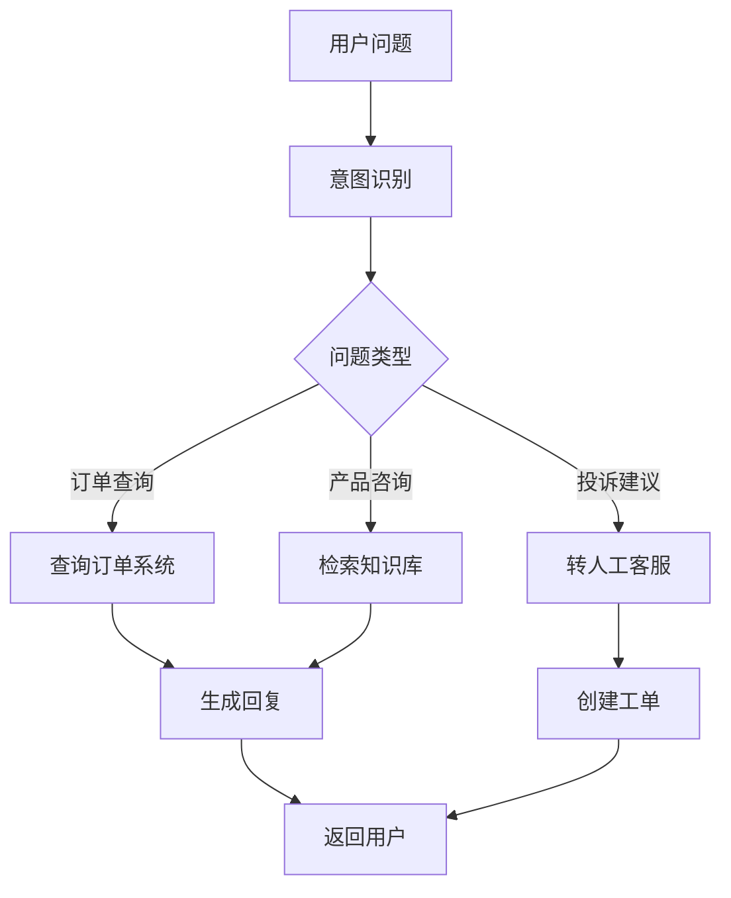
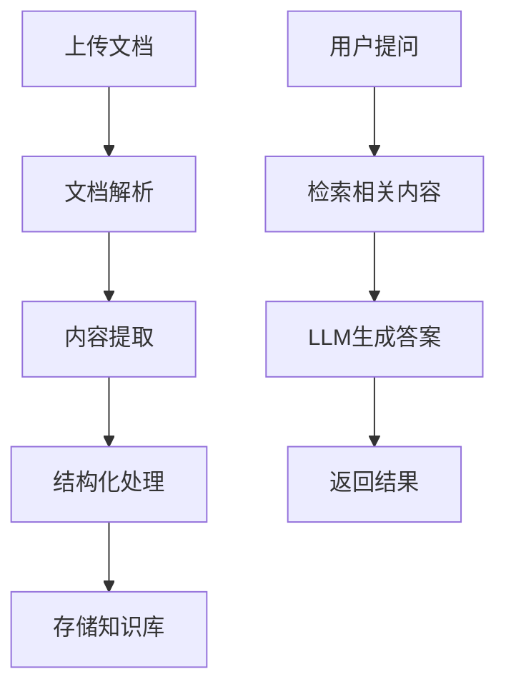

# 低代码AI平台

快速构建AI应用的低代码解决方案。

## 平台概览



## Coze平台

### 核心功能

| 功能 | 描述 |
|------|------|
| 插件使用 | 集成外部工具和服务 |
| 工作流 | 可视化流程编排 |
| 知识库 | RAG知识管理 |
| Agent | 智能体构建 |

### 工作流设计



### 创建Agent

```markdown
1. 定义角色和目标
2. 配置知识库
3. 添加工具插件
4. 设计工作流
5. 测试和发布
```

### Coze API调用

```python
from cozepy import Coze, TokenAuth

coze = Coze(auth=TokenAuth(token="your_token"))

workflow = coze.workflows.run(
    workflow_id="workflow_id",
    parameters={"input": "用户输入"}
)

print(workflow.output)
```

### 本地化部署

```bash
docker-compose up -d
```

## Dify平台

### 核心功能

| 功能 | 描述 |
|------|------|
| ChatFlow | 对话流程设计 |
| Workflow | 通用工作流 |
| Agent | 智能体构建 |
| 知识库 | RAG知识管理 |

### 本地部署

```bash
git clone https://github.com/langgenius/dify.git
cd dify/docker
docker compose up -d
```

### 创建应用



### Dify API调用

```python
import requests

response = requests.post(
    "https://api.dify.ai/v1/chat-messages",
    headers={
        "Authorization": "Bearer {api_key}",
        "Content-Type": "application/json"
    },
    json={
        "inputs": {},
        "query": "你好",
        "user": "user-123",
        "response_mode": "blocking"
    }
)
```

### Dify SDK

```python
from dify_client import DifyClient

client = DifyClient(api_key="your_api_key")

response = client.chat_messages.create(
    query="你好",
    user="user-123"
)
```

## 系统集成

### 集成策略



### 封装为插件

```python
def query_orders(user_id: str) -> dict:
    return {
        "orders": [
            {"id": "001", "status": "已发货"},
            {"id": "002", "status": "待付款"}
        ]
    }

plugin = {
    "name": "query_orders",
    "description": "查询用户订单",
    "parameters": {
        "user_id": {"type": "string", "description": "用户ID"}
    },
    "function": query_orders
}
```

### HTTP请求节点

```json
{
  "type": "http_request",
  "config": {
    "method": "GET",
    "url": "https://api.company.com/orders",
    "headers": {
      "Authorization": "Bearer ${api_key}"
    },
    "params": {
      "user_id": "${user_id}"
    }
  }
}
```

## 实战案例

### 智能客服



### 文档分析助手



## 最佳实践

### 1. 工作流设计

- 保持流程简洁
- 合理使用分支
- 添加错误处理

### 2. 知识库管理

- 定期更新内容
- 分类组织文档
- 监控检索效果

### 3. 性能优化

- 缓存常用结果
- 异步处理长任务
- 限流保护

## 小结

低代码平台加速AI应用开发：

1. **Coze**：工作流、插件、知识库
2. **Dify**：ChatFlow、Workflow、Agent
3. **系统集成**：API封装、数据库连接
4. **实战案例**：智能客服、文档分析
