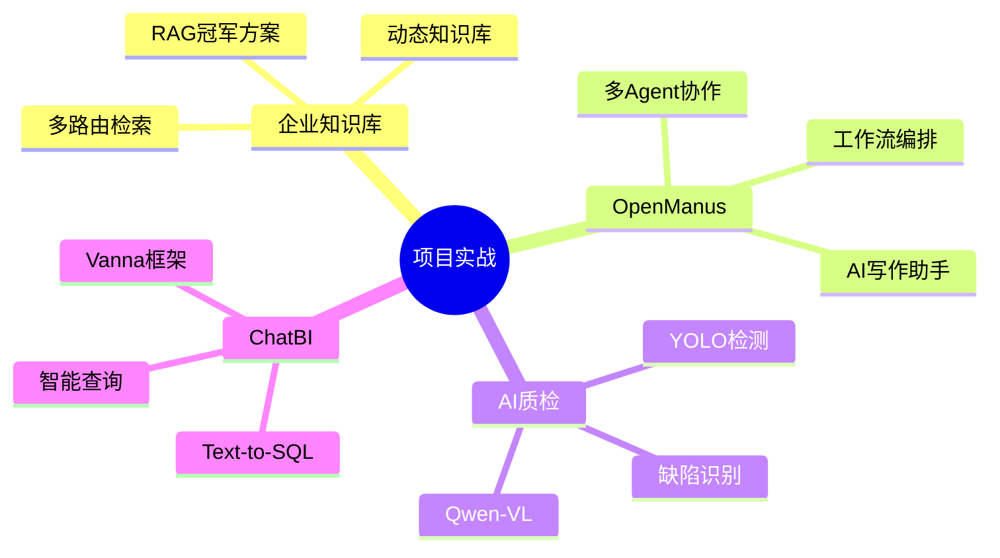
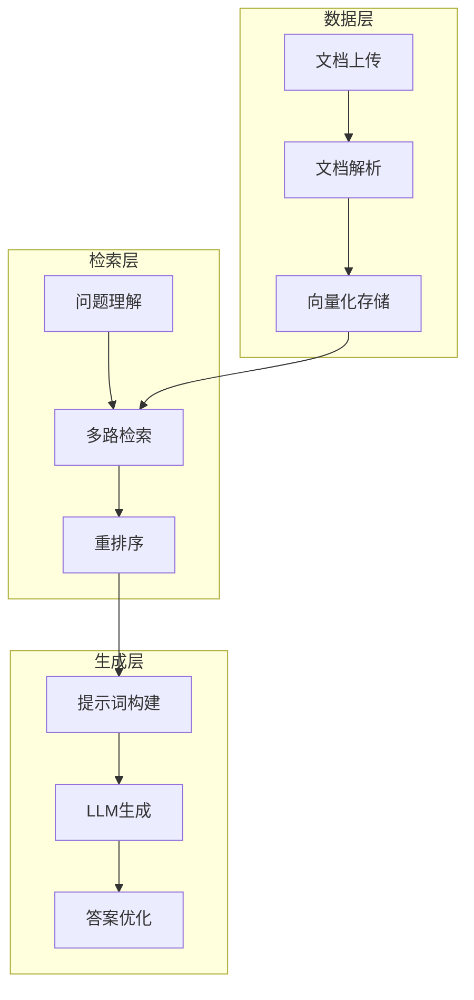
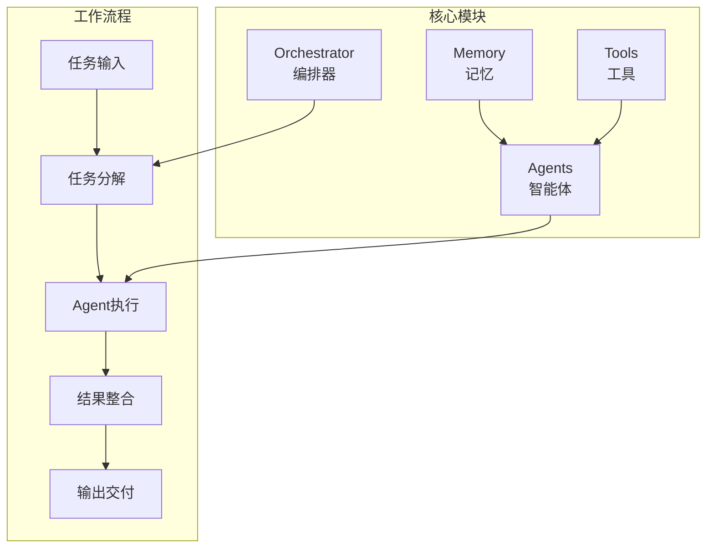
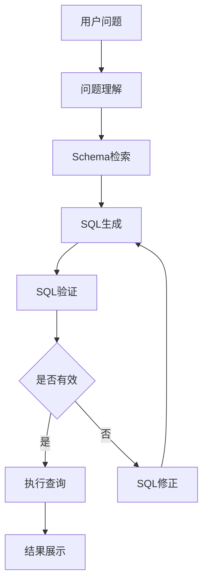

# AI项目实战

真实项目案例，从理论到实践。

## 项目概览



## 企业知识库RAG

### 项目架构



### RAG冠军方案

**多路由 + 动态知识库**

```python
class MultiRouteRAG:
    def __init__(self):
        self.vector_retriever = VectorRetriever()
        self.keyword_retriever = KeywordRetriever()
        self.graph_retriever = GraphRetriever()
    
    def retrieve(self, query: str):
        route = self.route_query(query)
        
        if route == "vector":
            return self.vector_retriever.search(query)
        elif route == "keyword":
            return self.keyword_retriever.search(query)
        else:
            return self.graph_retriever.search(query)
```

### 文档解析优化

```python
from docling import DocumentParser

def parse_document(file_path: str):
    parser = DocumentParser()
    
    result = parser.parse(
        file_path,
        extract_tables=True,
        extract_images=True
    )
    
    return {
        "text": result.text,
        "tables": result.tables,
        "images": result.images
    }
```

### 表格序列化

```python
def serialize_table(table) -> str:
    headers = table.headers
    rows = table.rows
    
    markdown = "| " + " | ".join(headers) + " |\n"
    markdown += "| " + " | ".join(["---"] * len(headers)) + " |\n"
    
    for row in rows:
        markdown += "| " + " | ".join(row) + " |\n"
    
    return markdown
```

## OpenManus开发

### 框架架构



### 构建写作助手

```python
from openmanus import Orchestrator, Agent

researcher = Agent(
    name="researcher",
    role="信息研究员",
    tools=["search", "wiki"]
)

writer = Agent(
    name="writer",
    role="内容撰写者",
    tools=["editor"]
)

orchestrator = Orchestrator(
    agents=[researcher, writer]
)

result = orchestrator.run(
    task="写一篇关于AI发展的文章"
)
```

### 中文写作流

```python
def chinese_writing_workflow(topic: str):
    steps = [
        {"agent": "researcher", "task": f"研究{topic}相关信息"},
        {"agent": "writer", "task": "撰写初稿"},
        {"agent": "editor", "task": "润色修改"},
        {"agent": "reviewer", "task": "最终审核"}
    ]
    
    for step in steps:
        result = execute_step(step)
    
    return result
```

## AI质检项目

### 技术选型

| 方案 | 优点 | 缺点 |
|------|------|------|
| YOLO | 速度快、精度高 | 需要标注数据 |
| Qwen-VL | 零样本能力 | 速度较慢 |

### YOLO训练

```python
from ultralytics import YOLO

model = YOLO("yolov8n.pt")

results = model.train(
    data="defect.yaml",
    epochs=100,
    imgsz=640,
    batch=16
)

model.export(format="onnx")
```

### Qwen-VL检测

```python
from transformers import AutoModelForVision2Seq, AutoProcessor

model = AutoModelForVision2Seq.from_pretrained("Qwen/Qwen-VL")
processor = AutoProcessor.from_pretrained("Qwen/Qwen-VL")

def detect_defect(image_path: str):
    inputs = processor(
        images=image_path,
        text="这张图片中有缺陷吗？如果有，请描述缺陷类型和位置。",
        return_tensors="pt"
    )
    
    outputs = model.generate(**inputs)
    return processor.decode(outputs[0])
```

### 数据集准备

```yaml
path: ./data
train: images/train
val: images/val

names:
  0: scratch
  1: dent
  2: crack
  3: stain
```

## ChatBI开发

### 系统架构



### Vanna框架

```python
import vanna as vn

vn.connect_to_sqlite("database.db")

vn.train(
    documentation="用户表包含用户ID、姓名、邮箱等字段",
    sql="SELECT * FROM users WHERE age > 18"
)

result = vn.ask("查询所有成年用户")
```

### SQL生成优化

```python
def generate_sql(question: str, schema: dict):
    prompt = f"""
    数据库Schema：
    {schema}
    
    用户问题：{question}
    
    请生成对应的SQL查询语句。
    """
    
    sql = llm.generate(prompt)
    
    if validate_sql(sql):
        return sql
    else:
        return fix_sql(sql)
```

### 前端集成

```python
import streamlit as st

st.title("ChatBI 智能查询")

question = st.text_input("请输入您的问题")

if st.button("查询"):
    sql = generate_sql(question, schema)
    result = execute_sql(sql)
    
    st.code(sql, language="sql")
    st.dataframe(result)
```

## 项目最佳实践

### 1. 需求分析

- 明确业务目标
- 确定技术边界
- 评估可行性

### 2. 技术选型

- 考虑团队能力
- 评估维护成本
- 选择成熟方案

### 3. 迭代开发

- MVP快速验证
- 持续收集反馈
- 逐步优化完善

## 小结

项目实战是将理论转化为能力的关键：

1. **企业知识库**：RAG冠军方案、文档解析
2. **OpenManus**：多Agent协作、写作助手
3. **AI质检**：YOLO vs Qwen-VL
4. **ChatBI**：Text-to-SQL、Vanna框架
