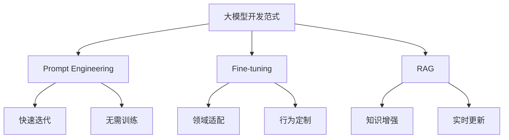
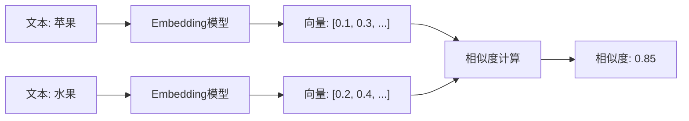
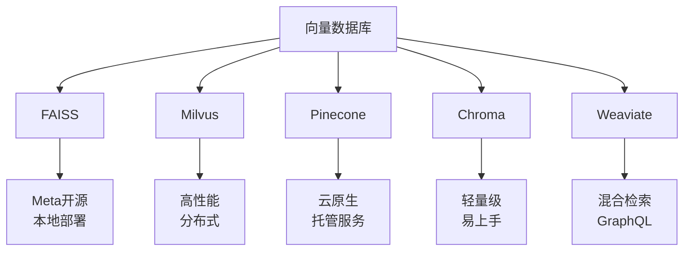
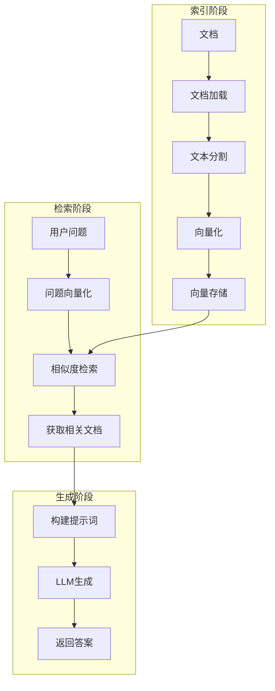
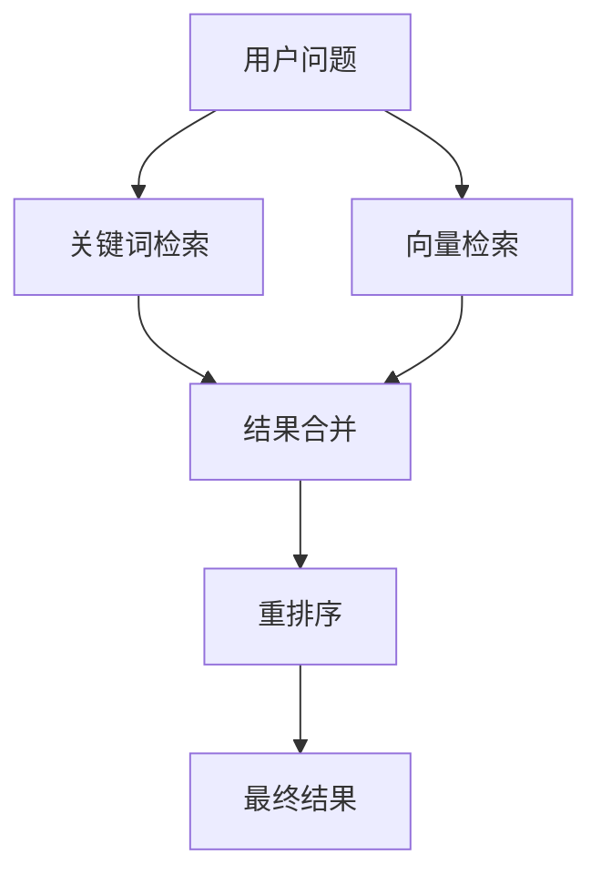

# RAG检索增强生成

构建检索增强生成系统，赋予大模型私有知识能力。

## RAG概述

### 什么是RAG

RAG (Retrieval-Augmented Generation) 是一种将检索与生成相结合的技术，通过检索外部知识增强大模型的生成能力。


### RAG核心价值

| 价值 | 描述 |
|------|------|
| 知识更新 | 无需重新训练即可更新知识 |
| 减少幻觉 | 基于事实生成，提高准确性 |
| 私有数据 | 安全使用企业内部数据 |
| 可追溯性 | 答案可追溯到来源文档 |

### 大模型开发三种范式



## Embeddings

### 什么是Embedding

Embedding是将文本转换为高维向量的过程，使计算机能够理解文本的语义。



### 相似度计算

**余弦相似度**

```python
import numpy as np

def cosine_similarity(a, b):
    return np.dot(a, b) / (np.linalg.norm(a) * np.linalg.norm(b))

vec1 = [0.1, 0.2, 0.3]
vec2 = [0.2, 0.3, 0.4]

similarity = cosine_similarity(vec1, vec2)
```

### Embedding模型选择

| 模型 | 维度 | 特点 | 适用场景 |
|------|------|------|---------|
| text-embedding-3-small | 1536 | OpenAI官方 | 通用场景 |
| text-embedding-3-large | 3072 | 高质量 | 高精度需求 |
| bge-large-zh | 1024 | 中文优化 | 中文场景 |
| m3e-base | 768 | 开源免费 | 成本敏感 |

### MTEB榜单

MTEB (Massive Text Embedding Benchmark) 是评估Embedding模型的权威榜单。

```python
from sentence_transformers import SentenceTransformer

model = SentenceTransformer('BAAI/bge-large-zh')

embeddings = model.encode([
    "这是一个测试句子",
    "这是另一个测试"
])
```

## 向量数据库

### 常见向量数据库



### FAISS使用

```python
import faiss
import numpy as np

dimension = 768
index = faiss.IndexFlatL2(dimension)

vectors = np.random.random((1000, dimension)).astype('float32')
index.add(vectors)

query = np.random.random((1, dimension)).astype('float32')
k = 5
distances, indices = index.search(query, k)
```

### Milvus使用

```python
from pymilvus import connections, Collection, FieldSchema, CollectionSchema, DataType

connections.connect("default", host="localhost", port="19530")

fields = [
    FieldSchema(name="id", dtype=DataType.INT64, is_primary=True),
    FieldSchema(name="embedding", dtype=DataType.FLOAT_VECTOR, dim=768)
]

schema = CollectionSchema(fields, "文档集合")
collection = Collection("documents", schema)

index_params = {
    "metric_type": "L2",
    "index_type": "IVF_FLAT",
    "params": {"nlist": 1024}
}
collection.create_index("embedding", index_params)
```

### Chroma使用

```python
import chromadb
from chromadb.config import Settings

client = chromadb.Client(Settings(
    chroma_db_impl="duckdb+parquet",
    persist_directory="./chroma_db"
))

collection = client.create_collection("documents")

collection.add(
    documents=["文档1内容", "文档2内容"],
    embeddings=[[0.1, 0.2], [0.3, 0.4]],
    metadatas=[{"source": "file1"}, {"source": "file2"}],
    ids=["id1", "id2"]
)

results = collection.query(
    query_embeddings=[[0.15, 0.25]],
    n_results=2
)
```

## RAG系统架构

### 基础架构



### 完整实现

```python
from langchain_openai import ChatOpenAI, OpenAIEmbeddings
from langchain_community.document_loaders import TextLoader
from langchain.text_splitter import RecursiveCharacterTextSplitter
from langchain_community.vectorstores import FAISS
from langchain.chains import RetrievalQA

loader = TextLoader("knowledge.txt")
documents = loader.load()

text_splitter = RecursiveCharacterTextSplitter(
    chunk_size=1000,
    chunk_overlap=200
)
texts = text_splitter.split_documents(documents)

embeddings = OpenAIEmbeddings()
vectorstore = FAISS.from_documents(texts, embeddings)

qa = RetrievalQA.from_chain_type(
    llm=ChatOpenAI(),
    chain_type="stuff",
    retriever=vectorstore.as_retriever(search_kwargs={"k": 3})
)

response = qa.invoke("文档的主要内容是什么？")
```

## 文档处理

### 文档加载

```python
from langchain_community.document_loaders import (
    PyPDFLoader,
    Docx2txtLoader,
    UnstructuredMarkdownLoader,
    WebBaseLoader
)

pdf_loader = PyPDFLoader("document.pdf")
docx_loader = Docx2txtLoader("document.docx")
md_loader = UnstructuredMarkdownLoader("document.md")
web_loader = WebBaseLoader("https://example.com")
```

### 文本分割策略

| 策略 | 描述 | 适用场景 |
|------|------|---------|
| 字符分割 | 按字符数分割 | 简单文本 |
| 递归分割 | 按段落、句子递归 | 通用场景 |
| 语义分割 | 按语义边界分割 | 高质量需求 |
| 代码分割 | 按代码结构分割 | 代码文档 |

```python
from langchain.text_splitter import (
    RecursiveCharacterTextSplitter,
    MarkdownHeaderTextSplitter,
    PythonCodeTextSplitter
)

recursive_splitter = RecursiveCharacterTextSplitter(
    chunk_size=1000,
    chunk_overlap=200,
    separators=["\n\n", "\n", " ", ""]
)

markdown_splitter = MarkdownHeaderTextSplitter(
    headers_to_split_on=[("#", "h1"), ("##", "h2")]
)
```

### 多模态处理

**PDF处理**

```python
from unstructured.partition.pdf import partition_pdf

elements = partition_pdf(
    filename="document.pdf",
    strategy="hi_res",
    extract_images_in_pdf=True
)
```

**表格处理**

```python
from langchain_community.document_loaders import UnstructuredExcelLoader

loader = UnstructuredExcelLoader("data.xlsx", mode="elements")
documents = loader.load()
```

## RAG调优

### 混合检索



```python
from langchain.retrievers import EnsembleRetriever
from langchain_community.retrievers import BM25Retriever

bm25_retriever = BM25Retriever.from_documents(documents)
bm25_retriever.k = 5

vector_retriever = vectorstore.as_retriever(search_kwargs={"k": 5})

ensemble_retriever = EnsembleRetriever(
    retrievers=[bm25_retriever, vector_retriever],
    weights=[0.4, 0.6]
)
```

### 重排序

```python
from langchain.retrievers import ContextualCompressionRetriever
from langchain.retrievers.document_compressors import CohereRerank

compressor = CohereRerank()
compression_retriever = ContextualCompressionRetriever(
    base_compressor=compressor,
    base_retriever=vectorstore.as_retriever()
)
```

### Query改写

```python
from langchain.chains import LLMChain
from langchain.prompts import PromptTemplate

rewrite_template = """
将以下问题改写为更适合检索的形式：

原问题：{question}

改写后的问题：
"""

rewrite_prompt = PromptTemplate.from_template(rewrite_template)
rewrite_chain = LLMChain(llm=llm, prompt=rewrite_prompt)

rewritten_query = rewrite_chain.run(question="怎么解决这个问题？")
```

## RAG评估

### 评估指标

| 指标 | 描述 | 计算方式 |
|------|------|---------|
| 忠实度 | 回答与检索内容的一致性 | 自动评估 |
| 相关性 | 回答与问题的相关性 | 自动评估 |
| 准确性 | 回答的正确性 | 人工评估 |
| 完整性 | 回答的全面程度 | 人工评估 |

### 自动评估

```python
from ragas import evaluate
from ragas.metrics import faithfulness, answer_relevancy

result = evaluate(
    dataset,
    metrics=[faithfulness, answer_relevancy]
)
```

### 大海捞针测试

```python
def needle_in_haystack_test(rag_system, context_length):
    needle = "密码是：123456"
    haystack = generate_random_text(context_length)
    
    test_doc = haystack + "\n" + needle
    rag_system.add_document(test_doc)
    
    query = "密码是什么？"
    response = rag_system.query(query)
    
    return "123456" in response
```

## 最佳实践

### 1. 分块策略

- 通用文档：chunk_size=1000, overlap=200
- 代码文档：按函数/类分割
- 长文档：考虑父文档检索

### 2. 检索优化

- 使用混合检索提高召回
- 重排序提高精度
- 考虑多轮对话上下文

### 3. 提示词设计

```python
template = """
基于以下上下文回答问题。如果上下文中没有相关信息，请说明"根据现有信息无法回答"。

上下文：
{context}

问题：{question}

答案：
"""
```

## 小结

RAG是增强大模型知识能力的核心技术：

1. **Embeddings**：文本向量化与相似度计算
2. **向量数据库**：FAISS、Milvus、Chroma
3. **文档处理**：加载、分割、多模态
4. **RAG调优**：混合检索、重排序、Query改写
5. **评估**：忠实度、相关性、大海捞针
