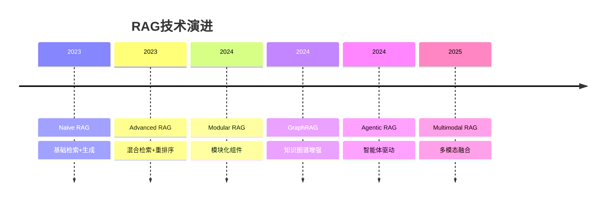
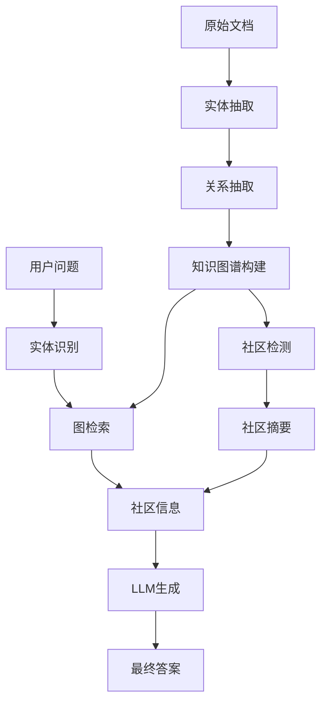
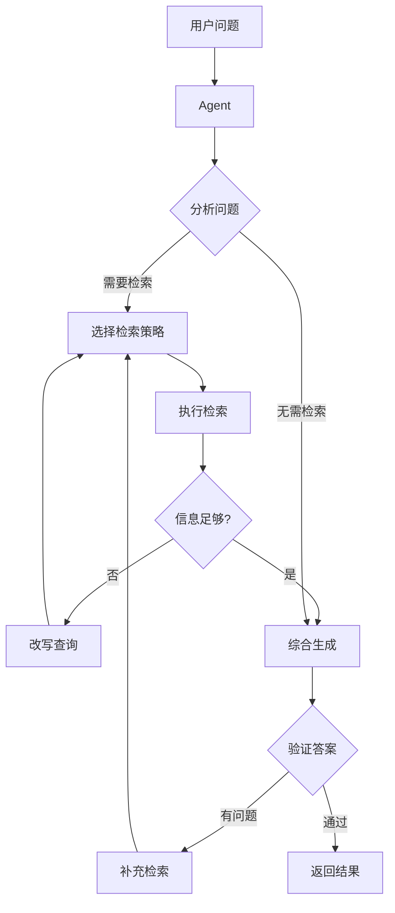
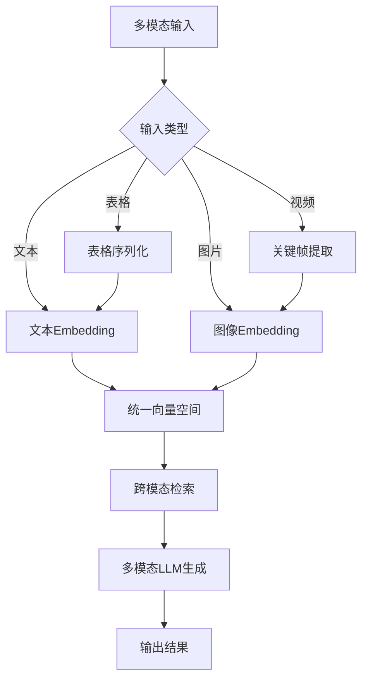

# 高级RAG技术

超越基础RAG，探索GraphRAG、Agentic RAG、多模态RAG等前沿检索增强生成技术。

## RAG技术演进



### RAG技术分层

| 层级 | 技术 | 特点 |
|------|------|------|
| L1 Naive RAG | 基础向量检索+生成 | 简单但效果有限 |
| L2 Advanced RAG | 混合检索+重排序+Query改写 | 显著提升准确率 |
| L3 Modular RAG | 模块化组件灵活组合 | 高度可定制 |
| L4 GraphRAG | 知识图谱+图检索 | 擅长全局推理 |
| L5 Agentic RAG | Agent驱动自主检索 | 智能决策与迭代 |

## GraphRAG

### 核心思想

GraphRAG通过构建知识图谱，将文档中的实体和关系结构化，实现更精准的语义检索和全局推理。



### GraphRAG vs 传统RAG

| 维度 | 传统RAG | GraphRAG |
|------|---------|----------|
| 知识表示 | 文本块 | 实体+关系图 |
| 检索方式 | 向量相似度 | 图遍历+向量 |
| 全局推理 | 弱 | 强 |
| 局部细节 | 强 | 强 |
| 构建成本 | 低 | 高 |
| 适用场景 | 事实问答 | 全局分析、多跳推理 |

### 知识图谱构建

```python
from dataclasses import dataclass, field
from typing import Optional
import json

@dataclass
class Entity:
    """知识图谱实体"""
    id: str
    name: str
    type: str
    description: str
    properties: dict = field(default_factory=dict)

@dataclass
class Relation:
    """知识图谱关系"""
    id: str
    source_id: str
    target_id: str
    relation_type: str
    description: str
    weight: float = 1.0

class KnowledgeGraphBuilder:
    """知识图谱构建器"""
    
    def __init__(self, llm):
        self.llm = llm
        self.entities: dict[str, Entity] = {}
        self.relations: list[Relation] = []
    
    async def extract_from_text(self, text: str) -> dict:
        """从文本中抽取实体和关系"""
        prompt = f"""请从以下文本中抽取实体和关系，以JSON格式输出。

文本：
{text}

输出格式：
{{
    "entities": [
        {{"name": "实体名", "type": "类型", "description": "描述"}}
    ],
    "relations": [
        {{"source": "源实体", "target": "目标实体", "type": "关系类型", "description": "描述"}}
    ]
}}"""
        
        response = await self.llm.ainvoke(prompt)
        result = json.loads(response.content)
        
        for ent in result.get("entities", []):
            entity = Entity(
                id=f"e_{len(self.entities)}",
                name=ent["name"],
                type=ent["type"],
                description=ent["description"]
            )
            self.entities[entity.name] = entity
        
        for rel in result.get("relations", []):
            relation = Relation(
                id=f"r_{len(self.relations)}",
                source_id=rel["source"],
                target_id=rel["target"],
                relation_type=rel["type"],
                description=rel["description"]
            )
            self.relations.append(relation)
        
        return {"entities": len(result.get("entities", [])), "relations": len(result.get("relations", []))}
    
    def get_entity_relations(self, entity_name: str, depth: int = 2) -> dict:
        """获取实体的关联子图"""
        visited = set()
        subgraph_entities = []
        subgraph_relations = []
        
        def _traverse(name: str, current_depth: int):
            if current_depth > depth or name in visited:
                return
            visited.add(name)
            
            if name in self.entities:
                subgraph_entities.append(self.entities[name])
            
            for rel in self.relations:
                if rel.source_id == name and rel.target_id not in visited:
                    subgraph_relations.append(rel)
                    _traverse(rel.target_id, current_depth + 1)
                elif rel.target_id == name and rel.source_id not in visited:
                    subgraph_relations.append(rel)
                    _traverse(rel.source_id, current_depth + 1)
        
        _traverse(entity_name, 0)
        return {"entities": subgraph_entities, "relations": subgraph_relations}
```

### 社区检测与摘要

```python
class CommunityDetector:
    """社区检测与摘要生成"""
    
    def __init__(self, llm):
        self.llm = llm
    
    def detect_communities(self, entities: dict, relations: list) -> list[dict]:
        """基于连接密度检测社区"""
        adjacency = self._build_adjacency(entities, relations)
        communities = self._louvain_community(adjacency)
        return communities
    
    async def generate_community_summary(self, community: dict) -> str:
        """为社区生成摘要"""
        entity_descriptions = "\n".join(
            f"- {e['name']}({e['type']}): {e['description']}" 
            for e in community["entities"]
        )
        
        relation_descriptions = "\n".join(
            f"- {r['source']} --[{r['type']}]--> {r['target']}" 
            for r in community["relations"]
        )
        
        prompt = f"""请为以下知识社区生成简洁摘要：

实体：
{entity_descriptions}

关系：
{relation_descriptions}

请生成一段摘要，概括这个社区的核心主题和关键信息。"""
        
        response = await self.llm.ainvoke(prompt)
        return response.content
    
    def _build_adjacency(self, entities, relations):
        """构建邻接表"""
        adjacency = {name: set() for name in entities}
        for rel in relations:
            if rel.source_id in adjacency:
                adjacency[rel.source_id].add(rel.target_id)
            if rel.target_id in adjacency:
                adjacency[rel.target_id].add(rel.source_id)
        return adjacency
    
    def _louvain_community(self, adjacency):
        """简化版Louvain社区检测"""
        communities = []
        visited = set()
        
        for node in adjacency:
            if node not in visited:
                community = {"entities": [], "relations": []}
                queue = [node]
                while queue:
                    current = queue.pop(0)
                    if current in visited:
                        continue
                    visited.add(current)
                    community["entities"].append(current)
                    queue.extend(adjacency.get(current, set()) - visited)
                communities.append(community)
        
        return communities
```

### GraphRAG检索

```python
class GraphRAGRetriever:
    """GraphRAG检索器"""
    
    def __init__(self, kg_builder: KnowledgeGraphBuilder, community_detector: CommunityDetector, vector_retriever=None):
        self.kg = kg_builder
        self.community = community_detector
        self.vector_retriever = vector_retriever
    
    async def retrieve(self, query: str, mode: str = "hybrid") -> list[dict]:
        """检索相关内容"""
        if mode == "local":
            return await self._local_search(query)
        elif mode == "global":
            return await self._global_search(query)
        else:
            return await self._hybrid_search(query)
    
    async def _local_search(self, query: str) -> list[dict]:
        """局部搜索：基于实体和关系"""
        entities = await self._extract_query_entities(query)
        results = []
        
        for entity_name in entities:
            subgraph = self.kg.get_entity_relations(entity_name, depth=2)
            context = self._format_subgraph(subgraph)
            results.append({
                "source": "graph_local",
                "entity": entity_name,
                "context": context
            })
        
        return results
    
    async def _global_search(self, query: str) -> list[dict]:
        """全局搜索：基于社区摘要"""
        communities = self.community.detect_communities(
            self.kg.entities, self.kg.relations
        )
        
        results = []
        for comm in communities:
            summary = await self.community.generate_community_summary(comm)
            relevance = await self._compute_relevance(query, summary)
            if relevance > 0.5:
                results.append({
                    "source": "graph_global",
                    "context": summary,
                    "relevance": relevance
                })
        
        return sorted(results, key=lambda x: x["relevance"], reverse=True)[:5]
    
    async def _hybrid_search(self, query: str) -> list[dict]:
        """混合搜索：图检索+向量检索"""
        graph_results = await self._local_search(query)
        
        vector_results = []
        if self.vector_retriever:
            docs = self.vector_retriever.similarity_search(query, k=5)
            vector_results = [
                {"source": "vector", "context": doc.page_content}
                for doc in docs
            ]
        
        return graph_results + vector_results
    
    async def _extract_query_entities(self, query: str) -> list[str]:
        """从查询中提取实体"""
        matched = []
        for name in self.kg.entities:
            if name in query:
                matched.append(name)
        return matched
    
    async def _compute_relevance(self, query: str, text: str) -> float:
        """计算相关性"""
        prompt = f"""请评估以下内容与查询的相关性，输出0-1之间的分数。
        
        查询：{query}
        内容：{text}
        
        只输出分数数字。"""
        
        response = await self.kg.llm.ainvoke(prompt)
        try:
            return float(response.content.strip())
        except ValueError:
            return 0.0
    
    def _format_subgraph(self, subgraph: dict) -> str:
        """格式化子图为文本"""
        parts = []
        for entity in subgraph["entities"]:
            parts.append(f"{entity.name}({entity.type}): {entity.description}")
        for rel in subgraph["relations"]:
            parts.append(f"{rel.source_id} --[{rel.relation_type}]--> {rel.target_id}")
        return "\n".join(parts)
```

## Agentic RAG

### 核心思想

Agentic RAG将Agent的自主决策能力引入RAG流程，让系统自主决定何时检索、检索什么、如何组合信息。



### Agentic RAG实现

```python
from enum import Enum
from typing import Optional

class SearchStrategy(Enum):
    VECTOR = "vector"
    KEYWORD = "keyword"
    GRAPH = "graph"
    WEB = "web"

class AgenticRAG:
    """智能体驱动的RAG系统"""
    
    def __init__(self, llm, vector_store, graph_store=None, web_search=None):
        self.llm = llm
        self.vector_store = vector_store
        self.graph_store = graph_store
        self.web_search = web_search
        self.max_iterations = 5
    
    async def query(self, question: str) -> dict:
        """处理用户查询"""
        context = []
        iteration = 0
        
        while iteration < self.max_iterations:
            action = await self._decide_action(question, context)
            
            if action["type"] == "answer":
                return {
                    "answer": action["content"],
                    "sources": context,
                    "iterations": iteration
                }
            elif action["type"] == "search":
                new_context = await self._execute_search(
                    action["query"],
                    action["strategy"]
                )
                context.extend(new_context)
            elif action["type"] == "refine":
                question = action["refined_query"]
            
            iteration += 1
        
        final_answer = await self._generate_answer(question, context)
        return {"answer": final_answer, "sources": context, "iterations": iteration}
    
    async def _decide_action(self, question: str, context: list) -> dict:
        """Agent决策下一步行动"""
        context_summary = "\n".join(
            f"[{c['source']}] {c['content'][:200]}" for c in context
        ) if context else "暂无上下文"
        
        prompt = f"""你是一个智能检索助手。根据当前情况决定下一步行动。

问题：{question}
已有上下文：
{context_summary}

可选行动：
1. answer - 已有足够信息，直接回答
2. search - 需要检索更多信息
3. refine - 需要改写查询

请以JSON格式输出：
{{"type": "行动类型", "query": "检索查询（如果search）", "strategy": "检索策略（vector/keyword/graph/web）", "refined_query": "改写后的查询（如果refine）", "content": "回答内容（如果answer）"}}"""
        
        response = await self.llm.ainvoke(prompt)
        return json.loads(response.content)
    
    async def _execute_search(self, query: str, strategy: str) -> list[dict]:
        """执行检索"""
        results = []
        
        if strategy in ["vector", "keyword"]:
            if strategy == "vector":
                docs = self.vector_store.similarity_search(query, k=5)
            else:
                docs = self.vector_store.keyword_search(query, k=5)
            results.extend([
                {"source": strategy, "content": doc.page_content, "score": doc.metadata.get("score", 0)}
                for doc in docs
            ])
        
        if strategy == "graph" and self.graph_store:
            graph_results = await self.graph_store.search(query)
            results.extend(graph_results)
        
        if strategy == "web" and self.web_search:
            web_results = await self.web_search.search(query)
            results.extend(web_results)
        
        return results
    
    async def _generate_answer(self, question: str, context: list) -> str:
        """生成最终答案"""
        context_text = "\n\n".join(
            f"[来源: {c['source']}]\n{c['content']}" for c in context
        )
        
        prompt = f"""基于以下上下文回答问题。如果上下文信息不足，请说明。

上下文：
{context_text}

问题：{question}

请给出详细、准确的回答，并标注信息来源。"""
        
        response = await self.llm.ainvoke(prompt)
        return response.content
```

## 多模态RAG

### 架构设计



### 图片RAG

```python
class ImageRAG:
    """图片RAG系统"""
    
    def __init__(self, clip_model, vector_store, llm):
        self.clip = clip_model
        self.vector_store = vector_store
        self.llm = llm
    
    async def index_images(self, image_paths: list[str]):
        """索引图片"""
        for path in image_paths:
            image_embedding = self.clip.encode_image(path)
            caption = await self._generate_caption(path)
            
            self.vector_store.add(
                embedding=image_embedding,
                metadata={
                    "type": "image",
                    "path": path,
                    "caption": caption
                }
            )
    
    async def query_with_image(self, query: str, query_image: str = None) -> str:
        """图片查询"""
        if query_image:
            query_embedding = self.clip.encode_image(query_image)
        else:
            query_embedding = self.clip.encode_text(query)
        
        results = self.vector_store.search(query_embedding, k=5)
        
        image_contexts = []
        for result in results:
            caption = result.metadata["caption"]
            image_contexts.append(caption)
        
        prompt = f"""基于以下图片描述回答问题：

图片描述：
{chr(10).join(image_contexts)}

问题：{query}"""
        
        response = await self.llm.ainvoke(prompt)
        return response.content
    
    async def _generate_caption(self, image_path: str) -> str:
        """生成图片描述"""
        prompt = "请详细描述这张图片的内容。"
        response = await self.llm.ainvoke_with_image(prompt, image_path)
        return response.content
```

### 表格RAG

```python
class TableRAG:
    """表格RAG系统"""
    
    def __init__(self, llm, vector_store):
        self.llm = llm
        self.vector_store = vector_store
    
    async def index_table(self, table_data: dict, source: str):
        """索引表格数据"""
        summary = await self._summarize_table(table_data)
        serialized = self._serialize_table(table_data)
        
        self.vector_store.add_texts(
            texts=[f"{summary}\n\n{serialized}"],
            metadatas=[{"type": "table", "source": source}]
        )
    
    def _serialize_table(self, table: dict) -> str:
        """将表格序列化为Markdown"""
        headers = table.get("headers", [])
        rows = table.get("rows", [])
        
        md = "| " + " | ".join(headers) + " |\n"
        md += "| " + " | ".join(["---"] * len(headers)) + " |\n"
        for row in rows:
            md += "| " + " | ".join(str(cell) for cell in row) + " |\n"
        
        return md
    
    async def _summarize_table(self, table: dict) -> str:
        """生成表格摘要"""
        serialized = self._serialize_table(table)
        prompt = f"请用一段话概括以下表格的核心信息：\n\n{serialized}"
        response = await self.llm.ainvoke(prompt)
        return response.content
```

## RAG优化进阶

### 自适应检索

```python
class AdaptiveRetriever:
    """自适应检索器：根据问题类型选择最佳检索策略"""
    
    def __init__(self, llm, retrievers: dict):
        self.llm = llm
        self.retrievers = retrievers
    
    async def retrieve(self, query: str) -> list:
        """自适应检索"""
        query_type = await self._classify_query(query)
        
        if query_type == "factual":
            return self.retrievers["vector"].similarity_search(query, k=5)
        elif query_type == "keyword":
            return self.retrievers["keyword"].search(query, k=5)
        elif query_type == "analytical":
            vector_results = self.retrievers["vector"].similarity_search(query, k=3)
            graph_results = await self.retrievers["graph"].search(query)
            return vector_results + graph_results
        else:
            return self.retrievers["vector"].similarity_search(query, k=5)
    
    async def _classify_query(self, query: str) -> str:
        """分类查询类型"""
        prompt = f"""请判断以下问题的类型：
        
        问题：{query}
        
        类型选项：
        - factual: 事实性问题，需要精确答案
        - keyword: 关键词匹配问题
        - analytical: 分析性问题，需要综合信息
        - conversational: 对话性问题
        
        只输出类型名称。"""
        
        response = await self.llm.ainvoke(prompt)
        return response.content.strip().lower()
```

### 检索结果融合

```python
class ResultFusion:
    """检索结果融合"""
    
    @staticmethod
    def reciprocal_rank_fusion(
        result_lists: list[list], 
        k: int = 60
    ) -> list:
        """倒数排名融合（RRF）"""
        scores = {}
        
        for results in result_lists:
            for rank, doc in enumerate(results):
                doc_id = doc.metadata.get("id", str(hash(doc.page_content)))
                if doc_id not in scores:
                    scores[doc_id] = {"score": 0, "doc": doc}
                scores[doc_id]["score"] += 1.0 / (k + rank + 1)
        
        sorted_results = sorted(
            scores.values(), 
            key=lambda x: x["score"], 
            reverse=True
        )
        return [item["doc"] for item in sorted_results]
    
    @staticmethod
    def weighted_fusion(
        result_lists: list[list],
        weights: list[float],
        k: int = 5
    ) -> list:
        """加权融合"""
        scores = {}
        
        for results, weight in zip(result_lists, weights):
            for rank, doc in enumerate(results):
                doc_id = doc.metadata.get("id", str(hash(doc.page_content)))
                if doc_id not in scores:
                    scores[doc_id] = {"score": 0, "doc": doc}
                scores[doc_id]["score"] += weight * (1.0 / (rank + 1))
        
        sorted_results = sorted(
            scores.values(), 
            key=lambda x: x["score"], 
            reverse=True
        )
        return [item["doc"] for item in sorted_results[:k]]
```

### 父文档检索

```python
class ParentDocumentRetriever:
    """父文档检索：检索小块，返回大块上下文"""
    
    def __init__(self, vector_store, doc_store, child_splitter, parent_splitter):
        self.vector_store = vector_store
        self.doc_store = doc_store
        self.child_splitter = child_splitter
        self.parent_splitter = parent_splitter
    
    def add_documents(self, documents: list):
        """添加文档"""
        for doc in documents:
            parent_chunks = self.parent_splitter.split_documents([doc])
            
            for parent in parent_chunks:
                parent_id = str(hash(parent.page_content))
                self.doc_store[parent_id] = parent
                
                child_chunks = self.child_splitter.split_documents([parent])
                for child in child_chunks:
                    child.metadata["parent_id"] = parent_id
                    self.vector_store.add_documents([child])
    
    def retrieve(self, query: str, k: int = 5) -> list:
        """检索：返回父文档"""
        child_results = self.vector_store.similarity_search(query, k=k)
        
        parent_ids = list(set(
            doc.metadata.get("parent_id") 
            for doc in child_results
        ))
        
        return [
            self.doc_store[pid] 
            for pid in parent_ids 
            if pid in self.doc_store
        ]
```

## RAG效果评估

### 评估框架

```python
class RAGEvaluator:
    """RAG系统评估器"""
    
    def __init__(self, llm):
        self.llm = llm
    
    async def evaluate(self, questions: list[dict]) -> dict:
        """评估RAG系统"""
        results = {
            "faithfulness": [],
            "relevancy": [],
            "completeness": [],
            "hallucination_rate": []
        }
        
        for q in questions:
            answer = q["answer"]
            context = q["context"]
            question = q["question"]
            
            results["faithfulness"].append(
                await self._eval_faithfulness(answer, context)
            )
            results["relevancy"].append(
                await self._eval_relevancy(answer, question)
            )
            results["completeness"].append(
                await self._eval_completeness(answer, question, context)
            )
            results["hallucination_rate"].append(
                await self._eval_hallucination(answer, context)
            )
        
        return {
            metric: sum(scores) / len(scores) 
            for metric, scores in results.items()
        }
    
    async def _eval_faithfulness(self, answer: str, context: str) -> float:
        """评估忠实度"""
        prompt = f"""评估回答是否忠实于上下文，输出0-1分数。

上下文：{context}
回答：{answer}

只输出分数。"""
        response = await self.llm.ainvoke(prompt)
        try:
            return float(response.content.strip())
        except ValueError:
            return 0.5
    
    async def _eval_relevancy(self, answer: str, question: str) -> float:
        """评估相关性"""
        prompt = f"""评估回答与问题的相关性，输出0-1分数。

问题：{question}
回答：{answer}

只输出分数。"""
        response = await self.llm.ainvoke(prompt)
        try:
            return float(response.content.strip())
        except ValueError:
            return 0.5
    
    async def _eval_completeness(self, answer: str, question: str, context: str) -> float:
        """评估完整性"""
        prompt = f"""评估回答的完整性，输出0-1分数。

问题：{question}
上下文：{context}
回答：{answer}

只输出分数。"""
        response = await self.llm.ainvoke(prompt)
        try:
            return float(response.content.strip())
        except ValueError:
            return 0.5
    
    async def _eval_hallucination(self, answer: str, context: str) -> float:
        """评估幻觉率（0=无幻觉，1=完全幻觉）"""
        prompt = f"""评估回答中是否存在上下文不支持的内容，输出0-1幻觉率。

上下文：{context}
回答：{answer}

只输出0-1之间的数字。"""
        response = await self.llm.ainvoke(prompt)
        try:
            return float(response.content.strip())
        except ValueError:
            return 0.5
```

## 技术选型指南

| 场景 | 推荐技术 | 原因 |
|------|---------|------|
| 事实问答 | Advanced RAG + 重排序 | 高精度需求 |
| 全局分析 | GraphRAG | 需要全局推理能力 |
| 复杂决策 | Agentic RAG | 需要自主判断和迭代 |
| 图片理解 | 多模态RAG | 跨模态检索 |
| 表格查询 | TableRAG + SQL Agent | 结构化数据 |
| 大规模知识库 | 父文档检索 + 自适应检索 | 平衡精度和效率 |

## 小结

高级RAG技术是RAG系统的进化方向：

1. **GraphRAG**：知识图谱增强，擅长全局推理和多跳问答
2. **Agentic RAG**：Agent驱动自主检索，智能决策迭代
3. **多模态RAG**：跨文本、图片、表格的统一检索
4. **优化进阶**：自适应检索、结果融合、父文档检索
5. **效果评估**：忠实度、相关性、完整性、幻觉率
