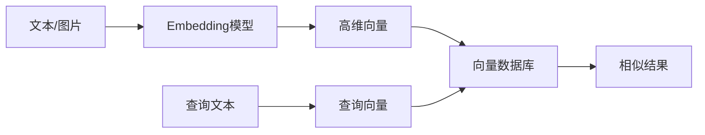
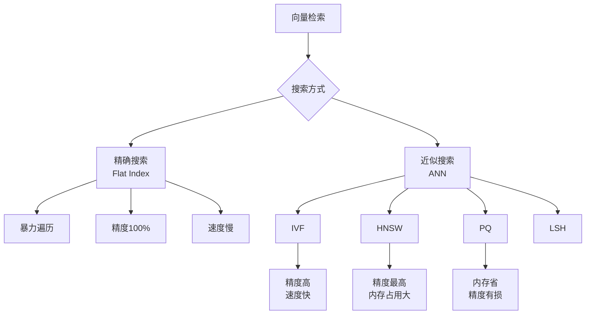
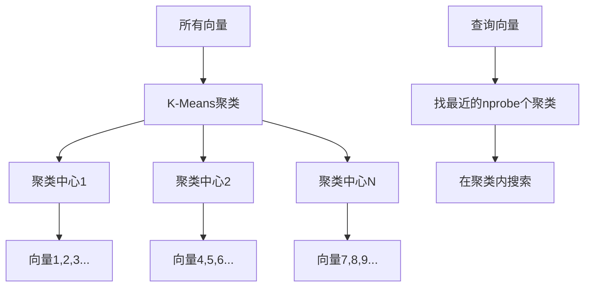
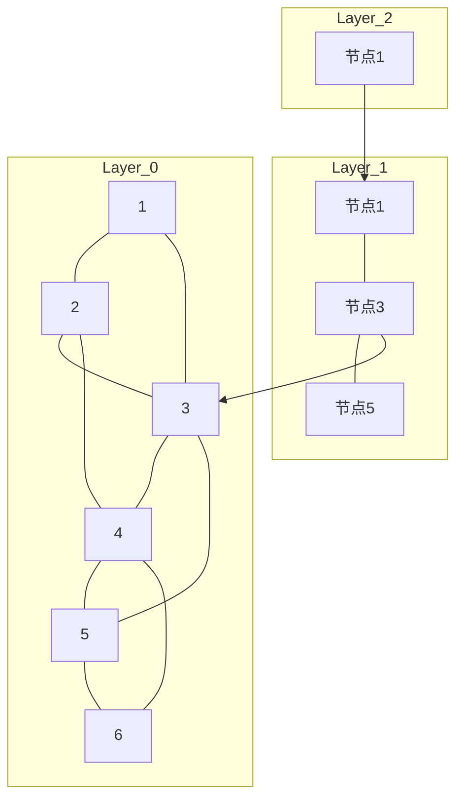
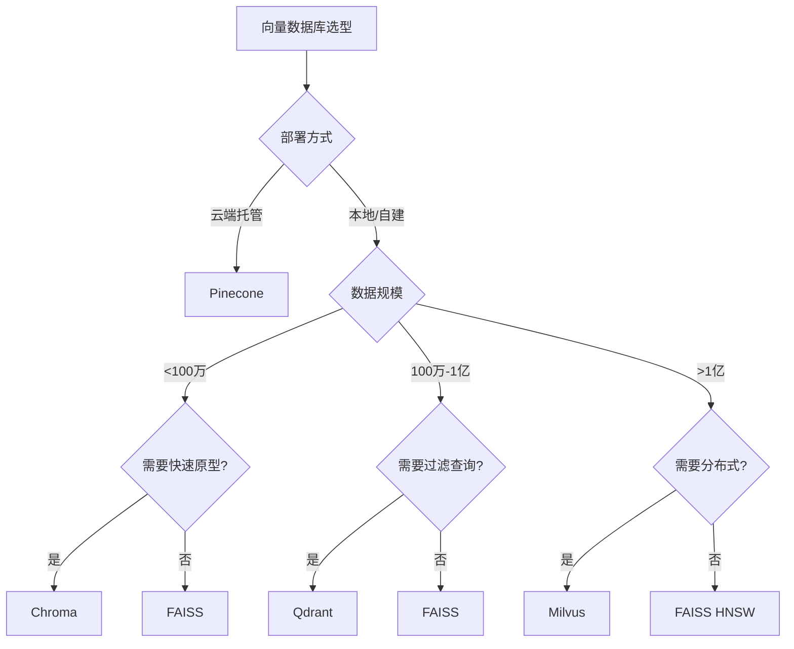

# 向量数据库详解

深入理解向量数据库的原理、选型和使用，为RAG系统选择最优的存储方案。

## 向量数据库概述

### 为什么需要向量数据库



传统数据库基于精确匹配，而向量数据库基于语义相似度检索，能够理解"意思相近"而非"字面相同"。

### 核心概念

| 概念 | 描述 |
|------|------|
| 向量 | 高维浮点数组，如 [0.1, 0.3, -0.2, ...] |
| 维度 | 向量的长度，常见768/1024/1536 |
| 距离度量 | 衡量向量相似度的方法 |
| 索引 | 加速向量检索的数据结构 |
| 召回率 | 检索到相关结果的比例 |

## 距离度量方法

### 常见度量

| 方法 | 公式 | 特点 | 取值范围 |
|------|------|------|---------|
| 余弦相似度 | cos(A,B) = A·B / (‖A‖·‖B‖) | 关注方向，忽略大小 | [-1, 1] |
| 欧氏距离 | d = √Σ(aᵢ-bᵢ)² | 关注绝对距离 | [0, +∞) |
| 内积 | IP = A·B | 关注方向和大小 | (-∞, +∞) |
| 汉明距离 | 不同维度数 | 适用于二值向量 | [0, n] |

```python
import numpy as np

def cosine_similarity(a: np.ndarray, b: np.ndarray) -> float:
    """计算余弦相似度"""
    return np.dot(a, b) / (np.linalg.norm(a) * np.linalg.norm(b))

def euclidean_distance(a: np.ndarray, b: np.ndarray) -> float:
    """计算欧氏距离"""
    return np.sqrt(np.sum((a - b) ** 2))

def inner_product(a: np.ndarray, b: np.ndarray) -> float:
    """计算内积"""
    return np.dot(a, b)
```

### 度量选择建议

| 场景 | 推荐度量 | 原因 |
|------|---------|------|
| 文本语义搜索 | 余弦相似度 | 关注语义方向 |
| 推荐系统 | 内积 | 考虑向量大小 |
| 地理位置搜索 | 欧氏距离 | 关注绝对距离 |
| 图像检索 | 余弦相似度 | 归一化后效果好 |

## 索引算法

### 精确搜索 vs 近似搜索



### IVF (Inverted File Index)

将向量空间划分为多个聚类，搜索时只检索最近的几个聚类。



```python
import faiss

dimension = 768
nlist = 100

quantizer = faiss.IndexFlatL2(dimension)
index = faiss.IndexIVFFlat(quantizer, dimension, nlist)

train_vectors = np.random.random((100000, dimension)).astype('float32')
index.train(train_vectors)
index.add(train_vectors)

index.nprobe = 10
query = np.random.random((1, dimension)).astype('float32')
distances, indices = index.search(query, k=5)
```

### HNSW (Hierarchical Navigable Small World)

多层图结构，从顶层快速定位到底层的最近邻。



```python
dimension = 768
M = 32
efConstruction = 200

index = faiss.IndexHNSWFlat(dimension, M)
index.hnsw.efConstruction = efConstruction
index.hnsw.efSearch = 64

vectors = np.random.random((100000, dimension)).astype('float32')
index.add(vectors)

query = np.random.random((1, dimension)).astype('float32')
distances, indices = index.search(query, k=5)
```

### PQ (Product Quantization)

将高维向量分割为子空间，分别量化，大幅降低内存占用。

```python
dimension = 768
nlist = 100
m = 48
code_size = 8

quantizer = faiss.IndexFlatL2(dimension)
index = faiss.IndexIVFPQ(quantizer, dimension, nlist, m, code_size)

train_vectors = np.random.random((100000, dimension)).astype('float32')
index.train(train_vectors)
index.add(train_vectors)

query = np.random.random((1, dimension)).astype('float32')
distances, indices = index.search(query, k=5)
```

### 索引性能对比

| 索引 | 构建速度 | 查询速度 | 内存占用 | 召回率 |
|------|---------|---------|---------|--------|
| Flat | 快 | 慢 | 高 | 100% |
| IVF-Flat | 中 | 中 | 高 | 95%+ |
| IVF-PQ | 慢 | 快 | 低 | 90%+ |
| HNSW | 慢 | 最快 | 高 | 98%+ |

## 主流向量数据库

### FAISS

Meta开源的高性能向量检索库，适合本地部署。

```python
import faiss
import numpy as np

class FAISSVectorStore:
    """FAISS向量存储封装"""
    
    def __init__(self, dimension: int = 768, index_type: str = "ivf"):
        self.dimension = dimension
        self.index_type = index_type
        self.index = None
        self.id_map = {}
    
    def build_index(self, vectors: np.ndarray, ids: list[str] = None):
        """构建索引"""
        vectors = vectors.astype('float32')
        n_vectors = vectors.shape[0]
        
        if self.index_type == "flat":
            self.index = faiss.IndexFlatL2(self.dimension)
        elif self.index_type == "ivf":
            nlist = min(int(np.sqrt(n_vectors)), 1000)
            quantizer = faiss.IndexFlatL2(self.dimension)
            self.index = faiss.IndexIVFFlat(quantizer, self.dimension, nlist)
            self.index.train(vectors)
        elif self.index_type == "hnsw":
            M = 32
            self.index = faiss.IndexHNSWFlat(self.dimension, M)
            self.index.hnsw.efConstruction = 200
        elif self.index_type == "pq":
            nlist = min(int(np.sqrt(n_vectors)), 1000)
            quantizer = faiss.IndexFlatL2(self.dimension)
            self.index = faiss.IndexIVFPQ(quantizer, self.dimension, nlist, 48, 8)
            self.index.train(vectors)
        
        if ids:
            self.index = faiss.IndexIDMap(self.index)
            id_array = np.array([hash(id_) % (2**31) for id_ in ids]).astype('int64')
            self.index.add_with_ids(vectors, id_array)
            for i, id_ in enumerate(ids):
                self.id_map[hash(id_) % (2**31)] = id_
        else:
            self.index.add(vectors)
    
    def search(self, query: np.ndarray, k: int = 5) -> list[dict]:
        """搜索最近邻"""
        query = query.astype('float32')
        if query.ndim == 1:
            query = query.reshape(1, -1)
        
        if hasattr(self.index, 'nprobe'):
            self.index.nprobe = 10
        
        distances, indices = self.index.search(query, k)
        
        results = []
        for i in range(len(indices[0])):
            idx = indices[0][i]
            if idx >= 0:
                results.append({
                    "index": int(idx),
                    "distance": float(distances[0][i]),
                    "id": self.id_map.get(int(idx), str(idx))
                })
        return results
    
    def save(self, path: str):
        """保存索引"""
        faiss.write_index(self.index, path)
    
    def load(self, path: str):
        """加载索引"""
        self.index = faiss.read_index(path)
```

### Milvus

高性能分布式向量数据库，适合生产环境。

```python
from pymilvus import (
    connections, Collection, FieldSchema, 
    CollectionSchema, DataType, utility
)

class MilvusVectorStore:
    """Milvus向量存储封装"""
    
    def __init__(self, host: str = "localhost", port: int = 19530):
        connections.connect("default", host=host, port=port)
    
    def create_collection(
        self, 
        name: str, 
        dimension: int = 768,
        description: str = ""
    ) -> Collection:
        """创建集合"""
        if utility.has_collection(name):
            return Collection(name)
        
        fields = [
            FieldSchema(name="id", dtype=DataType.INT64, is_primary=True, auto_id=True),
            FieldSchema(name="doc_id", dtype=DataType.VARCHAR, max_length=256),
            FieldSchema(name="embedding", dtype=DataType.FLOAT_VECTOR, dim=dimension),
            FieldSchema(name="text", dtype=DataType.VARCHAR, max_length=65535),
            FieldSchema(name="source", dtype=DataType.VARCHAR, max_length=512)
        ]
        
        schema = CollectionSchema(fields, description=description)
        collection = Collection(name, schema)
        
        index_params = {
            "metric_type": "COSINE",
            "index_type": "HNSW",
            "params": {"M": 16, "efConstruction": 256}
        }
        collection.create_index("embedding", index_params)
        
        return collection
    
    def insert(
        self, 
        collection_name: str, 
        embeddings: list,
        texts: list[str],
        doc_ids: list[str] = None,
        sources: list[str] = None
    ):
        """插入数据"""
        collection = Collection(collection_name)
        
        data = [
            doc_ids or [str(i) for i in range(len(texts))],
            embeddings,
            texts,
            sources or ["unknown"] * len(texts)
        ]
        
        collection.insert(data)
        collection.flush()
    
    def search(
        self, 
        collection_name: str, 
        query_embedding: list,
        k: int = 5,
        filter_expr: str = None
    ) -> list[dict]:
        """搜索"""
        collection = Collection(collection_name)
        collection.load()
        
        search_params = {"metric_type": "COSINE", "params": {"ef": 64}}
        
        results = collection.search(
            data=[query_embedding],
            anns_field="embedding",
            param=search_params,
            limit=k,
            expr=filter_expr,
            output_fields=["text", "source", "doc_id"]
        )
        
        output = []
        for hits in results:
            for hit in hits:
                output.append({
                    "id": hit.id,
                    "score": hit.score,
                    "text": hit.entity.get("text"),
                    "source": hit.entity.get("source"),
                    "doc_id": hit.entity.get("doc_id")
                })
        return output
```

### Chroma

轻量级嵌入式向量数据库，适合快速原型开发。

```python
import chromadb
from chromadb.config import Settings

class ChromaVectorStore:
    """Chroma向量存储封装"""
    
    def __init__(self, persist_directory: str = "./chroma_db"):
        self.client = chromadb.PersistentClient(path=persist_directory)
    
    def get_or_create_collection(self, name: str):
        """获取或创建集合"""
        return self.client.get_or_create_collection(
            name=name,
            metadata={"hnsw:space": "cosine"}
        )
    
    def add_documents(
        self, 
        collection_name: str,
        documents: list[str],
        embeddings: list[list[float]] = None,
        ids: list[str] = None,
        metadatas: list[dict] = None
    ):
        """添加文档"""
        collection = self.get_or_create_collection(collection_name)
        
        if ids is None:
            ids = [f"doc_{i}" for i in range(len(documents))]
        
        if embeddings is not None:
            collection.add(
                documents=documents,
                embeddings=embeddings,
                ids=ids,
                metadatas=metadatas
            )
        else:
            collection.add(
                documents=documents,
                ids=ids,
                metadatas=metadatas
            )
    
    def query(
        self, 
        collection_name: str,
        query_texts: list[str] = None,
        query_embeddings: list[list[float]] = None,
        n_results: int = 5,
        where: dict = None
    ) -> dict:
        """查询"""
        collection = self.get_or_create_collection(collection_name)
        
        kwargs = {"n_results": n_results}
        if query_texts:
            kwargs["query_texts"] = query_texts
        if query_embeddings:
            kwargs["query_embeddings"] = query_embeddings
        if where:
            kwargs["where"] = where
        
        return collection.query(**kwargs)
```

### Qdrant

高性能向量数据库，支持丰富的过滤条件。

```python
from qdrant_client import QdrantClient
from qdrant_client.models import (
    Distance, VectorParams, PointStruct, 
    Filter, FieldCondition, MatchValue
)

class QdrantVectorStore:
    """Qdrant向量存储封装"""
    
    def __init__(self, host: str = "localhost", port: int = 6333):
        self.client = QdrantClient(host=host, port=port)
    
    def create_collection(self, name: str, dimension: int = 768):
        """创建集合"""
        self.client.create_collection(
            collection_name=name,
            vectors_config=VectorParams(
                size=dimension,
                distance=Distance.COSINE
            )
        )
    
    def add_documents(
        self, 
        collection_name: str,
        vectors: list[list[float]],
        payloads: list[dict],
        ids: list[int] = None
    ):
        """添加文档"""
        if ids is None:
            ids = list(range(len(vectors)))
        
        points = [
            PointStruct(id=id_, vector=vector, payload=payload)
            for id_, vector, payload in zip(ids, vectors, payloads)
        ]
        
        self.client.upsert(collection_name=collection_name, points=points)
    
    def search(
        self, 
        collection_name: str,
        query_vector: list[float],
        k: int = 5,
        filter_conditions: dict = None
    ) -> list[dict]:
        """搜索"""
        query_filter = None
        if filter_conditions:
            query_filter = Filter(
                must=[
                    FieldCondition(key=k, match=MatchValue(value=v))
                    for k, v in filter_conditions.items()
                ]
            )
        
        results = self.client.search(
            collection_name=collection_name,
            query_vector=query_vector,
            limit=k,
            query_filter=query_filter
        )
        
        return [
            {
                "id": hit.id,
                "score": hit.score,
                "payload": hit.payload
            }
            for hit in results
        ]
```

## 数据库选型对比

### 综合对比

| 特性 | FAISS | Milvus | Chroma | Qdrant | Pinecone | Weaviate |
|------|-------|--------|--------|--------|----------|----------|
| 类型 | 库 | 分布式DB | 嵌入式DB | 分布式DB | 云服务 | 分布式DB |
| 部署 | 本地 | 集群 | 本地 | 集群/本地 | 云端 | 集群 |
| 规模 | 亿级 | 十亿级 | 百万级 | 十亿级 | 十亿级 | 十亿级 |
| 过滤 | 无 | 丰富 | 基础 | 丰富 | 丰富 | 丰富 |
| 持久化 | 手动 | 自动 | 自动 | 自动 | 自动 | 自动 |
| 多语言 | Python/C++ | 多语言 | Python | 多语言 | REST API | REST API |
| 开源 | 是 | 是 | 是 | 是 | 否 | 是 |
| 学习曲线 | 中 | 高 | 低 | 中 | 低 | 中 |

### 选型决策树



### 场景推荐

| 场景 | 推荐 | 原因 |
|------|------|------|
| 快速原型 | Chroma | 零配置，开箱即用 |
| 个人项目 | FAISS | 轻量高效 |
| 企业级应用 | Milvus/Qdrant | 高可用，丰富功能 |
| 云原生 | Pinecone | 免运维 |
| 学术研究 | FAISS | 灵活，算法全面 |
| 多模态检索 | Weaviate | 原生支持多模态 |

## 性能优化

### 索引优化

```python
class IndexOptimizer:
    """索引优化器"""
    
    @staticmethod
    def recommend_index(n_vectors: int, dimension: int, memory_gb: float) -> dict:
        """根据数据规模和资源推荐索引"""
        vector_size_mb = n_vectors * dimension * 4 / (1024 * 1024)
        
        if n_vectors < 100_000:
            return {
                "index": "Flat",
                "reason": "数据量小，精确搜索即可"
            }
        elif n_vectors < 1_000_000:
            return {
                "index": "IVF",
                "nlist": int(np.sqrt(n_vectors)),
                "nprobe": 10,
                "reason": "中等规模，IVF平衡速度和精度"
            }
        elif memory_gb * 1024 > vector_size_mb * 1.5:
            return {
                "index": "HNSW",
                "M": 32,
                "efConstruction": 200,
                "efSearch": 64,
                "reason": "内存充足，HNSW最高召回率"
            }
        else:
            return {
                "index": "IVF-PQ",
                "nlist": int(np.sqrt(n_vectors)),
                "m": dimension // 16,
                "code_size": 8,
                "reason": "内存受限，PQ压缩存储"
            }
```

### 批量操作优化

```python
class BatchProcessor:
    """批量操作优化"""
    
    def __init__(self, vector_store, batch_size: int = 1000):
        self.vector_store = vector_store
        self.batch_size = batch_size
    
    async def batch_insert(self, documents: list[dict]):
        """批量插入"""
        for i in range(0, len(documents), self.batch_size):
            batch = documents[i:i + self.batch_size]
            await self.vector_store.insert(batch)
    
    async def batch_search(self, queries: list, k: int = 5) -> list[list]:
        """批量查询"""
        results = []
        for i in range(0, len(queries), self.batch_size):
            batch = queries[i:i + self.batch_size]
            batch_results = await self.vector_store.batch_search(batch, k)
            results.extend(batch_results)
        return results
```

## 小结

向量数据库是RAG系统的核心基础设施：

1. **距离度量**：余弦相似度、欧氏距离、内积各有适用场景
2. **索引算法**：Flat、IVF、HNSW、PQ，平衡速度、精度和内存
3. **主流数据库**：FAISS、Milvus、Chroma、Qdrant各有优势
4. **选型指南**：根据规模、部署方式、功能需求选择
5. **性能优化**：索引选择、批量操作、参数调优
