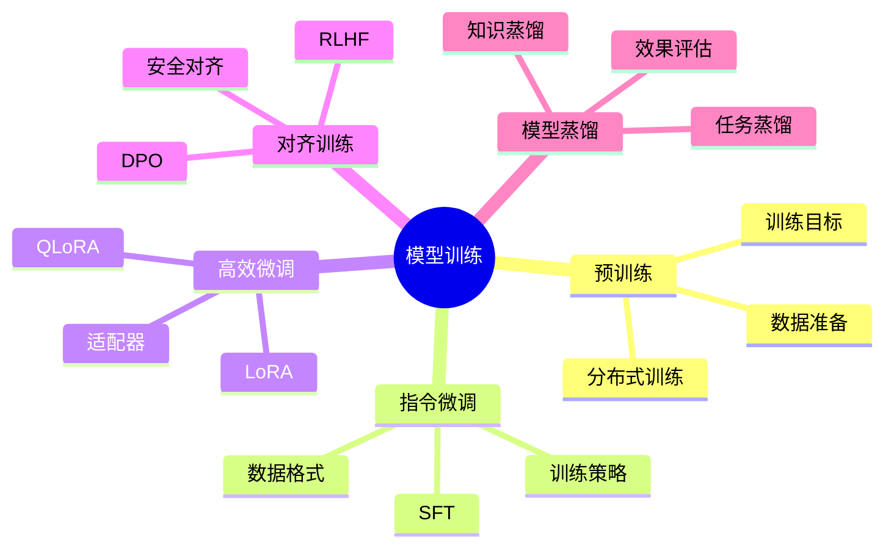
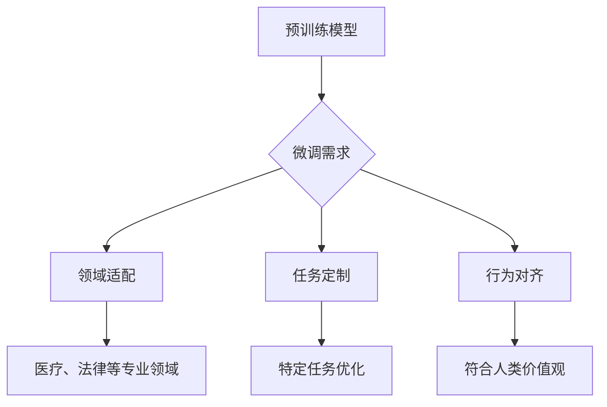
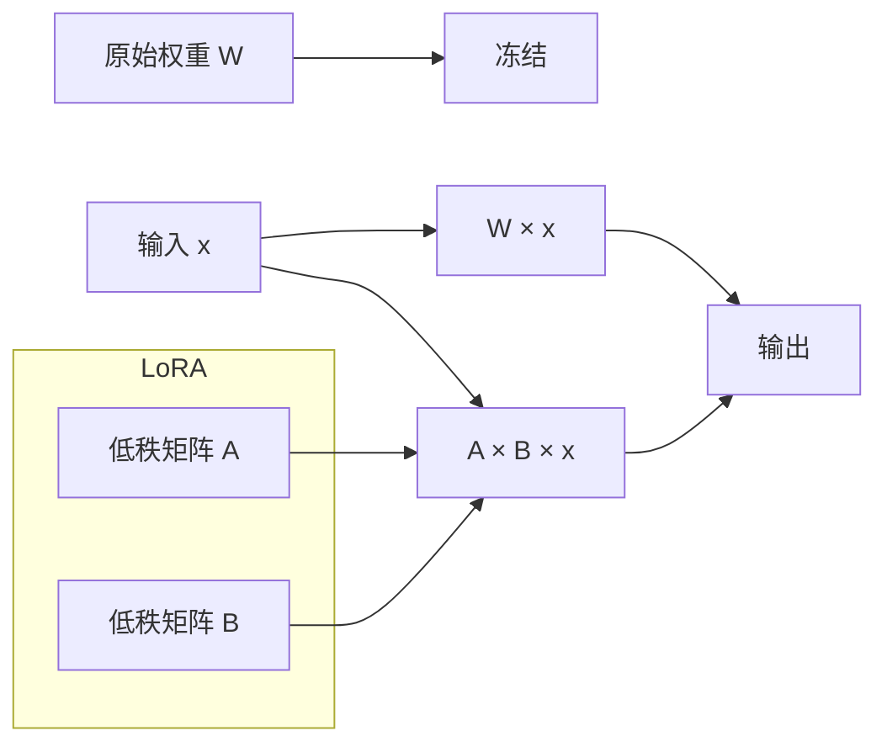
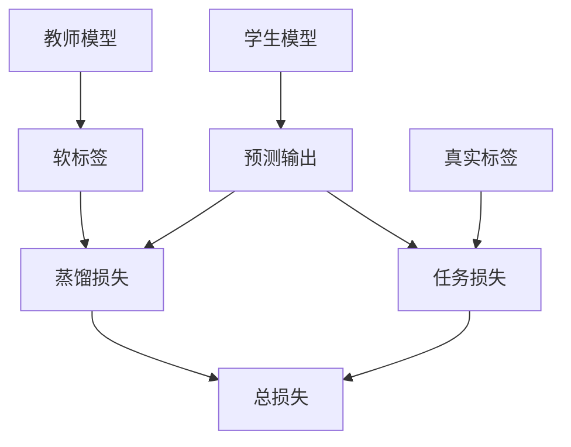

# 模型训练与微调

深入理解大模型训练原理，掌握高效微调技术。

## 知识图谱



## LLM微调原理

### 为什么需要微调



### 微调方法对比

| 方法 | 参数量 | 显存需求 | 效果 | 适用场景 |
|------|--------|---------|------|---------|
| 全参数微调 | 100% | 高 | 最好 | 大规模数据 |
| LoRA | <1% | 低 | 接近全参数 | 通用场景 |
| QLoRA | <1% | 最低 | 良好 | 资源受限 |
| Prefix Tuning | <1% | 低 | 良好 | 特定任务 |

## LoRA原理

### 核心思想

LoRA (Low-Rank Adaptation) 通过低秩分解来近似权重更新。



### 数学原理

原始权重矩阵 W ∈ R^(d×k)，LoRA添加两个低秩矩阵：
- A ∈ R^(r×k)，B ∈ R^(d×r)
- r << min(d, k)

输出计算：h = Wx + BAx = Wx + ΔWx

### LoRA实现

```python
from peft import LoraConfig, get_peft_model
from transformers import AutoModelForCausalLM

model = AutoModelForCausalLM.from_pretrained("Qwen/Qwen2-7B")

peft_config = LoraConfig(
    r=8,
    lora_alpha=32,
    lora_dropout=0.1,
    target_modules=["q_proj", "v_proj", "k_proj", "o_proj"],
    bias="none",
    task_type="CAUSAL_LM"
)

model = get_peft_model(model, peft_config)
model.print_trainable_parameters()
```

### QLoRA量化微调

```python
from transformers import BitsAndBytesConfig

bnb_config = BitsAndBytesConfig(
    load_in_4bit=True,
    bnb_4bit_quant_type="nf4",
    bnb_4bit_compute_dtype="float16",
    bnb_4bit_use_double_quant=True
)

model = AutoModelForCausalLM.from_pretrained(
    "Qwen/Qwen2-7B",
    quantization_config=bnb_config,
    device_map="auto"
)

from peft import prepare_model_for_kbit_training
model = prepare_model_for_kbit_training(model)

model = get_peft_model(model, peft_config)
```

## 数据工程

### 数据格式

**指令微调格式**

```json
{
  "instruction": "将以下句子翻译成英文",
  "input": "你好世界",
  "output": "Hello World"
}
```

**对话格式**

```json
{
  "conversations": [
    {"role": "user", "content": "你好"},
    {"role": "assistant", "content": "你好！有什么可以帮助你的？"}
  ]
}
```

### 数据收集策略

| 来源 | 特点 | 适用场景 |
|------|------|---------|
| 开源数据集 | 质量参差 | 通用能力 |
| 业务数据 | 领域相关 | 专业领域 |
| 合成数据 | 可控质量 | 特定任务 |
| 人工标注 | 高质量 | 关键任务 |

### 数据清洗

```python
def clean_data(text: str) -> str:
    text = text.strip()
    text = remove_duplicates(text)
    text = normalize_whitespace(text)
    text = remove_sensitive_info(text)
    return text

def filter_quality(data: list) -> list:
    return [
        item for item in data
        if len(item["instruction"]) > 10
        and len(item["output"]) > 5
        and not contains_harmful_content(item)
    ]
```

### 数据标注规范

```markdown
1. 指令清晰明确
2. 输入数据具有代表性
3. 输出准确完整
4. 避免歧义和模糊
5. 保持一致性
```

## 训练流程

### 训练配置

```python
from transformers import TrainingArguments

training_args = TrainingArguments(
    output_dir="./output",
    num_train_epochs=3,
    per_device_train_batch_size=4,
    gradient_accumulation_steps=4,
    warmup_steps=100,
    logging_steps=10,
    save_steps=500,
    learning_rate=2e-4,
    fp16=True,
    optim="adamw_torch"
)
```

### 训练器

```python
from transformers import Trainer
from datasets import load_dataset

dataset = load_dataset("json", data_files="train.json")

trainer = Trainer(
    model=model,
    args=training_args,
    train_dataset=dataset["train"],
    tokenizer=tokenizer
)

trainer.train()
```

### 显存估算

| 模型大小 | 全参数微调 | LoRA | QLoRA |
|---------|-----------|------|-------|
| 7B | 120GB+ | 16GB | 6GB |
| 13B | 200GB+ | 24GB | 10GB |
| 70B | 1TB+ | 80GB | 40GB |

## 模型蒸馏

### 知识蒸馏原理



### 蒸馏方法

| 方法 | 描述 | 适用场景 |
|------|------|---------|
| Logit蒸馏 | 匹配输出分布 | 通用场景 |
| 特征蒸馏 | 匹配中间层特征 | 深层理解 |
| 注意力蒸馏 | 匹配注意力图 | 结构化任务 |

### 蒸馏实现

```python
import torch
import torch.nn.functional as F

def distillation_loss(student_logits, teacher_logits, labels, temperature=2.0, alpha=0.5):
    soft_loss = F.kl_div(
        F.log_softmax(student_logits / temperature, dim=-1),
        F.softmax(teacher_logits / temperature, dim=-1),
        reduction="batchmean"
    ) * (temperature ** 2)
    
    hard_loss = F.cross_entropy(student_logits, labels)
    
    return alpha * soft_loss + (1 - alpha) * hard_loss
```

## 模型评估

### 自动评估指标

| 指标 | 描述 | 适用任务 |
|------|------|---------|
| BLEU | n-gram匹配 | 翻译、摘要 |
| ROUGE | 召回率 | 摘要 |
| Perplexity | 困惑度 | 语言模型 |
| Accuracy | 准确率 | 分类 |

### 基准测试

```python
from lm_eval import evaluator

results = evaluator.simple_evaluate(
    model=model,
    tasks=["hellaswag", "mmlu", "truthfulqa"],
    batch_size=8
)
```

### 人工评估

```markdown
评估维度：
1. 准确性：回答是否正确
2. 流畅性：语言是否自然
3. 相关性：是否切题
4. 完整性：是否全面
5. 安全性：是否有害
```

## 最佳实践

### 1. 数据质量优先

- Garbage In, Garbage Out
- 数据清洗比模型调优更重要
- 关注数据多样性

### 2. 超参数调优

```python
best_params = {
    "learning_rate": 2e-4,
    "batch_size": 4,
    "epochs": 3,
    "warmup_ratio": 0.1,
    "weight_decay": 0.01
}
```

### 3. 避免过拟合

- 使用验证集监控
- 早停策略
- 数据增强

## 小结

模型训练与微调是大模型应用的核心：

1. **微调方法**：LoRA、QLoRA高效微调
2. **数据工程**：收集、清洗、标注
3. **训练流程**：配置、训练、监控
4. **模型蒸馏**：知识迁移到小模型
5. **评估方法**：自动评估、基准测试、人工评估
