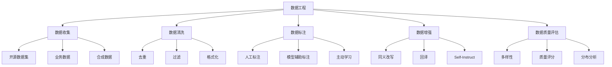
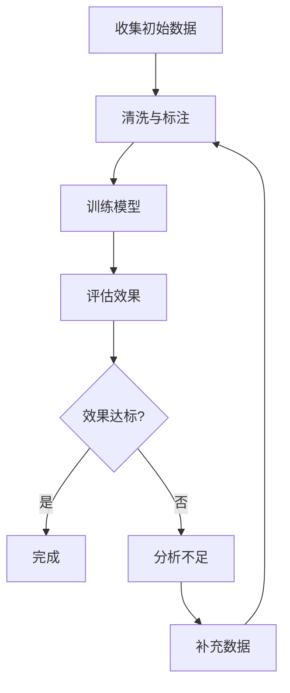

# 训练数据工程

数据是模型微调的基石，高质量的数据工程决定了微调效果的上限。

## 数据工程概览



## 数据收集

### 数据来源

| 来源 | 优点 | 缺点 | 适用场景 |
|------|------|------|---------|
| 开源数据集 | 免费、量大 | 质量参差 | 通用能力 |
| 业务数据 | 领域相关 | 需脱敏 | 领域适配 |
| 合成数据 | 可控、量大 | 可能偏差 | 特定任务 |
| 人工标注 | 高质量 | 成本高 | 关键任务 |
| 爬取数据 | 量大 | 需清洗 | 预训练 |

### 开源数据集

```python
from datasets import load_dataset, concatenate_datasets

def load_sft_datasets(task_type: str = "general") -> dict:
    """加载开源SFT数据集"""
    
    datasets_map = {
        "general": [
            "HuggingFaceH4/ultrachat_200k",
            "Open-Orca/OpenOrca",
        ],
        "chinese": [
            "shibing624/alpaca-zh",
            "BelleGroup/train_2M_CN",
        ],
        "code": [
            "codeparrot/code-alpaca",
            "nickrosh/Evol-Instruct-Code-80k-v1",
        ],
        "math": [
            "TIGER-Lab/MathInstruct",
            "meta-math/MetaMathQA",
        ]
    }
    
    results = {}
    for dataset_name in datasets_map.get(task_type, datasets_map["general"]):
        try:
            ds = load_dataset(dataset_name, split="train")
            results[dataset_name] = ds
        except Exception as e:
            print(f"加载 {dataset_name} 失败: {e}")
    
    return results
```

### 合成数据生成

```python
from openai import OpenAI

class SyntheticDataGenerator:
    """合成数据生成器"""
    
    def __init__(self, model: str = "gpt-4"):
        self.client = OpenAI()
        self.model = model
    
    async def generate_instruction_data(
        self, 
        domain: str, 
        num_samples: int = 100,
        difficulty: str = "medium"
    ) -> list[dict]:
        """生成指令微调数据"""
        
        prompt = f"""请生成{num_samples}条{domain}领域的指令微调数据。
        
        难度级别：{difficulty}
        
        每条数据包含：
        - instruction: 指令
        - input: 输入（可为空）
        - output: 期望输出
        
        要求：
        1. 指令多样化，覆盖不同任务类型
        2. 输出准确、完整、专业
        3. 难度与指定级别匹配
        
        请以JSON数组格式输出。"""
        
        response = self.client.chat.completions.create(
            model=self.model,
            messages=[{"role": "user", "content": prompt}],
            temperature=0.8
        )
        
        return json.loads(response.choices[0].message.content)
    
    async def self_instruct(self, seed_tasks: list[dict], num_new: int = 50) -> list[dict]:
        """Self-Instruct方法生成新数据"""
        
        seed_examples = "\n".join(
            f"指令: {t['instruction']}\n输出: {t['output']}" 
            for t in seed_tasks[:5]
        )
        
        prompt = f"""参考以下种子任务，生成{num_new}个新的指令-输出对。

种子任务：
{seed_examples}

请生成风格类似但内容不同的新任务。以JSON数组格式输出。"""
        
        response = self.client.chat.completions.create(
            model=self.model,
            messages=[{"role": "user", "content": prompt}],
            temperature=0.9
        )
        
        return json.loads(response.choices[0].message.content)
```

## 数据清洗

### 清洗流水线

```python
import re
import hashlib
from typing import Optional

class DataCleaner:
    """数据清洗器"""
    
    def __init__(self, min_length: int = 10, max_length: int = 8192):
        self.min_length = min_length
        self.max_length = max_length
        self.seen_hashes = set()
    
    def clean_text(self, text: str) -> Optional[str]:
        """清洗单条文本"""
        text = self._remove_html_tags(text)
        text = self._normalize_whitespace(text)
        text = self._remove_emoji(text)
        text = self._normalize_punctuation(text)
        text = text.strip()
        
        if not self._check_length(text):
            return None
        if self._is_duplicate(text):
            return None
        
        return text
    
    def clean_instruction_data(self, data: list[dict]) -> list[dict]:
        """清洗指令微调数据"""
        cleaned = []
        
        for item in data:
            instruction = self.clean_text(item.get("instruction", ""))
            output = self.clean_text(item.get("output", ""))
            
            if not instruction or not output:
                continue
            
            if len(output) < self.min_length:
                continue
            
            if instruction == output:
                continue
            
            cleaned_item = {
                "instruction": instruction,
                "input": self.clean_text(item.get("input", "")) or "",
                "output": output
            }
            
            cleaned.append(cleaned_item)
        
        return cleaned
    
    def _remove_html_tags(self, text: str) -> str:
        """移除HTML标签"""
        return re.sub(r'<[^>]+>', '', text)
    
    def _normalize_whitespace(self, text: str) -> str:
        """规范化空白字符"""
        text = re.sub(r'\n{3,}', '\n\n', text)
        text = re.sub(r' {2,}', ' ', text)
        return text
    
    def _remove_emoji(self, text: str) -> str:
        """移除emoji"""
        emoji_pattern = re.compile(
            "["
            "\U0001F600-\U0001F64F"
            "\U0001F300-\U0001F5FF"
            "\U0001F680-\U0001F6FF"
            "\U0001F1E0-\U0001F1FF"
            "]+",
            flags=re.UNICODE
        )
        return emoji_pattern.sub('', text)
    
    def _normalize_punctuation(self, text: str) -> str:
        """规范化标点"""
        text = re.sub(r'["""]', '"', text)
        text = re.sub(r'[''']', "'", text)
        return text
    
    def _check_length(self, text: str) -> bool:
        """检查文本长度"""
        return self.min_length <= len(text) <= self.max_length
    
    def _is_duplicate(self, text: str) -> bool:
        """检查是否重复"""
        text_hash = hashlib.md5(text.encode()).hexdigest()
        if text_hash in self.seen_hashes:
            return True
        self.seen_hashes.add(text_hash)
        return False
```

### 数据去重

```python
class Deduplicator:
    """数据去重器"""
    
    @staticmethod
    def exact_dedup(data: list[dict], key: str = "instruction") -> list[dict]:
        """精确去重"""
        seen = set()
        result = []
        for item in data:
            text = item.get(key, "")
            if text not in seen:
                seen.add(text)
                result.append(item)
        return result
    
    @staticmethod
    def fuzzy_dedup(data: list[dict], key: str = "instruction", threshold: float = 0.9) -> list[dict]:
        """模糊去重（基于MinHash）"""
        from datasketch import MinHash, MinHashLSH
        
        lsh = MinHashLSH(threshold=threshold, num_perm=128)
        result = []
        
        for i, item in enumerate(data):
            text = item.get(key, "")
            mh = MinHash(num_perm=128)
            for word in text.split():
                mh.update(word.encode('utf-8'))
            
            if not lsh.query(mh):
                lsh.insert(str(i), mh)
                result.append(item)
        
        return result
    
    @staticmethod
    def semantic_dedup(data: list[dict], key: str = "instruction", threshold: float = 0.95) -> list[dict]:
        """语义去重（基于Embedding）"""
        from sentence_transformers import SentenceTransformer
        import numpy as np
        
        model = SentenceTransformer('BAAI/bge-small-zh')
        texts = [item.get(key, "") for item in data]
        embeddings = model.encode(texts, show_progress_bar=True)
        
        result = []
        used = set()
        
        for i in range(len(data)):
            if i in used:
                continue
            result.append(data[i])
            
            for j in range(i + 1, len(data)):
                if j in used:
                    continue
                sim = np.dot(embeddings[i], embeddings[j]) / (
                    np.linalg.norm(embeddings[i]) * np.linalg.norm(embeddings[j])
                )
                if sim > threshold:
                    used.add(j)
        
        return result
```

## 数据标注

### 标注规范

```python
class AnnotationGuideline:
    """数据标注规范"""
    
    guidelines = {
        "instruction_quality": {
            "clear": "指令清晰明确，无歧义",
            "specific": "指令具体，有明确目标",
            "complete": "指令完整，包含必要信息",
        },
        "output_quality": {
            "accurate": "输出准确，无事实错误",
            "complete": "输出完整，覆盖所有要点",
            "helpful": "输出有帮助，解决用户问题",
            "safe": "输出安全，无有害内容",
        },
        "format_standards": {
            "no_placeholder": "不包含占位符或模板内容",
            "no_meta": "不包含元信息（如'作为AI...'）",
            "proper_length": "长度适中，不过短或过长",
        }
    }
    
    @classmethod
    def get_checklist(cls) -> list[str]:
        """获取标注检查清单"""
        checklist = []
        for category, items in cls.guidelines.items():
            for key, desc in items.items():
                checklist.append(f"[{category}] {key}: {desc}")
        return checklist
```

### 模型辅助标注

```python
class ModelAssistedAnnotator:
    """模型辅助标注器"""
    
    def __init__(self, model_name: str = "gpt-4"):
        self.client = OpenAI()
        self.model = model_name
    
    async def score_quality(self, instruction: str, output: str) -> dict:
        """评估数据质量"""
        prompt = f"""请评估以下指令-输出对的质量，从多个维度打分（1-5分）。

指令：{instruction}
输出：{output}

评分维度：
1. 准确性：输出是否准确无误
2. 完整性：输出是否完整覆盖要点
3. 相关性：输出是否与指令相关
4. 清晰度：输出是否清晰易懂
5. 安全性：输出是否安全无害

请以JSON格式输出：{{"accuracy": X, "completeness": X, "relevance": X, "clarity": X, "safety": X, "overall": X, "comment": "评语"}}"""
        
        response = self.client.chat.completions.create(
            model=self.model,
            messages=[{"role": "user", "content": prompt}],
            temperature=0.1
        )
        
        return json.loads(response.choices[0].message.content)
    
    async def improve_output(self, instruction: str, output: str) -> str:
        """改进输出质量"""
        prompt = f"""请改进以下指令-输出对中的输出部分。

指令：{instruction}
原始输出：{output}

改进要求：
1. 更准确、更完整
2. 更清晰、更有条理
3. 移除不必要的套话
4. 保持专业性和实用性

请直接输出改进后的内容。"""
        
        response = self.client.chat.completions.create(
            model=self.model,
            messages=[{"role": "user", "content": prompt}],
            temperature=0.3
        )
        
        return response.choices[0].message.content
```

## 数据增强

### 增强策略

```python
class DataAugmentor:
    """数据增强器"""
    
    def __init__(self, llm=None):
        self.llm = llm
    
    async def paraphrase(self, text: str) -> str:
        """同义改写"""
        prompt = f"请用不同的表达方式改写以下内容，保持语义不变：\n\n{text}"
        response = await self.llm.ainvoke(prompt)
        return response.content
    
    async def back_translate(self, text: str, intermediate_lang: str = "en") -> str:
        """回译增强"""
        prompt1 = f"将以下中文翻译成{intermediate_lang}：\n\n{text}"
        response1 = await self.llm.ainvoke(prompt1)
        
        prompt2 = f"将以下{intermediate_lang}翻译成中文：\n\n{response1.content}"
        response2 = await self.llm.ainvoke(prompt2)
        
        return response2.content
    
    async def complexity_variation(self, instruction: str, output: str) -> list[dict]:
        """复杂度变体"""
        variations = []
        
        for level in ["simple", "medium", "complex"]:
            prompt = f"""请将以下指令改写为{level}难度级别：

原始指令：{instruction}
原始输出：{output}

{level}级别的特点：
- simple: 简单直接，初学者可理解
- medium: 中等复杂，需要一定背景知识
- complex: 深入复杂，需要专业知识

请输出改写后的指令和对应输出。"""
            
            response = await self.llm.ainvoke(prompt)
            variations.append({
                "level": level,
                "content": response.content
            })
        
        return variations
    
    async def evol_instruct(self, instruction: str) -> str:
        """Evol-Instruct方法：进化指令复杂度"""
        prompt = f"""请将以下指令改写为更复杂的版本，可以：
1. 添加更多约束条件
2. 增加任务步骤
3. 提高专业深度
4. 组合多个子任务

原始指令：{instruction}

请输出改写后的指令。"""
        
        response = await self.llm.ainvoke(prompt)
        return response.content
```

## 数据质量评估

### 评估指标

```python
class DataQualityAssessor:
    """数据质量评估器"""
    
    def assess_dataset(self, data: list[dict]) -> dict:
        """评估数据集质量"""
        total = len(data)
        
        return {
            "total_samples": total,
            "avg_instruction_length": self._avg_length(data, "instruction"),
            "avg_output_length": self._avg_length(data, "output"),
            "unique_ratio": self._unique_ratio(data, "instruction"),
            "empty_input_ratio": self._empty_ratio(data, "input"),
            "length_distribution": self._length_distribution(data),
            "task_type_distribution": self._task_type_distribution(data),
        }
    
    def _avg_length(self, data: list[dict], key: str) -> float:
        """计算平均长度"""
        lengths = [len(item.get(key, "")) for item in data]
        return sum(lengths) / max(len(lengths), 1)
    
    def _unique_ratio(self, data: list[dict], key: str) -> float:
        """计算唯一比例"""
        values = [item.get(key, "") for item in data]
        return len(set(values)) / max(len(values), 1)
    
    def _empty_ratio(self, data: list[dict], key: str) -> float:
        """计算空值比例"""
        empty_count = sum(1 for item in data if not item.get(key, "").strip())
        return empty_count / max(len(data), 1)
    
    def _length_distribution(self, data: list[dict]) -> dict:
        """长度分布"""
        output_lengths = [len(item.get("output", "")) for item in data]
        return {
            "p25": self._percentile(output_lengths, 25),
            "p50": self._percentile(output_lengths, 50),
            "p75": self._percentile(output_lengths, 75),
            "min": min(output_lengths) if output_lengths else 0,
            "max": max(output_lengths) if output_lengths else 0,
        }
    
    def _task_type_distribution(self, data: list[dict]) -> dict:
        """任务类型分布"""
        type_keywords = {
            "翻译": ["翻译", "translate"],
            "摘要": ["摘要", "总结", "概括"],
            "问答": ["什么是", "解释", "说明"],
            "代码": ["代码", "编程", "实现"],
            "写作": ["写", "创作", "撰写"],
        }
        
        distribution = {k: 0 for k in type_keywords}
        for item in data:
            instruction = item.get("instruction", "")
            for task_type, keywords in type_keywords.items():
                if any(kw in instruction for kw in keywords):
                    distribution[task_type] += 1
                    break
            else:
                distribution.setdefault("其他", 0)
                distribution["其他"] += 1
        
        return distribution
    
    def _percentile(self, data: list, p: int) -> float:
        """计算百分位数"""
        sorted_data = sorted(data)
        index = int(len(sorted_data) * p / 100)
        return sorted_data[min(index, len(sorted_data) - 1)]
```

## 最佳实践

### 数据质量优先级

1. **准确性** > **完整性** > **多样性** > **数量**
2. 1000条高质量数据 > 10000条低质量数据
3. 数据分布要与目标应用场景匹配

### 数据配比建议

| 场景 | 通用数据 | 领域数据 | 任务数据 |
|------|---------|---------|---------|
| 通用助手 | 60% | 20% | 20% |
| 领域专家 | 20% | 50% | 30% |
| 特定任务 | 10% | 20% | 70% |

### 迭代优化流程



## 小结

数据工程是微调成功的基石：

1. **数据收集**：开源数据、业务数据、合成数据
2. **数据清洗**：去重、过滤、格式化
3. **数据标注**：标注规范、模型辅助标注
4. **数据增强**：同义改写、回译、Evol-Instruct
5. **质量评估**：多样性、分布分析、质量评分
