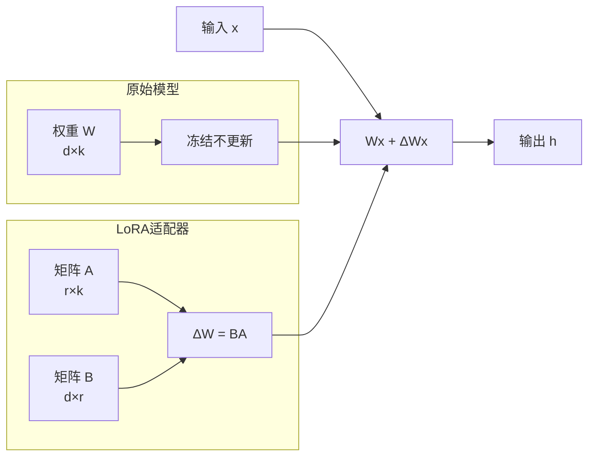

# LoRA微调实战指南

从原理到实践，全面掌握LoRA高效微调技术，在有限资源下实现模型领域适配。

## LoRA原理回顾

### 核心思想

LoRA (Low-Rank Adaptation) 通过在预训练权重矩阵旁添加低秩分解矩阵来实现高效微调，只训练极少量参数。



### 数学推导

原始前向传播：h = Wx

LoRA前向传播：h = Wx + BAx = Wx + α/r · BAx

其中：
- W ∈ R^(d×k)：原始冻结权重
- B ∈ R^(d×r)：LoRA矩阵B，初始化为0
- A ∈ R^(r×k)：LoRA矩阵A，使用高斯初始化
- r：LoRA秩，r << min(d, k)
- α：缩放因子，控制LoRA更新的强度

### 参数量对比

```python
def count_parameters(d: int, k: int, r: int) -> dict:
    """计算参数量"""
    original = d * k
    lora = d * r + r * k
    ratio = lora / original * 100
    return {
        "原始参数": original,
        "LoRA参数": lora,
        "参数占比": f"{ratio:.2f}%"
    }

# 示例：Qwen2-7B的q_proj层
result = count_parameters(d=4096, k=4096, r=8)
# 原始参数: 16,777,216
# LoRA参数: 65,536
# 参数占比: 0.39%
```

## 环境准备

### 硬件需求

| 模型大小 | 全参数微调 | LoRA (BF16) | QLoRA (4bit) |
|---------|-----------|-------------|-------------|
| 1.5B | 24GB | 8GB | 4GB |
| 7B | 120GB+ | 16GB | 6GB |
| 13B | 200GB+ | 24GB | 10GB |
| 70B | 1TB+ | 80GB | 40GB |

### 软件环境

```bash
pip install torch transformers peft trl datasets accelerate bitsandbytes
```

## LoRA微调实战

### Step 1: 数据准备

```python
from datasets import load_dataset, Dataset
import json

def prepare_sft_dataset(data_path: str, format_type: str = "alpaca") -> Dataset:
    """准备指令微调数据集"""
    
    if format_type == "alpaca":
        dataset = load_dataset("json", data_files=data_path)
        
        def format_alpaca(example):
            if example.get("input"):
                prompt = f"""### Instruction:
{example['instruction']}

### Input:
{example['input']}

### Response:
{example['output']}"""
            else:
                prompt = f"""### Instruction:
{example['instruction']}

### Response:
{example['output']}"""
            return {"text": prompt}
        
        dataset = dataset.map(format_alpaca)
    
    elif format_type == "chatml":
        dataset = load_dataset("json", data_files=data_path)
        
        def format_chatml(example):
            messages = example["conversations"]
            formatted = ""
            for msg in messages:
                role = msg["role"]
                content = msg["content"]
                formatted += f"<|im_start|>{role}\n{content}<|im_end|>\n"
            return {"text": formatted}
        
        dataset = dataset.map(format_chatml)
    
    return dataset["train"]

def create_sample_dataset():
    """创建示例数据集"""
    data = [
        {
            "instruction": "将以下句子翻译成英文",
            "input": "今天天气真好",
            "output": "The weather is really nice today."
        },
        {
            "instruction": "写一首关于春天的诗",
            "input": "",
            "output": "春风拂面花满枝，\n细雨润物草生迟。\n燕子归来寻旧垒，\n桃花依旧笑人痴。"
        },
        {
            "instruction": "解释以下技术概念",
            "input": "什么是LoRA？",
            "output": "LoRA (Low-Rank Adaptation) 是一种高效微调方法，通过在预训练模型的权重矩阵旁添加低秩分解矩阵来实现参数高效的模型适配。它只需要训练极少量的参数（通常不到1%），就能达到接近全参数微调的效果。"
        }
    ]
    
    with open("train_data.json", "w", encoding="utf-8") as f:
        json.dump(data, f, ensure_ascii=False, indent=2)
```

### Step 2: 模型加载与LoRA配置

```python
from transformers import AutoModelForCausalLM, AutoTokenizer, BitsAndBytesConfig
from peft import LoraConfig, get_peft_model, prepare_model_for_kbit_training, TaskType

def load_model_for_lora(
    model_name: str = "Qwen/Qwen2-7B",
    use_qlora: bool = False,
    device_map: str = "auto"
):
    """加载模型并配置LoRA"""
    
    if use_qlora:
        bnb_config = BitsAndBytesConfig(
            load_in_4bit=True,
            bnb_4bit_quant_type="nf4",
            bnb_4bit_compute_dtype="bfloat16",
            bnb_4bit_use_double_quant=True
        )
        
        model = AutoModelForCausalLM.from_pretrained(
            model_name,
            quantization_config=bnb_config,
            device_map=device_map,
            trust_remote_code=True
        )
        
        model = prepare_model_for_kbit_training(model)
    else:
        model = AutoModelForCausalLM.from_pretrained(
            model_name,
            torch_dtype="bfloat16",
            device_map=device_map,
            trust_remote_code=True
        )
    
    tokenizer = AutoTokenizer.from_pretrained(
        model_name,
        trust_remote_code=True,
        padding_side="right"
    )
    
    if tokenizer.pad_token is None:
        tokenizer.pad_token = tokenizer.eos_token
    
    return model, tokenizer

def configure_lora(
    r: int = 8,
    lora_alpha: int = 16,
    lora_dropout: float = 0.05,
    target_modules: list = None,
    task_type: str = "CAUSAL_LM"
) -> LoraConfig:
    """配置LoRA参数"""
    
    if target_modules is None:
        target_modules = ["q_proj", "k_proj", "v_proj", "o_proj"]
    
    return LoraConfig(
        r=r,
        lora_alpha=lora_alpha,
        lora_dropout=lora_dropout,
        target_modules=target_modules,
        bias="none",
        task_type=task_type
    )
```

### Step 3: 训练配置

```python
from transformers import TrainingArguments

def get_training_args(
    output_dir: str = "./lora_output",
    num_epochs: int = 3,
    batch_size: int = 4,
    learning_rate: float = 2e-4,
    gradient_accumulation_steps: int = 4,
    max_seq_length: int = 2048,
    use_qlora: bool = False
) -> TrainingArguments:
    """获取训练参数"""
    
    return TrainingArguments(
        output_dir=output_dir,
        num_train_epochs=num_epochs,
        per_device_train_batch_size=batch_size,
        per_device_eval_batch_size=batch_size,
        gradient_accumulation_steps=gradient_accumulation_steps,
        learning_rate=learning_rate,
        lr_scheduler_type="cosine",
        warmup_ratio=0.1,
        bf16=not use_qlora,
        fp16=use_qlora,
        logging_steps=10,
        save_steps=100,
        save_total_limit=3,
        evaluation_strategy="steps",
        eval_steps=100,
        load_best_model_at_end=True,
        metric_for_best_model="eval_loss",
        greater_is_better=False,
        gradient_checkpointing=True,
        optim="adamw_torch",
        report_to="tensorboard",
        remove_unused_columns=False,
        max_grad_norm=1.0,
    )
```

### Step 4: 使用TRL训练

```python
from trl import SFTTrainer

def train_lora(
    model_name: str = "Qwen/Qwen2-7B",
    data_path: str = "train_data.json",
    output_dir: str = "./lora_output",
    use_qlora: bool = False,
    r: int = 8,
    lora_alpha: int = 16,
    num_epochs: int = 3,
    batch_size: int = 4,
    learning_rate: float = 2e-4,
    max_seq_length: int = 2048,
):
    """LoRA微调主流程"""
    
    model, tokenizer = load_model_for_lora(model_name, use_qlora)
    
    lora_config = configure_lora(r=r, lora_alpha=lora_alpha)
    model = get_peft_model(model, lora_config)
    model.print_trainable_parameters()
    
    dataset = prepare_sft_dataset(data_path)
    
    train_dataset = dataset.select(range(int(len(dataset) * 0.9)))
    eval_dataset = dataset.select(range(int(len(dataset) * 0.9), len(dataset)))
    
    training_args = get_training_args(
        output_dir=output_dir,
        num_epochs=num_epochs,
        batch_size=batch_size,
        learning_rate=learning_rate,
        use_qlora=use_qlora
    )
    
    trainer = SFTTrainer(
        model=model,
        args=training_args,
        train_dataset=train_dataset,
        eval_dataset=eval_dataset,
        tokenizer=tokenizer,
        max_seq_length=max_seq_length,
        dataset_text_field="text",
    )
    
    trainer.train()
    
    trainer.save_model(output_dir)
    tokenizer.save_pretrained(output_dir)
    
    return trainer
```

### Step 5: 推理与合并

```python
from peft import PeftModel

def load_lora_for_inference(
    base_model_name: str,
    lora_path: str,
    use_qlora: bool = False
):
    """加载LoRA模型进行推理"""
    
    model, tokenizer = load_model_for_lora(base_model_name, use_qlora)
    
    model = PeftModel.from_pretrained(model, lora_path)
    model = model.merge_and_unload()
    
    return model, tokenizer

def merge_lora_to_base(
    base_model_name: str,
    lora_path: str,
    output_path: str
):
    """将LoRA权重合并到基础模型"""
    
    model, tokenizer = load_model_for_lora(base_model_name)
    
    model = PeftModel.from_pretrained(model, lora_path)
    model = model.merge_and_unload()
    
    model.save_pretrained(output_path)
    tokenizer.save_pretrained(output_path)

def inference(model, tokenizer, prompt: str, max_new_tokens: int = 512):
    """模型推理"""
    inputs = tokenizer(prompt, return_tensors="pt").to(model.device)
    
    outputs = model.generate(
        **inputs,
        max_new_tokens=max_new_tokens,
        temperature=0.7,
        top_p=0.9,
        do_sample=True,
        repetition_penalty=1.1
    )
    
    response = tokenizer.decode(outputs[0][inputs["input_ids"].shape[1]:], skip_special_tokens=True)
    return response
```

## LoRA参数调优

### 秩 (r) 的选择

| 秩 r | 可训练参数 | 效果 | 适用场景 |
|------|-----------|------|---------|
| 4 | 极少 | 基本适配 | 简单任务、风格迁移 |
| 8 | 少 | 良好适配 | 通用场景 |
| 16 | 中等 | 较好适配 | 复杂任务 |
| 32 | 较多 | 接近全参数 | 高精度需求 |
| 64 | 多 | 接近全参数 | 领域深度适配 |

### target_modules选择

```python
def get_recommended_targets(model_type: str) -> list[str]:
    """获取推荐的目标模块"""
    
    recommendations = {
        "qwen2": ["q_proj", "k_proj", "v_proj", "o_proj", "gate_proj", "up_proj", "down_proj"],
        "llama": ["q_proj", "k_proj", "v_proj", "o_proj", "gate_proj", "up_proj", "down_proj"],
        "chatglm": ["query_key_value", "dense", "dense_h_to_4h", "dense_4h_to_h"],
        "mistral": ["q_proj", "k_proj", "v_proj", "o_proj", "gate_proj", "up_proj", "down_proj"],
    }
    
    return recommendations.get(model_type, ["q_proj", "v_proj"])
```

### 学习率调优

```python
def get_recommended_lr(r: int, dataset_size: int) -> float:
    """根据秩和数据量推荐学习率"""
    
    base_lr = {
        4: 1e-4,
        8: 2e-4,
        16: 1e-4,
        32: 5e-5,
        64: 2e-5
    }
    
    lr = base_lr.get(r, 2e-4)
    
    if dataset_size < 1000:
        lr *= 0.5
    elif dataset_size > 10000:
        lr *= 1.5
    
    return lr
```

## 多LoRA管理

### LoRA切换

```python
class LoRAManager:
    """多LoRA适配器管理器"""
    
    def __init__(self, base_model_name: str):
        self.base_model_name = base_model_name
        self.model = None
        self.tokenizer = None
        self.current_adapter = None
        self.adapters: dict[str, str] = {}
    
    def load_base_model(self):
        """加载基础模型"""
        self.model, self.tokenizer = load_model_for_lora(self.base_model_name)
    
    def register_adapter(self, name: str, path: str):
        """注册LoRA适配器"""
        self.adapters[name] = path
    
    def switch_adapter(self, name: str):
        """切换LoRA适配器"""
        if name not in self.adapters:
            raise ValueError(f"适配器 {name} 未注册")
        
        if self.current_adapter:
            self.model.disable_adapter()
            self.model.unload_adapter(self.current_adapter)
        
        if not hasattr(self.model, 'peft_config'):
            from peft import PeftModel
            self.model = PeftModel.from_pretrained(self.model, self.adapters[name], adapter_name=name)
        else:
            self.model.load_adapter(self.adapters[name], adapter_name=name)
        
        self.model.set_adapter(name)
        self.current_adapter = name
    
    def inference(self, prompt: str, adapter_name: str = None, **kwargs):
        """推理"""
        if adapter_name and adapter_name != self.current_adapter:
            self.switch_adapter(adapter_name)
        
        return inference(self.model, self.tokenizer, prompt, **kwargs)
```

## 常见问题与解决

### 1. 显存不足

```python
def reduce_memory_usage():
    """降低显存使用"""
    strategies = [
        "使用QLoRA（4bit量化）",
        "减小batch_size，增加gradient_accumulation_steps",
        "启用gradient_checkpointing",
        "减小max_seq_length",
        "减小LoRA秩r",
        "只对attention层应用LoRA（q_proj, v_proj）",
    ]
    return strategies
```

### 2. 训练不收敛

```python
def debug_training():
    """训练调试检查清单"""
    checks = {
        "数据质量": "检查数据格式、清洗噪声数据",
        "学习率": "尝试降低学习率（1e-5 ~ 5e-4）",
        "LoRA秩": "增大秩r（8 → 16 → 32）",
        "target_modules": "增加更多目标模块",
        "数据量": "确保足够的训练数据（>1000条）",
        "数据分布": "检查训练数据的多样性",
        "warmup": "增加warmup步数",
        "梯度裁剪": "设置max_grad_norm=1.0",
    }
    return checks
```

### 3. 过拟合

```python
def prevent_overfitting():
    """防止过拟合"""
    return {
        "增加dropout": "lora_dropout=0.1",
        "数据增强": "同义改写、回译增强",
        "早停": "设置early_stopping_patience=3",
        "减小模型容量": "降低LoRA秩r",
        "正则化": "增加weight_decay=0.01",
        "数据量": "增加训练数据量",
    }
```

## 小结

LoRA微调是资源受限下的最佳实践：

1. **原理**：低秩分解，只训练<1%参数
2. **实战流程**：数据准备→模型加载→LoRA配置→训练→推理
3. **参数调优**：秩r、target_modules、学习率的选择
4. **多LoRA管理**：适配器注册、切换、合并
5. **问题排查**：显存不足、不收敛、过拟合
